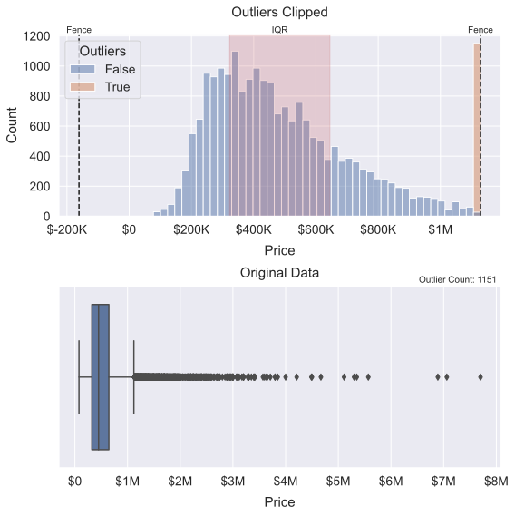
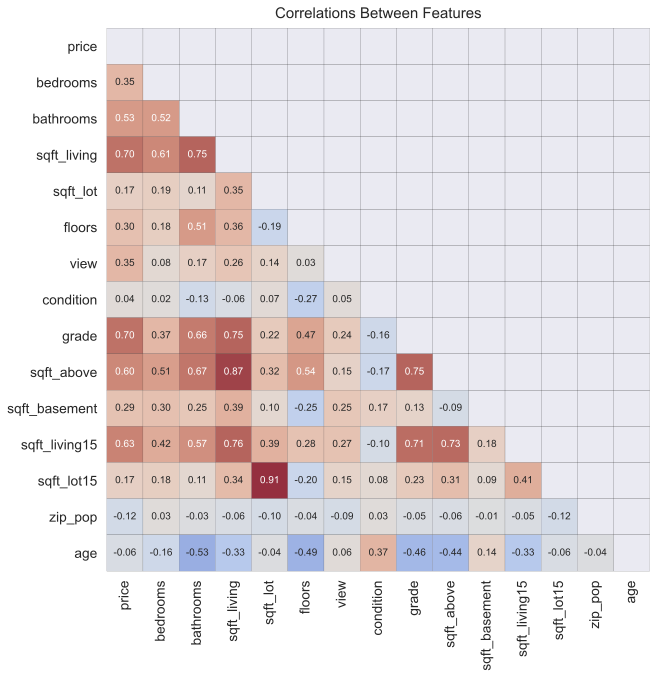

# Factors Affecting a Home's Value

* Name: Nicholas Gigliotti
* Email: ndgigliotti@gmail.com

## Business Problem

In this notebook, I conduct an analysis of the factors which contribute to a home's value for Data Driven Realty, a company which serves the residents of King County. King County home-owners are looking to renovate their homes to increase their value, and need some advice on where to direct their efforts. Naturally, I prioritize **renovatable features** over other features in my analysis. My central research question is:

> What renovatable features have the strongest positive effect on price?

I will attempt to answer this question by developing an ordinary least squares multiple regression model which is both (1) highly interpretable and (2) reasonably accurate. Interpretability is my main priority, since there are many ways to sacrifice interpretability to increase accuracy. Nevertheless, I try to select a model which meets the assumptions of linear regression to a reasonable degree, fits the data well, and deals with renovatable features.

After cleaning the data and dealing with outliers, I run several feature selection sweeps (see sweeps.ipynb) to guide my model-building process. In other words, I create thousands of models and record their statistics, and then analyze them (in this notebook) in order to decide which features to include in my model.

## Data

The complete King County real estate dataset includes about 21 features and 21,600 observations. It probably originated with the [King County Department of Assessments](https://kingcounty.gov/depts/assessor.aspx), but has been passed around a lot amongst data scientists on the internet (e.g. on [Kaggle](https://www.kaggle.com/harlfoxem/housesalesprediction)). My final model involves the features "price", "bedrooms", "bathrooms", "view", and "zipcode".

I also make use of a zipcode dataset downloaded from [unitedstateszipcodes.org](https://www.unitedstateszipcodes.org/). It's about 14 features and 42,632 observations. I'm only interested in a small subset of these observations related to the King County zipcodes, namely "primary_city".
    

## Methods

I clean the data in typical fashion, dealing with NaNs and duplicates and converting categorical variables. I deal with outliers by clipping them (i.e. moving them) to the Tukey fences surrounding the IQR. I use the IQR method because most of the feature distributions are very right-skewed. I clip the outliers to the IQR fences rather than dropping them in order to avoid the collateral damage that comes with dropping outliers from every feature (losing ~18% of the data, in this case). Clipping the outliers also preserves more of the dataset's accuracy, although it often results in a large artificial clusters at the edge of distributions. See the illustration below:
    

I do some feature engineering before processing all of the outliers. This includes creating categorical versions of numeric variables (e.g. "bedrooms" and "age"), and creating a "nearby_city" feature based on "zipcode".

After preparing the data, I produce numerous heatmaps to explore correlations between features. This is important in order to avoid multicollinearity in my regression models. I also make scatterplots to examine any possible linear relationships with price.

In an auxilliary notebook (sweeps.py), I run feature selection sweeps for OLS multiple regression by building models for nearly every combination of features and recording their statistics. I do this for 1-variable through 5-variable regressions. Then I use this sweep data in the main notebook to iteratively develop a final model which has high R2adj and many renovatable features.

    
## Final Model
I produce the following final model with an R2adj of 0.813, meaning that it explains 81.3% of the variance in price. It's residuals are not perfectly normally distributed, nor are they perfectly homoscedastic, but I have to sacrifice some accuracy in order to maintain maximum interpretability.

<table class="simpletable">
<caption>OLS Regression Results</caption>
<tr>
  <th>Dep. Variable:</th>          <td>price</td>      <th>  R-squared:         </th>  <td>   0.814</td>  
</tr>
<tr>
  <th>Model:</th>                   <td>OLS</td>       <th>  Adj. R-squared:    </th>  <td>   0.813</td>  
</tr>
<tr>
  <th>Method:</th>             <td>Least Squares</td>  <th>  F-statistic:       </th>  <td>   1139.</td>  
</tr>
<tr>
  <th>Date:</th>             <td>Tue, 04 May 2021</td> <th>  Prob (F-statistic):</th>   <td>  0.00</td>   
</tr>
<tr>
  <th>Time:</th>                 <td>02:12:50</td>     <th>  Log-Likelihood:    </th> <td>-2.7861e+05</td>
</tr>
<tr>
  <th>No. Observations:</th>      <td> 21420</td>      <th>  AIC:               </th>  <td>5.574e+05</td> 
</tr>
<tr>
  <th>Df Residuals:</th>          <td> 21337</td>      <th>  BIC:               </th>  <td>5.580e+05</td> 
</tr>
<tr>
  <th>Df Model:</th>              <td>    82</td>      <th>                     </th>      <td> </td>     
</tr>
<tr>
  <th>Covariance Type:</th>      <td>nonrobust</td>    <th>                     </th>      <td> </td>     
</tr>
</table>
<table class="simpletable">
<tr>
            <td></td>              <th>coef</th>     <th>std err</th>      <th>t</th>      <th>P>|t|</th>  <th>[0.025</th>    <th>0.975]</th>  
</tr>
<tr>
  <th>Intercept</th>            <td> 7.281e+04</td> <td> 6526.468</td> <td>   11.156</td> <td> 0.000</td> <td>    6e+04</td> <td> 8.56e+04</td>
</tr>
<tr>
  <th>C(zipcode)[T.98002]</th>  <td> 8397.6192</td> <td> 9603.621</td> <td>    0.874</td> <td> 0.382</td> <td>-1.04e+04</td> <td> 2.72e+04</td>
</tr>
<tr>
  <th>C(zipcode)[T.98003]</th>  <td>-5400.5042</td> <td> 8663.738</td> <td>   -0.623</td> <td> 0.533</td> <td>-2.24e+04</td> <td> 1.16e+04</td>
</tr>
<tr>
  <th>C(zipcode)[T.98004]</th>  <td> 5.352e+05</td> <td> 8424.944</td> <td>   63.526</td> <td> 0.000</td> <td> 5.19e+05</td> <td> 5.52e+05</td>
</tr>
<tr>
  <th>C(zipcode)[T.98005]</th>  <td> 3.704e+05</td> <td> 1.01e+04</td> <td>   36.496</td> <td> 0.000</td> <td>  3.5e+05</td> <td>  3.9e+05</td>
</tr>
<tr>
  <th>C(zipcode)[T.98006]</th>  <td> 3.049e+05</td> <td> 7596.236</td> <td>   40.136</td> <td> 0.000</td> <td>  2.9e+05</td> <td>  3.2e+05</td>
</tr>
<tr>
  <th>C(zipcode)[T.98007]</th>  <td> 2.636e+05</td> <td> 1.08e+04</td> <td>   24.362</td> <td> 0.000</td> <td> 2.42e+05</td> <td> 2.85e+05</td>
</tr>
<tr>
  <th>C(zipcode)[T.98008]</th>  <td> 2.536e+05</td> <td> 8614.293</td> <td>   29.437</td> <td> 0.000</td> <td> 2.37e+05</td> <td>  2.7e+05</td>
</tr>
<tr>
  <th>C(zipcode)[T.98010]</th>  <td> 1.176e+05</td> <td> 1.23e+04</td> <td>    9.576</td> <td> 0.000</td> <td> 9.35e+04</td> <td> 1.42e+05</td>
</tr>
<tr>
  <th>C(zipcode)[T.98011]</th>  <td> 1.591e+05</td> <td> 9643.942</td> <td>   16.498</td> <td> 0.000</td> <td>  1.4e+05</td> <td> 1.78e+05</td>
</tr>
<tr>
  <th>C(zipcode)[T.98014]</th>  <td> 1.468e+05</td> <td> 1.13e+04</td> <td>   12.980</td> <td> 0.000</td> <td> 1.25e+05</td> <td> 1.69e+05</td>
</tr>
<tr>
  <th>C(zipcode)[T.98019]</th>  <td> 1.214e+05</td> <td> 9705.389</td> <td>   12.513</td> <td> 0.000</td> <td> 1.02e+05</td> <td>  1.4e+05</td>
</tr>
<tr>
  <th>C(zipcode)[T.98022]</th>  <td> 2.818e+04</td> <td> 9126.982</td> <td>    3.088</td> <td> 0.002</td> <td> 1.03e+04</td> <td> 4.61e+04</td>
</tr>
<tr>
  <th>C(zipcode)[T.98023]</th>  <td>-2.041e+04</td> <td> 7513.031</td> <td>   -2.716</td> <td> 0.007</td> <td>-3.51e+04</td> <td>-5681.822</td>
</tr>
<tr>
  <th>C(zipcode)[T.98024]</th>  <td> 2.157e+05</td> <td> 1.34e+04</td> <td>   16.047</td> <td> 0.000</td> <td> 1.89e+05</td> <td> 2.42e+05</td>
</tr>
<tr>
  <th>C(zipcode)[T.98027]</th>  <td> 2.121e+05</td> <td> 7850.951</td> <td>   27.016</td> <td> 0.000</td> <td> 1.97e+05</td> <td> 2.27e+05</td>
</tr>
<tr>
  <th>C(zipcode)[T.98028]</th>  <td> 1.468e+05</td> <td> 8607.615</td> <td>   17.050</td> <td> 0.000</td> <td>  1.3e+05</td> <td> 1.64e+05</td>
</tr>
<tr>
  <th>C(zipcode)[T.98029]</th>  <td> 2.092e+05</td> <td> 8376.814</td> <td>   24.979</td> <td> 0.000</td> <td> 1.93e+05</td> <td> 2.26e+05</td>
</tr>
<tr>
  <th>C(zipcode)[T.98030]</th>  <td> 2222.4999</td> <td> 8874.529</td> <td>    0.250</td> <td> 0.802</td> <td>-1.52e+04</td> <td> 1.96e+04</td>
</tr>
<tr>
  <th>C(zipcode)[T.98031]</th>  <td> 1.412e+04</td> <td> 8702.013</td> <td>    1.622</td> <td> 0.105</td> <td>-2939.806</td> <td> 3.12e+04</td>
</tr>
<tr>
  <th>C(zipcode)[T.98032]</th>  <td>-1542.6228</td> <td> 1.13e+04</td> <td>   -0.137</td> <td> 0.891</td> <td>-2.37e+04</td> <td> 2.06e+04</td>
</tr>
<tr>
  <th>C(zipcode)[T.98033]</th>  <td> 3.467e+05</td> <td> 7752.667</td> <td>   44.717</td> <td> 0.000</td> <td> 3.31e+05</td> <td> 3.62e+05</td>
</tr>
<tr>
  <th>C(zipcode)[T.98034]</th>  <td> 1.893e+05</td> <td> 7360.233</td> <td>   25.722</td> <td> 0.000</td> <td> 1.75e+05</td> <td> 2.04e+05</td>
</tr>
<tr>
  <th>C(zipcode)[T.98038]</th>  <td> 4.908e+04</td> <td> 7261.260</td> <td>    6.759</td> <td> 0.000</td> <td> 3.48e+04</td> <td> 6.33e+04</td>
</tr>
<tr>
  <th>C(zipcode)[T.98039]</th>  <td> 5.546e+05</td> <td> 1.65e+04</td> <td>   33.517</td> <td> 0.000</td> <td> 5.22e+05</td> <td> 5.87e+05</td>
</tr>
<tr>
  <th>C(zipcode)[T.98040]</th>  <td> 4.449e+05</td> <td> 8725.106</td> <td>   50.993</td> <td> 0.000</td> <td> 4.28e+05</td> <td> 4.62e+05</td>
</tr>
<tr>
  <th>C(zipcode)[T.98042]</th>  <td> 2.019e+04</td> <td> 7349.306</td> <td>    2.748</td> <td> 0.006</td> <td> 5788.634</td> <td> 3.46e+04</td>
</tr>
<tr>
  <th>C(zipcode)[T.98045]</th>  <td> 1.181e+05</td> <td> 9290.597</td> <td>   12.716</td> <td> 0.000</td> <td> 9.99e+04</td> <td> 1.36e+05</td>
</tr>
<tr>
  <th>C(zipcode)[T.98052]</th>  <td> 2.655e+05</td> <td> 7323.845</td> <td>   36.257</td> <td> 0.000</td> <td> 2.51e+05</td> <td>  2.8e+05</td>
</tr>
<tr>
  <th>C(zipcode)[T.98053]</th>  <td>  2.84e+05</td> <td> 7921.796</td> <td>   35.853</td> <td> 0.000</td> <td> 2.68e+05</td> <td>    3e+05</td>
</tr>
<tr>
  <th>C(zipcode)[T.98055]</th>  <td> 4.034e+04</td> <td> 8809.228</td> <td>    4.580</td> <td> 0.000</td> <td> 2.31e+04</td> <td> 5.76e+04</td>
</tr>
<tr>
  <th>C(zipcode)[T.98056]</th>  <td>  1.09e+05</td> <td> 7847.724</td> <td>   13.890</td> <td> 0.000</td> <td> 9.36e+04</td> <td> 1.24e+05</td>
</tr>
<tr>
  <th>C(zipcode)[T.98058]</th>  <td> 4.806e+04</td> <td> 7654.925</td> <td>    6.278</td> <td> 0.000</td> <td> 3.31e+04</td> <td> 6.31e+04</td>
</tr>
<tr>
  <th>C(zipcode)[T.98059]</th>  <td> 1.375e+05</td> <td> 7613.198</td> <td>   18.066</td> <td> 0.000</td> <td> 1.23e+05</td> <td> 1.52e+05</td>
</tr>
<tr>
  <th>C(zipcode)[T.98065]</th>  <td>  1.55e+05</td> <td> 8445.037</td> <td>   18.355</td> <td> 0.000</td> <td> 1.38e+05</td> <td> 1.72e+05</td>
</tr>
<tr>
  <th>C(zipcode)[T.98070]</th>  <td> 1.623e+05</td> <td> 1.16e+04</td> <td>   13.967</td> <td> 0.000</td> <td>  1.4e+05</td> <td> 1.85e+05</td>
</tr>
<tr>
  <th>C(zipcode)[T.98072]</th>  <td>  2.09e+05</td> <td> 8711.819</td> <td>   23.993</td> <td> 0.000</td> <td> 1.92e+05</td> <td> 2.26e+05</td>
</tr>
<tr>
  <th>C(zipcode)[T.98074]</th>  <td> 2.213e+05</td> <td> 7793.704</td> <td>   28.389</td> <td> 0.000</td> <td> 2.06e+05</td> <td> 2.37e+05</td>
</tr>
<tr>
  <th>C(zipcode)[T.98075]</th>  <td> 2.569e+05</td> <td> 8200.047</td> <td>   31.325</td> <td> 0.000</td> <td> 2.41e+05</td> <td> 2.73e+05</td>
</tr>
<tr>
  <th>C(zipcode)[T.98077]</th>  <td> 2.323e+05</td> <td> 9673.338</td> <td>   24.018</td> <td> 0.000</td> <td> 2.13e+05</td> <td> 2.51e+05</td>
</tr>
<tr>
  <th>C(zipcode)[T.98092]</th>  <td>-4793.4446</td> <td> 8130.851</td> <td>   -0.590</td> <td> 0.556</td> <td>-2.07e+04</td> <td> 1.11e+04</td>
</tr>
<tr>
  <th>C(zipcode)[T.98102]</th>  <td> 3.983e+05</td> <td> 1.21e+04</td> <td>   32.984</td> <td> 0.000</td> <td> 3.75e+05</td> <td> 4.22e+05</td>
</tr>
<tr>
  <th>C(zipcode)[T.98103]</th>  <td> 3.131e+05</td> <td> 7246.266</td> <td>   43.210</td> <td> 0.000</td> <td> 2.99e+05</td> <td> 3.27e+05</td>
</tr>
<tr>
  <th>C(zipcode)[T.98105]</th>  <td>  4.17e+05</td> <td> 9169.812</td> <td>   45.475</td> <td> 0.000</td> <td> 3.99e+05</td> <td> 4.35e+05</td>
</tr>
<tr>
  <th>C(zipcode)[T.98106]</th>  <td> 8.517e+04</td> <td> 8273.661</td> <td>   10.294</td> <td> 0.000</td> <td>  6.9e+04</td> <td> 1.01e+05</td>
</tr>
<tr>
  <th>C(zipcode)[T.98107]</th>  <td> 2.929e+05</td> <td> 8800.275</td> <td>   33.280</td> <td> 0.000</td> <td> 2.76e+05</td> <td>  3.1e+05</td>
</tr>
<tr>
  <th>C(zipcode)[T.98108]</th>  <td> 1.071e+05</td> <td> 9794.802</td> <td>   10.939</td> <td> 0.000</td> <td> 8.79e+04</td> <td> 1.26e+05</td>
</tr>
<tr>
  <th>C(zipcode)[T.98109]</th>  <td> 4.334e+05</td> <td> 1.19e+04</td> <td>   36.573</td> <td> 0.000</td> <td>  4.1e+05</td> <td> 4.57e+05</td>
</tr>
<tr>
  <th>C(zipcode)[T.98112]</th>  <td> 4.801e+05</td> <td> 8787.396</td> <td>   54.634</td> <td> 0.000</td> <td> 4.63e+05</td> <td> 4.97e+05</td>
</tr>
<tr>
  <th>C(zipcode)[T.98115]</th>  <td>  3.33e+05</td> <td> 7290.163</td> <td>   45.680</td> <td> 0.000</td> <td> 3.19e+05</td> <td> 3.47e+05</td>
</tr>
<tr>
  <th>C(zipcode)[T.98116]</th>  <td>  2.83e+05</td> <td> 8288.152</td> <td>   34.145</td> <td> 0.000</td> <td> 2.67e+05</td> <td> 2.99e+05</td>
</tr>
<tr>
  <th>C(zipcode)[T.98117]</th>  <td> 3.106e+05</td> <td> 7365.510</td> <td>   42.163</td> <td> 0.000</td> <td> 2.96e+05</td> <td> 3.25e+05</td>
</tr>
<tr>
  <th>C(zipcode)[T.98118]</th>  <td> 1.577e+05</td> <td> 7522.100</td> <td>   20.965</td> <td> 0.000</td> <td> 1.43e+05</td> <td> 1.72e+05</td>
</tr>
<tr>
  <th>C(zipcode)[T.98119]</th>  <td> 4.049e+05</td> <td> 9846.242</td> <td>   41.120</td> <td> 0.000</td> <td> 3.86e+05</td> <td> 4.24e+05</td>
</tr>
<tr>
  <th>C(zipcode)[T.98122]</th>  <td> 2.999e+05</td> <td> 8574.032</td> <td>   34.974</td> <td> 0.000</td> <td> 2.83e+05</td> <td> 3.17e+05</td>
</tr>
<tr>
  <th>C(zipcode)[T.98125]</th>  <td> 1.998e+05</td> <td> 7861.935</td> <td>   25.408</td> <td> 0.000</td> <td> 1.84e+05</td> <td> 2.15e+05</td>
</tr>
<tr>
  <th>C(zipcode)[T.98126]</th>  <td> 1.779e+05</td> <td> 8160.754</td> <td>   21.803</td> <td> 0.000</td> <td> 1.62e+05</td> <td> 1.94e+05</td>
</tr>
<tr>
  <th>C(zipcode)[T.98133]</th>  <td> 1.496e+05</td> <td> 7544.600</td> <td>   19.835</td> <td> 0.000</td> <td> 1.35e+05</td> <td> 1.64e+05</td>
</tr>
<tr>
  <th>C(zipcode)[T.98136]</th>  <td> 2.402e+05</td> <td> 8833.758</td> <td>   27.190</td> <td> 0.000</td> <td> 2.23e+05</td> <td> 2.58e+05</td>
</tr>
<tr>
  <th>C(zipcode)[T.98144]</th>  <td> 2.463e+05</td> <td> 8206.416</td> <td>   30.012</td> <td> 0.000</td> <td>  2.3e+05</td> <td> 2.62e+05</td>
</tr>
<tr>
  <th>C(zipcode)[T.98146]</th>  <td> 1.071e+05</td> <td> 8652.600</td> <td>   12.381</td> <td> 0.000</td> <td> 9.02e+04</td> <td> 1.24e+05</td>
</tr>
<tr>
  <th>C(zipcode)[T.98148]</th>  <td> 5.252e+04</td> <td> 1.55e+04</td> <td>    3.382</td> <td> 0.001</td> <td> 2.21e+04</td> <td>  8.3e+04</td>
</tr>
<tr>
  <th>C(zipcode)[T.98155]</th>  <td> 1.475e+05</td> <td> 7690.616</td> <td>   19.175</td> <td> 0.000</td> <td> 1.32e+05</td> <td> 1.63e+05</td>
</tr>
<tr>
  <th>C(zipcode)[T.98166]</th>  <td> 1.266e+05</td> <td> 8938.434</td> <td>   14.163</td> <td> 0.000</td> <td> 1.09e+05</td> <td> 1.44e+05</td>
</tr>
<tr>
  <th>C(zipcode)[T.98168]</th>  <td> 4.781e+04</td> <td> 8826.561</td> <td>    5.417</td> <td> 0.000</td> <td> 3.05e+04</td> <td> 6.51e+04</td>
</tr>
<tr>
  <th>C(zipcode)[T.98177]</th>  <td> 2.418e+05</td> <td> 8914.088</td> <td>   27.121</td> <td> 0.000</td> <td> 2.24e+05</td> <td> 2.59e+05</td>
</tr>
<tr>
  <th>C(zipcode)[T.98178]</th>  <td> 4.837e+04</td> <td> 8861.438</td> <td>    5.459</td> <td> 0.000</td> <td>  3.1e+04</td> <td> 6.57e+04</td>
</tr>
<tr>
  <th>C(zipcode)[T.98188]</th>  <td>  3.12e+04</td> <td> 1.09e+04</td> <td>    2.858</td> <td> 0.004</td> <td> 9804.073</td> <td> 5.26e+04</td>
</tr>
<tr>
  <th>C(zipcode)[T.98198]</th>  <td> 2.025e+04</td> <td> 8692.230</td> <td>    2.330</td> <td> 0.020</td> <td> 3217.475</td> <td> 3.73e+04</td>
</tr>
<tr>
  <th>C(zipcode)[T.98199]</th>  <td> 3.666e+05</td> <td> 8388.523</td> <td>   43.706</td> <td> 0.000</td> <td>  3.5e+05</td> <td> 3.83e+05</td>
</tr>
<tr>
  <th>C(cat_bedrooms)[T.3]</th> <td> 3.491e+04</td> <td> 2516.513</td> <td>   13.870</td> <td> 0.000</td> <td>    3e+04</td> <td> 3.98e+04</td>
</tr>
<tr>
  <th>C(cat_bedrooms)[T.4]</th> <td> 7.734e+04</td> <td> 2834.022</td> <td>   27.291</td> <td> 0.000</td> <td> 7.18e+04</td> <td> 8.29e+04</td>
</tr>
<tr>
  <th>C(cat_bedrooms)[T.5]</th> <td> 9.292e+04</td> <td> 3838.504</td> <td>   24.208</td> <td> 0.000</td> <td> 8.54e+04</td> <td>    1e+05</td>
</tr>
<tr>
  <th>C(cat_bedrooms)[T.6]</th> <td> 9.555e+04</td> <td> 6642.167</td> <td>   14.385</td> <td> 0.000</td> <td> 8.25e+04</td> <td> 1.09e+05</td>
</tr>
<tr>
  <th>C(cat_grade)[T.7]</th>    <td> 3.374e+04</td> <td> 2823.263</td> <td>   11.952</td> <td> 0.000</td> <td> 2.82e+04</td> <td> 3.93e+04</td>
</tr>
<tr>
  <th>C(cat_grade)[T.8]</th>    <td> 9.807e+04</td> <td> 3278.418</td> <td>   29.913</td> <td> 0.000</td> <td> 9.16e+04</td> <td> 1.04e+05</td>
</tr>
<tr>
  <th>C(cat_grade)[T.9]</th>    <td> 2.333e+05</td> <td> 3929.517</td> <td>   59.362</td> <td> 0.000</td> <td> 2.26e+05</td> <td> 2.41e+05</td>
</tr>
<tr>
  <th>C(cat_grade)[T.10]</th>   <td> 3.637e+05</td> <td> 4683.375</td> <td>   77.667</td> <td> 0.000</td> <td> 3.55e+05</td> <td> 3.73e+05</td>
</tr>
<tr>
  <th>C(cat_view)[T.1]</th>     <td> 9.669e+04</td> <td> 6111.989</td> <td>   15.819</td> <td> 0.000</td> <td> 8.47e+04</td> <td> 1.09e+05</td>
</tr>
<tr>
  <th>C(cat_view)[T.2]</th>     <td> 9.638e+04</td> <td> 3691.651</td> <td>   26.108</td> <td> 0.000</td> <td> 8.91e+04</td> <td> 1.04e+05</td>
</tr>
<tr>
  <th>C(cat_view)[T.3]</th>     <td> 1.472e+05</td> <td> 5032.760</td> <td>   29.240</td> <td> 0.000</td> <td> 1.37e+05</td> <td> 1.57e+05</td>
</tr>
<tr>
  <th>C(cat_view)[T.4]</th>     <td> 2.722e+05</td> <td> 6354.646</td> <td>   42.835</td> <td> 0.000</td> <td>  2.6e+05</td> <td> 2.85e+05</td>
</tr>
<tr>
  <th>bathrooms</th>            <td> 4.314e+04</td> <td> 1535.432</td> <td>   28.096</td> <td> 0.000</td> <td> 4.01e+04</td> <td> 4.61e+04</td>
</tr>
</table>
<table class="simpletable">
<tr>
  <th>Omnibus:</th>       <td>2025.399</td> <th>  Durbin-Watson:     </th> <td>   1.970</td>
</tr>
<tr>
  <th>Prob(Omnibus):</th>  <td> 0.000</td>  <th>  Jarque-Bera (JB):  </th> <td>5491.939</td>
</tr>
<tr>
  <th>Skew:</th>           <td> 0.535</td>  <th>  Prob(JB):          </th> <td>    0.00</td>
</tr>
<tr>
  <th>Kurtosis:</th>       <td> 5.238</td>  <th>  Cond. No.          </th> <td>    166.</td>
</tr>
</table>  Notes: [1] Standard Errors assume that the covariance matrix of the errors is correctly specified.

<table border="1" class="dataframe">
  <thead>
    <tr style="text-align: right;">
      <th></th>
      <th>breusch_pagan</th>
    </tr>
  </thead>
  <tbody>
    <tr>
      <th>lm</th>
      <td>2227.848535</td>
    </tr>
    <tr>
      <th>lm_pval</th>
      <td>0.000000</td>
    </tr>
    <tr>
      <th>f_val</th>
      <td>30.205185</td>
    </tr>
    <tr>
      <th>f_pval</th>
      <td>0.000000</td>
    </tr>
  </tbody>
</table>

<table border="1" class="dataframe">
  <thead>
    <tr style="text-align: right;">
      <th></th>
      <th>bad_pvalue</th>
    </tr>
  </thead>
  <tbody>
    <tr>
      <th>C(zipcode)[T.98002]</th>
      <td>0.381898</td>
    </tr>
    <tr>
      <th>C(zipcode)[T.98003]</th>
      <td>0.533064</td>
    </tr>
    <tr>
      <th>C(zipcode)[T.98030]</th>
      <td>0.802253</td>
    </tr>
    <tr>
      <th>C(zipcode)[T.98031]</th>
      <td>0.104766</td>
    </tr>
    <tr>
      <th>C(zipcode)[T.98032]</th>
      <td>0.891408</td>
    </tr>
    <tr>
      <th>C(zipcode)[T.98092]</th>
      <td>0.555507</td>
    </tr>
  </tbody>
</table>

    

    

## Recommendations
I arrive at the following recommendations for King County residents:
* Increase your housing grade as much as possible.
* Try to attain a view rating of at least $1$ by landscaping, installing windows, or removing junk.
* Aim to have at least $4$ bedrooms, and then expect diminishing returns if you keep adding more.
* Add more full, half, and quarter-bathrooms.

I'm confident in that these recommendations will help residents increase the value of their homes through renovation. I selected `final_model` from about 21,700 other models with a wide variety of predictor combinations. I filtered through this massive set of models to find the model with the best combination of $R^2_{adj}$, relevant predictors, residual normality, and residual homoscedasticity.

# Future Work

There is much more that could be done for King County homeowners. The first step would be to look at other models I've created and learn about features such as "sqft_living" and "sqft_lot" which didn't make it into `final_model`. There is much more that could be done with data from this very notebook.

Speaking of data from this very notebook, I'd like to run feature-selection sweeps using the normalized datasets, `log_df` and `quantile_df`, I created. I'd be interested in seeing how much better the scaled models are, and what insights they offer at the expense of interpretability.

My final suggestion is to look for more data, ideally data with time information gathered over the course of decades. I'd be interested in investigating the change over time in how various features affect home value. For someone looking to renovate, the best investment would be in features that are on the rise.

