<div align="center">

</div>


# Factors Affecting a Home's Value

* Name: Nicholas Gigliotti
* Email: ndgigliotti@gmail.com


<h1>Table of Contents<span class="tocSkip"></span></h1>
<div class="toc"><ul class="toc-item"><li><span><a href="#Factors-Affecting-a-Home's-Value" data-toc-modified-id="Factors-Affecting-a-Home's-Value-1">Factors Affecting a Home's Value</a></span><ul class="toc-item"><li><span><a href="#Introduction" data-toc-modified-id="Introduction-1.1">Introduction</a></span></li><li><span><a href="#First-Impressions-of-the-Dataset" data-toc-modified-id="First-Impressions-of-the-Dataset-1.2">First Impressions of the Dataset</a></span></li></ul></li><li><span><a href="#Cleaning-the-Data" data-toc-modified-id="Cleaning-the-Data-2">Cleaning the Data</a></span><ul class="toc-item"><li><span><a href="#Scrub-df" data-toc-modified-id="Scrub-df-2.1">Scrub <code>df</code></a></span><ul class="toc-item"><li><span><a href="#Outlier-Adjustment-for-Discrete-Variables" data-toc-modified-id="Outlier-Adjustment-for-Discrete-Variables-2.1.1">Outlier Adjustment for Discrete Variables</a></span></li><li><span><a href="#Conversion-of-Categoricals" data-toc-modified-id="Conversion-of-Categoricals-2.1.2">Conversion of Categoricals</a></span></li></ul></li><li><span><a href="#Scrub-zip_df" data-toc-modified-id="Scrub-zip_df-2.2">Scrub <code>zip_df</code></a></span></li><li><span><a href="#Feature-Engineering" data-toc-modified-id="Feature-Engineering-2.3">Feature Engineering</a></span><ul class="toc-item"><li><span><a href="#Feature-Scaling" data-toc-modified-id="Feature-Scaling-2.3.1">Feature Scaling</a></span></li></ul></li><li><span><a href="#Outlier-Adjustment-for-Continuous-Variables" data-toc-modified-id="Outlier-Adjustment-for-Continuous-Variables-2.4">Outlier Adjustment for Continuous Variables</a></span><ul class="toc-item"><li><span><a href="#Redistributing-Outliers" data-toc-modified-id="Redistributing-Outliers-2.4.1">Redistributing Outliers</a></span></li><li><span><a href="#Outlier-Removal-for-Scaled-Dataset" data-toc-modified-id="Outlier-Removal-for-Scaled-Dataset-2.4.2">Outlier Removal for Scaled Dataset</a></span></li></ul></li></ul></li><li><span><a href="#Exploration" data-toc-modified-id="Exploration-3">Exploration</a></span><ul class="toc-item"><li><span><a href="#Correlation-Heatmaps" data-toc-modified-id="Correlation-Heatmaps-3.1">Correlation Heatmaps</a></span></li><li><span><a href="#Checking-Linearity" data-toc-modified-id="Checking-Linearity-3.2">Checking Linearity</a></span></li><li><span><a href="#Other-Observations" data-toc-modified-id="Other-Observations-3.3">Other Observations</a></span></li></ul></li><li><span><a href="#Model-Building" data-toc-modified-id="Model-Building-4">Model Building</a></span><ul class="toc-item"><li><span><a href="#Interpretation-and-Recommendations" data-toc-modified-id="Interpretation-and-Recommendations-4.1">Interpretation and Recommendations</a></span><ul class="toc-item"><li><span><a href="#Zipcode" data-toc-modified-id="Zipcode-4.1.1">Zipcode</a></span></li><li><span><a href="#Housing-Grade" data-toc-modified-id="Housing-Grade-4.1.2">Housing Grade</a></span></li><li><span><a href="#View-Quality" data-toc-modified-id="View-Quality-4.1.3">View Quality</a></span></li><li><span><a href="#Bedrooms" data-toc-modified-id="Bedrooms-4.1.4">Bedrooms</a></span></li><li><span><a href="#Living-Space" data-toc-modified-id="Living-Space-4.1.5">Living Space</a></span></li></ul></li></ul></li><li><span><a href="#Recommendations-Recap" data-toc-modified-id="Recommendations-Recap-5">Recommendations Recap</a></span></li><li><span><a href="#Future-Work" data-toc-modified-id="Future-Work-6">Future Work</a></span></li></ul></div>

## Introduction

In this notebook, I conduct an analysis of the factors which contribute to a home's value for residents of King County. These home-owners are looking to renovate their homes to increase their value, and need some advice on where to direct their efforts. Naturally, I prioritize **renovatable features** over other features in my analysis. My central research question is:

> What renovatable features have the strongest effect on price?

I will attempt to answer this question by developing an ordinary least squares multiple regression model which is both (1) highly interpretable and (2) reasonably accurate. Interpretability is my main priority, since there are many ways to sacrifice interpretability to increase accuracy. Nevertheless, I try to select a model which meets the assumptions of linear regression to a reasonable degree, fits the data well, and deals with renovatable features.

After cleaning the data and dealing with outliers, I run several feature selection sweeps (see sweeps.ipynb) to guide my model-building process. In other words, I create thousands of models and record their statistics, and then analyze them (in this notebook) in order to decide which features to include in my model.

I begin by importing the necessary modules.


```python
import pandas as pd
import numpy as np
from sklearn.preprocessing import minmax_scale
import seaborn as sns
import matplotlib.pyplot as plt
from matplotlib import ticker
import os

sns.set_theme(font_scale=1.25, style='darkgrid')
sns.set_palette("deep", desat=0.85, color_codes=True)
%matplotlib inline
```

The following are my own modules, which contain a variety of useful functions.


```python
%load_ext autoreload
%autoreload 2
import cleaning
import outliers
import plotting
import modeling
import utils
```

## First Impressions of the Dataset

The complete King County real estate dataset includes about 21 features and 21,600 observations. I'm interested in exploring most of these features, although not so much "lat" and "long". It's generally not practical to move a house to a different location, anyway.

With an eye toward the specifics, I notice that "sqft_basement" is `object` dtype, which can't be right. Furthermore, some columns clearly have missing values.


```python
df = pd.read_csv(os.path.join("data", "kc_house_data.csv"), parse_dates=["date"])
df.info()
```

    <class 'pandas.core.frame.DataFrame'>
    RangeIndex: 21597 entries, 0 to 21596
    Data columns (total 21 columns):
     #   Column         Non-Null Count  Dtype         
    ---  ------         --------------  -----         
     0   id             21597 non-null  int64         
     1   date           21597 non-null  datetime64[ns]
     2   price          21597 non-null  float64       
     3   bedrooms       21597 non-null  int64         
     4   bathrooms      21597 non-null  float64       
     5   sqft_living    21597 non-null  int64         
     6   sqft_lot       21597 non-null  int64         
     7   floors         21597 non-null  float64       
     8   waterfront     19221 non-null  float64       
     9   view           21534 non-null  float64       
     10  condition      21597 non-null  int64         
     11  grade          21597 non-null  int64         
     12  sqft_above     21597 non-null  int64         
     13  sqft_basement  21597 non-null  object        
     14  yr_built       21597 non-null  int64         
     15  yr_renovated   17755 non-null  float64       
     16  zipcode        21597 non-null  int64         
     17  lat            21597 non-null  float64       
     18  long           21597 non-null  float64       
     19  sqft_living15  21597 non-null  int64         
     20  sqft_lot15     21597 non-null  int64         
    dtypes: datetime64[ns](1), float64(8), int64(11), object(1)
    memory usage: 3.5+ MB
    

The following is a basic zipcode dataset downloaded from [unitedstateszipcodes.org](https://www.unitedstateszipcodes.org/). It's about 14 features and 42,632 observations. I'm only interested in a small subset of these observations related to the King County zipcodes. With regard to the features, I'm mostly interested in "primary_city", which I'll be adding to the King County dataset.


```python
zip_df = pd.read_csv(os.path.join("data", "zip_code_database.csv"), index_col=0)
zip_df.info()
```

    <class 'pandas.core.frame.DataFrame'>
    Int64Index: 42632 entries, 501 to 99950
    Data columns (total 14 columns):
     #   Column                         Non-Null Count  Dtype  
    ---  ------                         --------------  -----  
     0   type                           42632 non-null  object 
     1   decommissioned                 42632 non-null  int64  
     2   primary_city                   42632 non-null  object 
     3   acceptable_cities              9023 non-null   object 
     4   unacceptable_cities            12318 non-null  object 
     5   state                          42632 non-null  object 
     6   county                         41790 non-null  object 
     7   timezone                       41918 non-null  object 
     8   area_codes                     39698 non-null  object 
     9   world_region                   333 non-null    object 
     10  country                        42632 non-null  object 
     11  latitude                       42632 non-null  float64
     12  longitude                      42632 non-null  float64
     13  irs_estimated_population_2015  42632 non-null  int64  
    dtypes: float64(2), int64(2), object(10)
    memory usage: 4.9+ MB
    

# Cleaning the Data

I clean the data in typical fashion (dealing with NaNs, duplicates, etc.), deal with the outliers of discrete numeric variables, engineer some features, and then deal with the outliers of continuous variables.

## Scrub `df`
Looks alright, but there are 0s and NaNs in "yr_renovated".


```python
df.head()
```


<div>
<style scoped>
    .dataframe tbody tr th:only-of-type {
        vertical-align: middle;
    }

    .dataframe tbody tr th {
        vertical-align: top;
    }

    .dataframe thead th {
        text-align: right;
    }
</style>
<table border="1" class="dataframe">
  <thead>
    <tr style="text-align: right;">
      <th></th>
      <th>id</th>
      <th>date</th>
      <th>price</th>
      <th>bedrooms</th>
      <th>bathrooms</th>
      <th>sqft_living</th>
      <th>sqft_lot</th>
      <th>floors</th>
      <th>waterfront</th>
      <th>view</th>
      <th>...</th>
      <th>grade</th>
      <th>sqft_above</th>
      <th>sqft_basement</th>
      <th>yr_built</th>
      <th>yr_renovated</th>
      <th>zipcode</th>
      <th>lat</th>
      <th>long</th>
      <th>sqft_living15</th>
      <th>sqft_lot15</th>
    </tr>
  </thead>
  <tbody>
    <tr>
      <th>0</th>
      <td>7129300520</td>
      <td>2014-10-13</td>
      <td>221900.0</td>
      <td>3</td>
      <td>1.00</td>
      <td>1180</td>
      <td>5650</td>
      <td>1.0</td>
      <td>NaN</td>
      <td>0.0</td>
      <td>...</td>
      <td>7</td>
      <td>1180</td>
      <td>0.0</td>
      <td>1955</td>
      <td>0.0</td>
      <td>98178</td>
      <td>47.5112</td>
      <td>-122.257</td>
      <td>1340</td>
      <td>5650</td>
    </tr>
    <tr>
      <th>1</th>
      <td>6414100192</td>
      <td>2014-12-09</td>
      <td>538000.0</td>
      <td>3</td>
      <td>2.25</td>
      <td>2570</td>
      <td>7242</td>
      <td>2.0</td>
      <td>0.0</td>
      <td>0.0</td>
      <td>...</td>
      <td>7</td>
      <td>2170</td>
      <td>400.0</td>
      <td>1951</td>
      <td>1991.0</td>
      <td>98125</td>
      <td>47.7210</td>
      <td>-122.319</td>
      <td>1690</td>
      <td>7639</td>
    </tr>
    <tr>
      <th>2</th>
      <td>5631500400</td>
      <td>2015-02-25</td>
      <td>180000.0</td>
      <td>2</td>
      <td>1.00</td>
      <td>770</td>
      <td>10000</td>
      <td>1.0</td>
      <td>0.0</td>
      <td>0.0</td>
      <td>...</td>
      <td>6</td>
      <td>770</td>
      <td>0.0</td>
      <td>1933</td>
      <td>NaN</td>
      <td>98028</td>
      <td>47.7379</td>
      <td>-122.233</td>
      <td>2720</td>
      <td>8062</td>
    </tr>
    <tr>
      <th>3</th>
      <td>2487200875</td>
      <td>2014-12-09</td>
      <td>604000.0</td>
      <td>4</td>
      <td>3.00</td>
      <td>1960</td>
      <td>5000</td>
      <td>1.0</td>
      <td>0.0</td>
      <td>0.0</td>
      <td>...</td>
      <td>7</td>
      <td>1050</td>
      <td>910.0</td>
      <td>1965</td>
      <td>0.0</td>
      <td>98136</td>
      <td>47.5208</td>
      <td>-122.393</td>
      <td>1360</td>
      <td>5000</td>
    </tr>
    <tr>
      <th>4</th>
      <td>1954400510</td>
      <td>2015-02-18</td>
      <td>510000.0</td>
      <td>3</td>
      <td>2.00</td>
      <td>1680</td>
      <td>8080</td>
      <td>1.0</td>
      <td>0.0</td>
      <td>0.0</td>
      <td>...</td>
      <td>8</td>
      <td>1680</td>
      <td>0.0</td>
      <td>1987</td>
      <td>0.0</td>
      <td>98074</td>
      <td>47.6168</td>
      <td>-122.045</td>
      <td>1800</td>
      <td>7503</td>
    </tr>
  </tbody>
</table>
<p>5 rows × 21 columns</p>
</div>


I replace the 0s in "yr_renovated" with NaNs, since they are obviously just null values.


```python
df["yr_renovated"].replace(0.0, value=np.NaN, inplace=True)
```

Turns out "yr_renovated" is 97% NaNs. Guess I'll be dropping that column. I have no idea whether the data is incomplete or whether the NaN houses were simply never renovated. 97% is a very large percentage.

There are a few NaNs in "waterfront" and "view" as well, although fortunately much less. I notice that "id" has 177 duplicates, which is a lot for an ID column. Presumably, I'll have to drop those.


```python
cleaning.info(df)
```


<div>
<style scoped>
    .dataframe tbody tr th:only-of-type {
        vertical-align: middle;
    }

    .dataframe tbody tr th {
        vertical-align: top;
    }

    .dataframe thead th {
        text-align: right;
    }
</style>
<table border="1" class="dataframe">
  <thead>
    <tr style="text-align: right;">
      <th></th>
      <th>dup</th>
      <th>dup_%</th>
      <th>nan</th>
      <th>nan_%</th>
      <th>uniq</th>
      <th>uniq_%</th>
    </tr>
  </thead>
  <tbody>
    <tr>
      <th>yr_renovated</th>
      <td>21527</td>
      <td>99.68</td>
      <td>20853</td>
      <td>96.56</td>
      <td>69</td>
      <td>0.32</td>
    </tr>
    <tr>
      <th>waterfront</th>
      <td>21594</td>
      <td>99.99</td>
      <td>2376</td>
      <td>11.00</td>
      <td>2</td>
      <td>0.01</td>
    </tr>
    <tr>
      <th>view</th>
      <td>21591</td>
      <td>99.97</td>
      <td>63</td>
      <td>0.29</td>
      <td>5</td>
      <td>0.02</td>
    </tr>
    <tr>
      <th>id</th>
      <td>177</td>
      <td>0.82</td>
      <td>0</td>
      <td>0.00</td>
      <td>21420</td>
      <td>99.18</td>
    </tr>
    <tr>
      <th>sqft_above</th>
      <td>20655</td>
      <td>95.64</td>
      <td>0</td>
      <td>0.00</td>
      <td>942</td>
      <td>4.36</td>
    </tr>
    <tr>
      <th>sqft_living15</th>
      <td>20820</td>
      <td>96.40</td>
      <td>0</td>
      <td>0.00</td>
      <td>777</td>
      <td>3.60</td>
    </tr>
    <tr>
      <th>long</th>
      <td>20846</td>
      <td>96.52</td>
      <td>0</td>
      <td>0.00</td>
      <td>751</td>
      <td>3.48</td>
    </tr>
    <tr>
      <th>lat</th>
      <td>16564</td>
      <td>76.70</td>
      <td>0</td>
      <td>0.00</td>
      <td>5033</td>
      <td>23.30</td>
    </tr>
    <tr>
      <th>zipcode</th>
      <td>21527</td>
      <td>99.68</td>
      <td>0</td>
      <td>0.00</td>
      <td>70</td>
      <td>0.32</td>
    </tr>
    <tr>
      <th>yr_built</th>
      <td>21481</td>
      <td>99.46</td>
      <td>0</td>
      <td>0.00</td>
      <td>116</td>
      <td>0.54</td>
    </tr>
    <tr>
      <th>sqft_basement</th>
      <td>21293</td>
      <td>98.59</td>
      <td>0</td>
      <td>0.00</td>
      <td>304</td>
      <td>1.41</td>
    </tr>
    <tr>
      <th>condition</th>
      <td>21592</td>
      <td>99.98</td>
      <td>0</td>
      <td>0.00</td>
      <td>5</td>
      <td>0.02</td>
    </tr>
    <tr>
      <th>grade</th>
      <td>21586</td>
      <td>99.95</td>
      <td>0</td>
      <td>0.00</td>
      <td>11</td>
      <td>0.05</td>
    </tr>
    <tr>
      <th>date</th>
      <td>21225</td>
      <td>98.28</td>
      <td>0</td>
      <td>0.00</td>
      <td>372</td>
      <td>1.72</td>
    </tr>
    <tr>
      <th>floors</th>
      <td>21591</td>
      <td>99.97</td>
      <td>0</td>
      <td>0.00</td>
      <td>6</td>
      <td>0.03</td>
    </tr>
    <tr>
      <th>sqft_lot</th>
      <td>11821</td>
      <td>54.73</td>
      <td>0</td>
      <td>0.00</td>
      <td>9776</td>
      <td>45.27</td>
    </tr>
    <tr>
      <th>sqft_living</th>
      <td>20563</td>
      <td>95.21</td>
      <td>0</td>
      <td>0.00</td>
      <td>1034</td>
      <td>4.79</td>
    </tr>
    <tr>
      <th>bathrooms</th>
      <td>21568</td>
      <td>99.87</td>
      <td>0</td>
      <td>0.00</td>
      <td>29</td>
      <td>0.13</td>
    </tr>
    <tr>
      <th>bedrooms</th>
      <td>21585</td>
      <td>99.94</td>
      <td>0</td>
      <td>0.00</td>
      <td>12</td>
      <td>0.06</td>
    </tr>
    <tr>
      <th>price</th>
      <td>17975</td>
      <td>83.23</td>
      <td>0</td>
      <td>0.00</td>
      <td>3622</td>
      <td>16.77</td>
    </tr>
    <tr>
      <th>sqft_lot15</th>
      <td>12915</td>
      <td>59.80</td>
      <td>0</td>
      <td>0.00</td>
      <td>8682</td>
      <td>40.20</td>
    </tr>
  </tbody>
</table>
</div>


I replace the NaNs in "view" and "waterfront" with the mode, which is 0 for both. Then I drop the columns I don't need: "date", "yr_renovated", "lat", and "long".


```python
df["view"] = df["view"].fillna(df["view"].mode()[0])
df["waterfront"] = df["waterfront"].fillna(df["waterfront"].mode()[0])
df.drop(columns=["date", "yr_renovated", "lat", "long"], inplace=True)
```

Now to figure out what's going on with those duplicate ID entries.

As I suspected, they're pretty much just duplicate rows which need to be removed.


```python
cleaning.dup_rows(df, subset=["id"], keep=False).sort_values("id")
```


<div>
<style scoped>
    .dataframe tbody tr th:only-of-type {
        vertical-align: middle;
    }

    .dataframe tbody tr th {
        vertical-align: top;
    }

    .dataframe thead th {
        text-align: right;
    }
</style>
<table border="1" class="dataframe">
  <thead>
    <tr style="text-align: right;">
      <th></th>
      <th>id</th>
      <th>price</th>
      <th>bedrooms</th>
      <th>bathrooms</th>
      <th>sqft_living</th>
      <th>sqft_lot</th>
      <th>floors</th>
      <th>waterfront</th>
      <th>view</th>
      <th>condition</th>
      <th>grade</th>
      <th>sqft_above</th>
      <th>sqft_basement</th>
      <th>yr_built</th>
      <th>zipcode</th>
      <th>sqft_living15</th>
      <th>sqft_lot15</th>
    </tr>
  </thead>
  <tbody>
    <tr>
      <th>2495</th>
      <td>1000102</td>
      <td>300000.0</td>
      <td>6</td>
      <td>3.00</td>
      <td>2400</td>
      <td>9373</td>
      <td>2.0</td>
      <td>0.0</td>
      <td>0.0</td>
      <td>3</td>
      <td>7</td>
      <td>2400</td>
      <td>0.0</td>
      <td>1991</td>
      <td>98002</td>
      <td>2060</td>
      <td>7316</td>
    </tr>
    <tr>
      <th>2494</th>
      <td>1000102</td>
      <td>280000.0</td>
      <td>6</td>
      <td>3.00</td>
      <td>2400</td>
      <td>9373</td>
      <td>2.0</td>
      <td>0.0</td>
      <td>0.0</td>
      <td>3</td>
      <td>7</td>
      <td>2400</td>
      <td>0.0</td>
      <td>1991</td>
      <td>98002</td>
      <td>2060</td>
      <td>7316</td>
    </tr>
    <tr>
      <th>16800</th>
      <td>7200179</td>
      <td>150000.0</td>
      <td>2</td>
      <td>1.00</td>
      <td>840</td>
      <td>12750</td>
      <td>1.0</td>
      <td>0.0</td>
      <td>0.0</td>
      <td>3</td>
      <td>6</td>
      <td>840</td>
      <td>0.0</td>
      <td>1925</td>
      <td>98055</td>
      <td>1480</td>
      <td>6969</td>
    </tr>
    <tr>
      <th>16801</th>
      <td>7200179</td>
      <td>175000.0</td>
      <td>2</td>
      <td>1.00</td>
      <td>840</td>
      <td>12750</td>
      <td>1.0</td>
      <td>0.0</td>
      <td>0.0</td>
      <td>3</td>
      <td>6</td>
      <td>840</td>
      <td>0.0</td>
      <td>1925</td>
      <td>98055</td>
      <td>1480</td>
      <td>6969</td>
    </tr>
    <tr>
      <th>11422</th>
      <td>109200390</td>
      <td>250000.0</td>
      <td>3</td>
      <td>1.75</td>
      <td>1480</td>
      <td>3900</td>
      <td>1.0</td>
      <td>0.0</td>
      <td>0.0</td>
      <td>4</td>
      <td>7</td>
      <td>1480</td>
      <td>0.0</td>
      <td>1980</td>
      <td>98023</td>
      <td>1830</td>
      <td>6956</td>
    </tr>
    <tr>
      <th>...</th>
      <td>...</td>
      <td>...</td>
      <td>...</td>
      <td>...</td>
      <td>...</td>
      <td>...</td>
      <td>...</td>
      <td>...</td>
      <td>...</td>
      <td>...</td>
      <td>...</td>
      <td>...</td>
      <td>...</td>
      <td>...</td>
      <td>...</td>
      <td>...</td>
      <td>...</td>
    </tr>
    <tr>
      <th>6339</th>
      <td>9828200460</td>
      <td>260000.0</td>
      <td>2</td>
      <td>1.00</td>
      <td>700</td>
      <td>4800</td>
      <td>1.0</td>
      <td>0.0</td>
      <td>0.0</td>
      <td>3</td>
      <td>7</td>
      <td>700</td>
      <td>0.0</td>
      <td>1922</td>
      <td>98122</td>
      <td>1440</td>
      <td>4800</td>
    </tr>
    <tr>
      <th>15186</th>
      <td>9834200305</td>
      <td>615000.0</td>
      <td>3</td>
      <td>1.00</td>
      <td>1790</td>
      <td>3876</td>
      <td>1.5</td>
      <td>0.0</td>
      <td>0.0</td>
      <td>5</td>
      <td>7</td>
      <td>1090</td>
      <td>700.0</td>
      <td>1904</td>
      <td>98144</td>
      <td>1360</td>
      <td>4080</td>
    </tr>
    <tr>
      <th>15185</th>
      <td>9834200305</td>
      <td>350000.0</td>
      <td>3</td>
      <td>1.00</td>
      <td>1790</td>
      <td>3876</td>
      <td>1.5</td>
      <td>0.0</td>
      <td>0.0</td>
      <td>5</td>
      <td>7</td>
      <td>1090</td>
      <td>?</td>
      <td>1904</td>
      <td>98144</td>
      <td>1360</td>
      <td>4080</td>
    </tr>
    <tr>
      <th>1084</th>
      <td>9834200885</td>
      <td>360000.0</td>
      <td>4</td>
      <td>2.50</td>
      <td>2080</td>
      <td>4080</td>
      <td>1.0</td>
      <td>0.0</td>
      <td>0.0</td>
      <td>5</td>
      <td>7</td>
      <td>1040</td>
      <td>1040.0</td>
      <td>1962</td>
      <td>98144</td>
      <td>1340</td>
      <td>4080</td>
    </tr>
    <tr>
      <th>1085</th>
      <td>9834200885</td>
      <td>550000.0</td>
      <td>4</td>
      <td>2.50</td>
      <td>2080</td>
      <td>4080</td>
      <td>1.0</td>
      <td>0.0</td>
      <td>0.0</td>
      <td>5</td>
      <td>7</td>
      <td>1040</td>
      <td>1040.0</td>
      <td>1962</td>
      <td>98144</td>
      <td>1340</td>
      <td>4080</td>
    </tr>
  </tbody>
</table>
<p>353 rows × 17 columns</p>
</div>


I'll also go ahead and set the index to the IDs, now that they're all unique. I prefer special IDs to a generic `RangeIndex` because there's less chance of making a mistake when trying to align different tables.


```python
df.drop_duplicates(subset=["id"], inplace=True)
df.set_index("id", inplace=True)
```

I noticed in the above duplicate rows that "sqft_basement" has a "?" value. I also noted earlier that it was `object` dtype. Time to fix that.


```python
df["sqft_basement"] = df["sqft_basement"].replace("?", "0.0")
df["sqft_basement"] = df["sqft_basement"].astype("float64")
df["sqft_basement"].head()
```


    id
    7129300520      0.0
    6414100192    400.0
    5631500400      0.0
    2487200875    910.0
    1954400510      0.0
    Name: sqft_basement, dtype: float64


Let's inspect the unique values of the columns with a small number of uniques, just to make sure there isn't anything else out of place.


```python
cleaning.show_uniques(df, cut=12)
cleaning.show_uniques(df[["bathrooms"]])
```


<div>
<style scoped>
    .dataframe tbody tr th:only-of-type {
        vertical-align: middle;
    }

    .dataframe tbody tr th {
        vertical-align: top;
    }

    .dataframe thead th {
        text-align: right;
    }
</style>
<table border="1" class="dataframe">
  <thead>
    <tr style="text-align: right;">
      <th></th>
      <th>bedrooms</th>
    </tr>
  </thead>
  <tbody>
    <tr>
      <th>0</th>
      <td>1</td>
    </tr>
    <tr>
      <th>1</th>
      <td>2</td>
    </tr>
    <tr>
      <th>2</th>
      <td>3</td>
    </tr>
    <tr>
      <th>3</th>
      <td>4</td>
    </tr>
    <tr>
      <th>4</th>
      <td>5</td>
    </tr>
    <tr>
      <th>5</th>
      <td>6</td>
    </tr>
    <tr>
      <th>6</th>
      <td>7</td>
    </tr>
    <tr>
      <th>7</th>
      <td>8</td>
    </tr>
    <tr>
      <th>8</th>
      <td>9</td>
    </tr>
    <tr>
      <th>9</th>
      <td>10</td>
    </tr>
    <tr>
      <th>10</th>
      <td>11</td>
    </tr>
    <tr>
      <th>11</th>
      <td>33</td>
    </tr>
  </tbody>
</table>
</div>


<div>
<style scoped>
    .dataframe tbody tr th:only-of-type {
        vertical-align: middle;
    }

    .dataframe tbody tr th {
        vertical-align: top;
    }

    .dataframe thead th {
        text-align: right;
    }
</style>
<table border="1" class="dataframe">
  <thead>
    <tr style="text-align: right;">
      <th></th>
      <th>floors</th>
    </tr>
  </thead>
  <tbody>
    <tr>
      <th>0</th>
      <td>1.0</td>
    </tr>
    <tr>
      <th>1</th>
      <td>1.5</td>
    </tr>
    <tr>
      <th>2</th>
      <td>2.0</td>
    </tr>
    <tr>
      <th>3</th>
      <td>2.5</td>
    </tr>
    <tr>
      <th>4</th>
      <td>3.0</td>
    </tr>
    <tr>
      <th>5</th>
      <td>3.5</td>
    </tr>
  </tbody>
</table>
</div>


<div>
<style scoped>
    .dataframe tbody tr th:only-of-type {
        vertical-align: middle;
    }

    .dataframe tbody tr th {
        vertical-align: top;
    }

    .dataframe thead th {
        text-align: right;
    }
</style>
<table border="1" class="dataframe">
  <thead>
    <tr style="text-align: right;">
      <th></th>
      <th>waterfront</th>
    </tr>
  </thead>
  <tbody>
    <tr>
      <th>0</th>
      <td>0.0</td>
    </tr>
    <tr>
      <th>1</th>
      <td>1.0</td>
    </tr>
  </tbody>
</table>
</div>


<div>
<style scoped>
    .dataframe tbody tr th:only-of-type {
        vertical-align: middle;
    }

    .dataframe tbody tr th {
        vertical-align: top;
    }

    .dataframe thead th {
        text-align: right;
    }
</style>
<table border="1" class="dataframe">
  <thead>
    <tr style="text-align: right;">
      <th></th>
      <th>view</th>
    </tr>
  </thead>
  <tbody>
    <tr>
      <th>0</th>
      <td>0.0</td>
    </tr>
    <tr>
      <th>1</th>
      <td>1.0</td>
    </tr>
    <tr>
      <th>2</th>
      <td>2.0</td>
    </tr>
    <tr>
      <th>3</th>
      <td>3.0</td>
    </tr>
    <tr>
      <th>4</th>
      <td>4.0</td>
    </tr>
  </tbody>
</table>
</div>


<div>
<style scoped>
    .dataframe tbody tr th:only-of-type {
        vertical-align: middle;
    }

    .dataframe tbody tr th {
        vertical-align: top;
    }

    .dataframe thead th {
        text-align: right;
    }
</style>
<table border="1" class="dataframe">
  <thead>
    <tr style="text-align: right;">
      <th></th>
      <th>condition</th>
    </tr>
  </thead>
  <tbody>
    <tr>
      <th>0</th>
      <td>1</td>
    </tr>
    <tr>
      <th>1</th>
      <td>2</td>
    </tr>
    <tr>
      <th>2</th>
      <td>3</td>
    </tr>
    <tr>
      <th>3</th>
      <td>4</td>
    </tr>
    <tr>
      <th>4</th>
      <td>5</td>
    </tr>
  </tbody>
</table>
</div>


<div>
<style scoped>
    .dataframe tbody tr th:only-of-type {
        vertical-align: middle;
    }

    .dataframe tbody tr th {
        vertical-align: top;
    }

    .dataframe thead th {
        text-align: right;
    }
</style>
<table border="1" class="dataframe">
  <thead>
    <tr style="text-align: right;">
      <th></th>
      <th>grade</th>
    </tr>
  </thead>
  <tbody>
    <tr>
      <th>0</th>
      <td>3</td>
    </tr>
    <tr>
      <th>1</th>
      <td>4</td>
    </tr>
    <tr>
      <th>2</th>
      <td>5</td>
    </tr>
    <tr>
      <th>3</th>
      <td>6</td>
    </tr>
    <tr>
      <th>4</th>
      <td>7</td>
    </tr>
    <tr>
      <th>5</th>
      <td>8</td>
    </tr>
    <tr>
      <th>6</th>
      <td>9</td>
    </tr>
    <tr>
      <th>7</th>
      <td>10</td>
    </tr>
    <tr>
      <th>8</th>
      <td>11</td>
    </tr>
    <tr>
      <th>9</th>
      <td>12</td>
    </tr>
    <tr>
      <th>10</th>
      <td>13</td>
    </tr>
  </tbody>
</table>
</div>


<div>
<style scoped>
    .dataframe tbody tr th:only-of-type {
        vertical-align: middle;
    }

    .dataframe tbody tr th {
        vertical-align: top;
    }

    .dataframe thead th {
        text-align: right;
    }
</style>
<table border="1" class="dataframe">
  <thead>
    <tr style="text-align: right;">
      <th></th>
      <th>bathrooms</th>
    </tr>
  </thead>
  <tbody>
    <tr>
      <th>0</th>
      <td>0.50</td>
    </tr>
    <tr>
      <th>1</th>
      <td>0.75</td>
    </tr>
    <tr>
      <th>2</th>
      <td>1.00</td>
    </tr>
    <tr>
      <th>3</th>
      <td>1.25</td>
    </tr>
    <tr>
      <th>4</th>
      <td>1.50</td>
    </tr>
    <tr>
      <th>5</th>
      <td>1.75</td>
    </tr>
    <tr>
      <th>6</th>
      <td>2.00</td>
    </tr>
    <tr>
      <th>7</th>
      <td>2.25</td>
    </tr>
    <tr>
      <th>8</th>
      <td>2.50</td>
    </tr>
    <tr>
      <th>9</th>
      <td>2.75</td>
    </tr>
    <tr>
      <th>10</th>
      <td>3.00</td>
    </tr>
    <tr>
      <th>11</th>
      <td>3.25</td>
    </tr>
    <tr>
      <th>12</th>
      <td>3.50</td>
    </tr>
    <tr>
      <th>13</th>
      <td>3.75</td>
    </tr>
    <tr>
      <th>14</th>
      <td>4.00</td>
    </tr>
    <tr>
      <th>15</th>
      <td>4.25</td>
    </tr>
    <tr>
      <th>16</th>
      <td>4.50</td>
    </tr>
    <tr>
      <th>17</th>
      <td>4.75</td>
    </tr>
    <tr>
      <th>18</th>
      <td>5.00</td>
    </tr>
    <tr>
      <th>19</th>
      <td>5.25</td>
    </tr>
    <tr>
      <th>20</th>
      <td>5.50</td>
    </tr>
    <tr>
      <th>21</th>
      <td>5.75</td>
    </tr>
    <tr>
      <th>22</th>
      <td>6.00</td>
    </tr>
    <tr>
      <th>23</th>
      <td>6.25</td>
    </tr>
    <tr>
      <th>24</th>
      <td>6.50</td>
    </tr>
    <tr>
      <th>25</th>
      <td>6.75</td>
    </tr>
    <tr>
      <th>26</th>
      <td>7.50</td>
    </tr>
    <tr>
      <th>27</th>
      <td>7.75</td>
    </tr>
    <tr>
      <th>28</th>
      <td>8.00</td>
    </tr>
  </tbody>
</table>
</div>


### Outlier Adjustment for Discrete Variables
In order to give myself some flexibility in model-building, I'm going to create categorical versions of some of these features. For those like "zipcode" which are decidedly categorical to begin with, I'll simply convert them in-place.

But before I can convert these features, I need to deal with their outliers.


```python
to_cat = ["waterfront", "bedrooms", "bathrooms", "condition", "grade", "floors", "view", "zipcode"]
plotting.multi_dist(df[to_cat], sp_height=4, ncols=4)
plt.tight_layout()
```


    
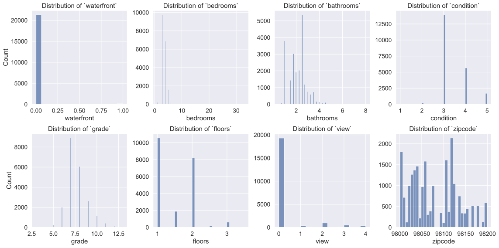
    


```python
address_outs = ["bedrooms", "bathrooms", "condition", "grade", "floors"]
fig, ax = plt.subplots(figsize=(10, 8))
ax = sns.boxplot(data=df[address_outs], ax=ax)
ax.set_xlabel("Feature", labelpad=10)
ax.set_ylabel("Various Units", labelpad=10)
ax.set_title("Outliers of Discrete Numeric Variables")
```


    Text(0.5, 1.0, 'Outliers of Discrete Numeric Variables')


    

    


My outlier adjustment procedure of choice for **skewed**, **discrete**, data is to "clip" all outliers to the Tukey boxplot fences. This means that instead of dropping outliers, I reset their values to the value of the nearest boxplot fence. This clipping approach is pretty clean for discrete variables, and doesn't produce weird spikes in the distribution like it does for continuous variables. It also saves me from having to drop thousands of observations from the dataset. Furthermore, it's more accurate than dropping the outliers, because it just reduces their weight while keeping them at the same end of the distribution.

I leave "view" and "waterfront" alone because the outlier algorithm reduces them to one value (zero). And "zipcode" should not be treated as a discrete numeric variable, so I leave it alone for now too.


```python
df[address_outs] = outliers.iqr_clip(df[address_outs])
plotting.multi_dist(df[address_outs], sp_height=4, ncols=4)
plt.tight_layout()
```


<div>
<style scoped>
    .dataframe tbody tr th:only-of-type {
        vertical-align: middle;
    }

    .dataframe tbody tr th {
        vertical-align: top;
    }

    .dataframe thead th {
        text-align: right;
    }
</style>
<table border="1" class="dataframe">
  <thead>
    <tr style="text-align: right;">
      <th></th>
      <th>n_clipped</th>
      <th>pct_clipped</th>
    </tr>
  </thead>
  <tbody>
    <tr>
      <th>bedrooms</th>
      <td>518</td>
      <td>2.418301</td>
    </tr>
    <tr>
      <th>bathrooms</th>
      <td>558</td>
      <td>2.605042</td>
    </tr>
    <tr>
      <th>condition</th>
      <td>28</td>
      <td>0.130719</td>
    </tr>
    <tr>
      <th>grade</th>
      <td>1889</td>
      <td>8.818861</td>
    </tr>
    <tr>
      <th>floors</th>
      <td>0</td>
      <td>0.000000</td>
    </tr>
    <tr>
      <th>total_obs</th>
      <td>2447</td>
      <td>11.423903</td>
    </tr>
  </tbody>
</table>
</div>


    
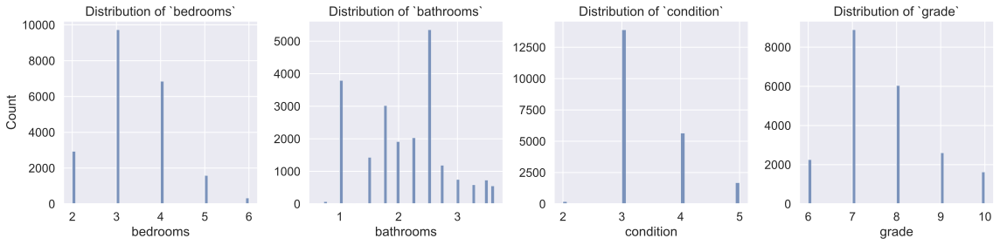
    


### Conversion of Categoricals
I convert "waterfront" and "zipcode" to categorical variables in-place, while creating new features prefixed with "cat_" for the rest. Being able to treat these discrete variables as categorical will afford me a lot of flexibility later on when it comes to building regression models.


```python
# some preliminary type conversions
df["waterfront"] = df["waterfront"].astype(np.bool_)
df["view"] = df["view"].astype("int64")

# convert waterfront and zipcode in place
df[["waterfront", "zipcode"]] = df[["waterfront", "zipcode"]].astype("category")

# copy the other candidates as ordered categories
to_cat = ["bedrooms", "bathrooms", "condition", "grade", "floors", "view"]
cat_df = df.loc[:, to_cat].astype("category")
for col in to_cat:
    cat_df[col].cat.as_ordered(inplace=True)

# prefix the copies and add to `df`
df = pd.concat([df, cat_df.add_prefix("cat_")], axis=1)

for col in df.filter(like="cat_").columns:
    display(col)
    display(df[col].cat.categories)
```


    'cat_bedrooms'


    Int64Index([2, 3, 4, 5, 6], dtype='int64')


    'cat_bathrooms'


    Float64Index([0.625, 0.75, 1.0, 1.25, 1.5, 1.75, 2.0, 2.25, 2.5, 2.75, 3.0,
                  3.25, 3.5, 3.625],
                 dtype='float64')


    'cat_condition'


    Int64Index([2, 3, 4, 5], dtype='int64')


    'cat_grade'


    Int64Index([6, 7, 8, 9, 10], dtype='int64')


    'cat_floors'


    Float64Index([1.0, 1.5, 2.0, 2.5, 3.0, 3.5], dtype='float64')


    'cat_view'


    Int64Index([0, 1, 2, 3, 4], dtype='int64')


## Scrub `zip_df`
Now to briefly deal with the zipcode dataset. First, I'll reduce it to only the relevant King County zipcodes.


```python
zip_df = zip_df.loc[df["zipcode"].unique()]
display(zip_df.shape)
zip_df.head()
```


    (70, 14)


<div>
<style scoped>
    .dataframe tbody tr th:only-of-type {
        vertical-align: middle;
    }

    .dataframe tbody tr th {
        vertical-align: top;
    }

    .dataframe thead th {
        text-align: right;
    }
</style>
<table border="1" class="dataframe">
  <thead>
    <tr style="text-align: right;">
      <th></th>
      <th>type</th>
      <th>decommissioned</th>
      <th>primary_city</th>
      <th>acceptable_cities</th>
      <th>unacceptable_cities</th>
      <th>state</th>
      <th>county</th>
      <th>timezone</th>
      <th>area_codes</th>
      <th>world_region</th>
      <th>country</th>
      <th>latitude</th>
      <th>longitude</th>
      <th>irs_estimated_population_2015</th>
    </tr>
    <tr>
      <th>zip</th>
      <th></th>
      <th></th>
      <th></th>
      <th></th>
      <th></th>
      <th></th>
      <th></th>
      <th></th>
      <th></th>
      <th></th>
      <th></th>
      <th></th>
      <th></th>
      <th></th>
    </tr>
  </thead>
  <tbody>
    <tr>
      <th>98178</th>
      <td>STANDARD</td>
      <td>0</td>
      <td>Seattle</td>
      <td>Tukwila</td>
      <td>Bryn Mawr, Skyway</td>
      <td>WA</td>
      <td>King County</td>
      <td>America/Los_Angeles</td>
      <td>206,253,425</td>
      <td>NaN</td>
      <td>US</td>
      <td>47.49</td>
      <td>-122.25</td>
      <td>23750</td>
    </tr>
    <tr>
      <th>98125</th>
      <td>STANDARD</td>
      <td>0</td>
      <td>Seattle</td>
      <td>NaN</td>
      <td>Lake City, Northgate</td>
      <td>WA</td>
      <td>King County</td>
      <td>America/Los_Angeles</td>
      <td>206</td>
      <td>NaN</td>
      <td>US</td>
      <td>47.71</td>
      <td>-122.30</td>
      <td>35640</td>
    </tr>
    <tr>
      <th>98028</th>
      <td>STANDARD</td>
      <td>0</td>
      <td>Kenmore</td>
      <td>Bothell</td>
      <td>NaN</td>
      <td>WA</td>
      <td>King County</td>
      <td>America/Los_Angeles</td>
      <td>425</td>
      <td>NaN</td>
      <td>US</td>
      <td>47.75</td>
      <td>-122.24</td>
      <td>21650</td>
    </tr>
    <tr>
      <th>98136</th>
      <td>STANDARD</td>
      <td>0</td>
      <td>Seattle</td>
      <td>NaN</td>
      <td>Westwood</td>
      <td>WA</td>
      <td>King County</td>
      <td>America/Los_Angeles</td>
      <td>206</td>
      <td>NaN</td>
      <td>US</td>
      <td>47.53</td>
      <td>-122.39</td>
      <td>14980</td>
    </tr>
    <tr>
      <th>98074</th>
      <td>STANDARD</td>
      <td>0</td>
      <td>Sammamish</td>
      <td>Redmond</td>
      <td>NaN</td>
      <td>WA</td>
      <td>King County</td>
      <td>America/Los_Angeles</td>
      <td>206,425</td>
      <td>NaN</td>
      <td>US</td>
      <td>47.62</td>
      <td>-122.02</td>
      <td>28270</td>
    </tr>
  </tbody>
</table>
</div>


Then, I'll reduce it to a handful of columns. Really, "primary_city" is the only one I care about, but I'll keep the population column to see if it leads anywhere. As sanity checks, I'll leave "state" and "county".

Fortunately, it looks like this small table doesn't need further cleaning.


```python
zip_df = zip_df.loc[:, ["primary_city", "state", "county", "irs_estimated_population_2015"]]
zip_df = zip_df.sort_index()
display(zip_df.shape)
cleaning.info(zip_df)
```


    (70, 4)


<div>
<style scoped>
    .dataframe tbody tr th:only-of-type {
        vertical-align: middle;
    }

    .dataframe tbody tr th {
        vertical-align: top;
    }

    .dataframe thead th {
        text-align: right;
    }
</style>
<table border="1" class="dataframe">
  <thead>
    <tr style="text-align: right;">
      <th></th>
      <th>dup</th>
      <th>dup_%</th>
      <th>nan</th>
      <th>nan_%</th>
      <th>uniq</th>
      <th>uniq_%</th>
    </tr>
  </thead>
  <tbody>
    <tr>
      <th>primary_city</th>
      <td>46</td>
      <td>65.71</td>
      <td>0</td>
      <td>0.0</td>
      <td>24</td>
      <td>34.29</td>
    </tr>
    <tr>
      <th>state</th>
      <td>69</td>
      <td>98.57</td>
      <td>0</td>
      <td>0.0</td>
      <td>1</td>
      <td>1.43</td>
    </tr>
    <tr>
      <th>county</th>
      <td>69</td>
      <td>98.57</td>
      <td>0</td>
      <td>0.0</td>
      <td>1</td>
      <td>1.43</td>
    </tr>
    <tr>
      <th>irs_estimated_population_2015</th>
      <td>0</td>
      <td>0.00</td>
      <td>0</td>
      <td>0.0</td>
      <td>70</td>
      <td>100.00</td>
    </tr>
  </tbody>
</table>
</div>


## Feature Engineering
Time to create some new features. I'll start by creating a "nearby_city" feature using "zipcode" from `df` and "primary_city" from `zip_df`. One thing I like about city names versus zipcodes is that they're easier to process as a human being.


```python
df["nearby_city"] = df["zipcode"].map(lambda x: zip_df.at[x, "primary_city"])
df["nearby_city"] = df["nearby_city"].astype("category")
df["nearby_city"].head()
```


    id
    7129300520      Seattle
    6414100192      Seattle
    5631500400      Kenmore
    2487200875      Seattle
    1954400510    Sammamish
    Name: nearby_city, dtype: category
    Categories (24, object): ['Auburn', 'Bellevue', 'Black Diamond', 'Bothell', ..., 'Seattle', 'Snoqualmie', 'Vashon', 'Woodinville']


I'll go ahead and add a column for zipcode population. I don't have high hopes for this feature, but might as well give it a try. A much more interesting feature would be population density, but unfortunately my zipcode dataset doesn't include any area data.


```python
df["zip_pop"] = df["zipcode"].map(lambda x: zip_df.at[x, "irs_estimated_population_2015"])
df["zip_pop"] = df["zip_pop"].astype("int64")
df["zip_pop"].head()
```


    id
    7129300520    23750
    6414100192    35640
    5631500400    21650
    2487200875    14980
    1954400510    28270
    Name: zip_pop, dtype: int64


```python
df.describe()
```


<div>
<style scoped>
    .dataframe tbody tr th:only-of-type {
        vertical-align: middle;
    }

    .dataframe tbody tr th {
        vertical-align: top;
    }

    .dataframe thead th {
        text-align: right;
    }
</style>
<table border="1" class="dataframe">
  <thead>
    <tr style="text-align: right;">
      <th></th>
      <th>price</th>
      <th>bedrooms</th>
      <th>bathrooms</th>
      <th>sqft_living</th>
      <th>sqft_lot</th>
      <th>floors</th>
      <th>view</th>
      <th>condition</th>
      <th>grade</th>
      <th>sqft_above</th>
      <th>sqft_basement</th>
      <th>yr_built</th>
      <th>sqft_living15</th>
      <th>sqft_lot15</th>
      <th>zip_pop</th>
    </tr>
  </thead>
  <tbody>
    <tr>
      <th>count</th>
      <td>2.142000e+04</td>
      <td>21420.000000</td>
      <td>21420.000000</td>
      <td>21420.000000</td>
      <td>2.142000e+04</td>
      <td>21420.000000</td>
      <td>21420.000000</td>
      <td>21420.000000</td>
      <td>21420.000000</td>
      <td>21420.000000</td>
      <td>21420.000000</td>
      <td>21420.000000</td>
      <td>21420.000000</td>
      <td>21420.000000</td>
      <td>21420.000000</td>
    </tr>
    <tr>
      <th>mean</th>
      <td>5.407393e+05</td>
      <td>3.376984</td>
      <td>2.101786</td>
      <td>2083.132633</td>
      <td>1.512804e+04</td>
      <td>1.495985</td>
      <td>0.233987</td>
      <td>3.412092</td>
      <td>7.647852</td>
      <td>1791.170215</td>
      <td>285.904342</td>
      <td>1971.092997</td>
      <td>1988.384080</td>
      <td>12775.718161</td>
      <td>31577.397759</td>
    </tr>
    <tr>
      <th>std</th>
      <td>3.679311e+05</td>
      <td>0.864801</td>
      <td>0.721039</td>
      <td>918.808412</td>
      <td>4.153080e+04</td>
      <td>0.540081</td>
      <td>0.765437</td>
      <td>0.646180</td>
      <td>1.066769</td>
      <td>828.692965</td>
      <td>440.008202</td>
      <td>29.387141</td>
      <td>685.537057</td>
      <td>27345.621867</td>
      <td>11576.945612</td>
    </tr>
    <tr>
      <th>min</th>
      <td>7.800000e+04</td>
      <td>2.000000</td>
      <td>0.625000</td>
      <td>370.000000</td>
      <td>5.200000e+02</td>
      <td>1.000000</td>
      <td>0.000000</td>
      <td>2.000000</td>
      <td>6.000000</td>
      <td>370.000000</td>
      <td>0.000000</td>
      <td>1900.000000</td>
      <td>399.000000</td>
      <td>651.000000</td>
      <td>3230.000000</td>
    </tr>
    <tr>
      <th>25%</th>
      <td>3.225000e+05</td>
      <td>3.000000</td>
      <td>1.750000</td>
      <td>1430.000000</td>
      <td>5.040000e+03</td>
      <td>1.000000</td>
      <td>0.000000</td>
      <td>3.000000</td>
      <td>7.000000</td>
      <td>1200.000000</td>
      <td>0.000000</td>
      <td>1952.000000</td>
      <td>1490.000000</td>
      <td>5100.000000</td>
      <td>23030.000000</td>
    </tr>
    <tr>
      <th>50%</th>
      <td>4.500000e+05</td>
      <td>3.000000</td>
      <td>2.250000</td>
      <td>1920.000000</td>
      <td>7.614000e+03</td>
      <td>1.500000</td>
      <td>0.000000</td>
      <td>3.000000</td>
      <td>7.000000</td>
      <td>1560.000000</td>
      <td>0.000000</td>
      <td>1975.000000</td>
      <td>1840.000000</td>
      <td>7620.000000</td>
      <td>31710.000000</td>
    </tr>
    <tr>
      <th>75%</th>
      <td>6.450000e+05</td>
      <td>4.000000</td>
      <td>2.500000</td>
      <td>2550.000000</td>
      <td>1.069050e+04</td>
      <td>2.000000</td>
      <td>0.000000</td>
      <td>4.000000</td>
      <td>8.000000</td>
      <td>2220.000000</td>
      <td>550.000000</td>
      <td>1997.000000</td>
      <td>2370.000000</td>
      <td>10086.250000</td>
      <td>40510.000000</td>
    </tr>
    <tr>
      <th>max</th>
      <td>7.700000e+06</td>
      <td>6.000000</td>
      <td>3.625000</td>
      <td>13540.000000</td>
      <td>1.651359e+06</td>
      <td>3.500000</td>
      <td>4.000000</td>
      <td>5.000000</td>
      <td>10.000000</td>
      <td>9410.000000</td>
      <td>4820.000000</td>
      <td>2015.000000</td>
      <td>6210.000000</td>
      <td>871200.000000</td>
      <td>65300.000000</td>
    </tr>
  </tbody>
</table>
</div>


The median of "sqft_basement" is 0.0, meaning that at least half of the houses have no basement. I'll turn this into a boolean categorical "has_basement".


```python
df["has_basement"] = (df["sqft_basement"] > 0).astype("category")
df.drop(columns="sqft_basement", inplace=True)
```

I find "age" more intuitive than "yr_built", not that it really matters.


```python
df["age"] = 2021 - df["yr_built"]
df.drop(columns="yr_built", inplace=True)
```

I create a categorical age variable, experimentally.


```python
new = pd.Interval(0, 10, closed="left")
mid_age = pd.Interval(10, 50, closed="left")
old = pd.Interval(50, 100, closed="left")
antique = pd.Interval(100, 130, closed="left")
df["cat_age"] = pd.cut(df["age"], pd.IntervalIndex([new, mid_age, old, antique]))
df["cat_age"] = df["cat_age"].cat.rename_categories(["new", "mid-age", "old", "antique"])
df["cat_age"].head()
```


    id
    7129300520        old
    6414100192        old
    5631500400        old
    2487200875        old
    1954400510    mid-age
    Name: cat_age, dtype: category
    Categories (4, object): ['new' < 'mid-age' < 'old' < 'antique']


I also create lot area categoricals, thinking it might help because the distributions are so skewed.


```python
quartile_labels = ["S", "M", "L", "XL"]
df["lot_area"] = pd.qcut(df["sqft_lot"], 4, quartile_labels)
df["lot15_area"] = pd.qcut(df["sqft_lot15"], 4, quartile_labels)
df[["lot_area", "lot15_area"]].head()
```


<div>
<style scoped>
    .dataframe tbody tr th:only-of-type {
        vertical-align: middle;
    }

    .dataframe tbody tr th {
        vertical-align: top;
    }

    .dataframe thead th {
        text-align: right;
    }
</style>
<table border="1" class="dataframe">
  <thead>
    <tr style="text-align: right;">
      <th></th>
      <th>lot_area</th>
      <th>lot15_area</th>
    </tr>
    <tr>
      <th>id</th>
      <th></th>
      <th></th>
    </tr>
  </thead>
  <tbody>
    <tr>
      <th>7129300520</th>
      <td>M</td>
      <td>M</td>
    </tr>
    <tr>
      <th>6414100192</th>
      <td>M</td>
      <td>L</td>
    </tr>
    <tr>
      <th>5631500400</th>
      <td>L</td>
      <td>L</td>
    </tr>
    <tr>
      <th>2487200875</th>
      <td>S</td>
      <td>S</td>
    </tr>
    <tr>
      <th>1954400510</th>
      <td>L</td>
      <td>M</td>
    </tr>
  </tbody>
</table>
</div>


Plots of the categorical features I created. None of them look too impressive.


```python
fig, axs = plt.subplots(ncols=2, nrows=2, sharey=True, figsize=(10, 10))
ax1, ax2 = axs[0, :]
ax3, ax4 = axs[1, :]
dot = 1
ax1 = sns.stripplot(data=df, x="lot_area", y="price", size=dot, ax=ax1)
ax2 = sns.stripplot(data=df, x="lot15_area", y="price", size=dot, ax=ax2)
ax3 = sns.stripplot(data=df, x="cat_age", y="price", size=dot, ax=ax3)
ax4 = sns.stripplot(data=df, x="has_basement", y="price", size=dot, ax=ax4)

for ax in axs.flat:
    ax.yaxis.set_major_formatter(plotting.big_money_formatter())
    ax.set_ylabel(ax.get_ylabel(), labelpad=10)
    ax.set_title(f"{ax.get_xlabel()} vs. {ax.get_ylabel()}")
fig.tight_layout()
```


    

    


### Feature Scaling

Since my goal is to create a highly interpretable model, I don't plan on using scaled data. Nonetheless, I create a scaled version of the dataset to set aside in case I want to experiment with it later. I scale all numeric features, first using the log10 function to normalize skewed distributions, and then using a min-max scaler to really equalize the magnitudes. I drop "view" and "condition", since they have 0s as values and I still have their categorical variants.


```python
scale_df = df.copy()
scale_df.drop(["view", "condition"], axis=1, inplace=True)
scale_df.update(utils.transform(scale_df.select_dtypes(np.number), pipe=[np.log10, minmax_scale]))
plotting.multi_dist(scale_df, sp_height=3, ncols=4)
plt.tight_layout()
```


    ['log10', 'minmax_scale']


    
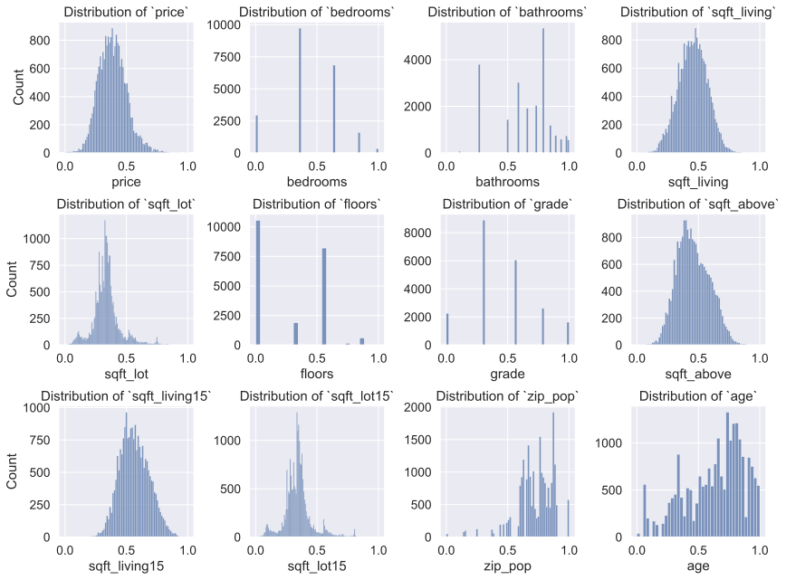
    


## Outlier Adjustment for Continuous Variables

Most of the continuous data is very right-skewed, and none of it is normal. In cases like "sqft_lot" there are clearly tons of outliers. This is a pretty bad situation to be in for linear regression, since outliers are liable to distort the coefficients.

Fortunately, I have a special algorithm for dealing with outliers for continuous variables, which I'll explain below.


```python
address_outs = ['price',
                'sqft_living',
                'sqft_lot',
                'sqft_above',
                'sqft_living15',
                'sqft_lot15',
                'zip_pop',
                'age']
plotting.multi_dist(df[address_outs], sp_height=3, ncols=4)
plt.tight_layout()
```


    

    


### Redistributing Outliers

I've already touched on the notion of "clipping" outliers to algorithmically determined limits. Earlier, I clipped the outliers of discrete variables to the Tukey fences located above and below the IQR at $1.5\times \text{IQR}$. I will continue to use the skewness-robust IQR method for identifying outliers, but I will avoid harshly clipping them to the Tukey fences. As you can see in the figure below, clipping the outliers of a continuous variable like "price" produces a giant spike in the distribution. I also don't want to drop the outliers, since that would mean losing thousands of observations. If one feature had 2,000 outliers and another had 0, I would still have to drop 2,000 observations across the board.

Since one of the most important assumptions for linear regression is the **homoscedasticity** (even variance) of the residuals, I can't afford to create any artificial spikes in the data. Furthermore, I don't want to use a transformation which will obscure the meaning of the model coefficients.

My solution is to redistribute the outliers or "tuck them in" to the main body of the distribution. More precisely, I move the outliers to uniformly distributed random positions between the IQR and the nearest Tukey fence. This sacrifices only a small amount of the dataset's accuracy, since outliers are only a small percentage of each sample. The outliers are still located on the same end of the distribution, but they are de-weighted without producing an artificial cluster on the fringe. In the figure below, the "Outliers Tucked" distribution looks almost the same as the "Outliers Dropped" distribution.


```python
outs, (original, tucked, clipped, dropped) = outliers.iqr_tuck_demo(df["price"])
fig, axs = plt.subplots(nrows=2, ncols=2, sharey=True, figsize=(12, 8))
sns.histplot(x=tucked, hue=outs, multiple="stack", palette="deep", ax=axs[0, 0])
sns.histplot(x=clipped, hue=outs, multiple="stack", palette="deep", ax=axs[0, 1])
sns.histplot(x=dropped, hue=outs, multiple="stack", palette="deep", ax=axs[1, 0])
sns.histplot(x=original, hue=outs, multiple="stack", palette="deep", ax=axs[1, 1])
iqr_color = sns.color_palette("deep")[3]
plotting.add_tukey_marks(original, axs[0, 0], iqr_color=iqr_color)
plotting.add_tukey_marks(original, axs[0, 1], iqr_color=iqr_color)
plotting.add_tukey_marks(original, axs[1, 0], iqr_color=iqr_color)
plotting.add_tukey_marks(original, axs[1, 1], iqr_color=iqr_color)
for ax in axs.flat:
    leg_texts = ax.get_legend().get_texts()
    leg_texts[0].set_text("Inliers")
    leg_texts[1].set_text("Outliers")
    ax.get_legend().set_title(None)
    ax.xaxis.set_major_formatter(plotting.big_money_formatter())
    ax.set_xlabel(original.name.title(), labelpad=10)
for ax in axs.flatten()[1:]:
    ax.get_legend().remove()
axs[0, 0].set_title("Outliers Tucked", pad=15)
axs[0, 1].set_title("Outliers Clipped", pad=15)
axs[1, 0].set_title("Outliers Dropped", pad=15)
axs[1, 1].set_title("Original Data", pad=15)
axs[1, 1].text(axs[1, 1].get_xlim()[1], axs[1, 1].get_ylim()[1] * 1.01, f"Outlier Count: {outs.sum()}", ha="right")
fig.tight_layout()
```


<div>
<style scoped>
    .dataframe tbody tr th:only-of-type {
        vertical-align: middle;
    }

    .dataframe tbody tr th {
        vertical-align: top;
    }

    .dataframe thead th {
        text-align: right;
    }
</style>
<table border="1" class="dataframe">
  <thead>
    <tr style="text-align: right;">
      <th></th>
      <th>n_tucked</th>
      <th>pct_tucked</th>
    </tr>
  </thead>
  <tbody>
    <tr>
      <th>price</th>
      <td>1151</td>
      <td>5.373483</td>
    </tr>
    <tr>
      <th>total_obs</th>
      <td>1151</td>
      <td>5.373483</td>
    </tr>
  </tbody>
</table>
</div>


    
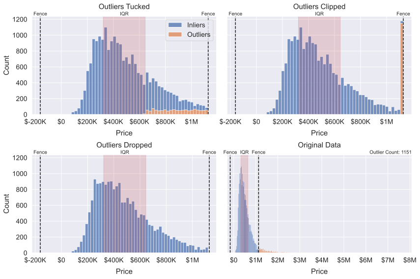
    


Here's a look at the outliers slated for redistribution. Note the stretch between the upper fence and the IQR box&mdash;that's where the outliers are going. Also note the enormous range of the outliers for some of these features.

I plot the distributions on a log scale so they can be compared despite their different orders of magnitude and units. The log scale has the effect of shrinking the apparent distance between the IQR and upper fence, so keep that in mind. The upper and lower fences are equidistant from the IQR.


```python
fig, ax = plt.subplots(figsize=(12,8))
sns.boxplot(data=df[address_outs], ax=ax)
ax.set_yscale("log")
ax.set_xlabel("Feature", labelpad=5)
ax.set_ylabel("Various Units")
ax.set_title("Outliers of Continuous Variables")
```


    Text(0.5, 1.0, 'Outliers of Continuous Variables')


    
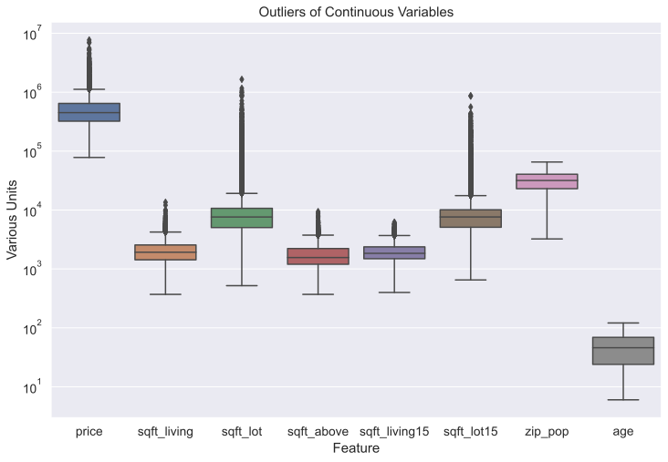
    


As you can see below, the "tucking" method results in some pretty clean distributions. I also avoid having to drop about 3,750 observations across the board (~17% of the data).

What's that? You say my method is ad-hoc? Just an excuse to shape the data however I want?

Well, it *is* a strategy for artificially normalizing the data as much as possible. Dealing with outliers is an artificial business, if "outliers" are understood simply as far-out data points. These points are genuine data points, reflective of reality, and as scientists we are saying, "let's just disregard them for modeling purposes." I would probably not use random redistribution if my focus was on descriptive statistics, but a certain amount of idealization is acceptable for modeling. A model is, after all, an idealized simplification of reality.


```python
address_outs = ['price',
                'sqft_living',
                'sqft_lot',
                'sqft_above',
                'sqft_living15',
                'sqft_lot15']
df[address_outs] = outliers.iqr_tuck(df[address_outs])
axs = plotting.multi_dist(df[address_outs], sp_height=4, ncols=3)
axs[0, 0].xaxis.set_major_formatter(plotting.big_money_formatter())
plt.tight_layout()
```


<div>
<style scoped>
    .dataframe tbody tr th:only-of-type {
        vertical-align: middle;
    }

    .dataframe tbody tr th {
        vertical-align: top;
    }

    .dataframe thead th {
        text-align: right;
    }
</style>
<table border="1" class="dataframe">
  <thead>
    <tr style="text-align: right;">
      <th></th>
      <th>n_tucked</th>
      <th>pct_tucked</th>
    </tr>
  </thead>
  <tbody>
    <tr>
      <th>price</th>
      <td>1151</td>
      <td>5.373483</td>
    </tr>
    <tr>
      <th>sqft_living</th>
      <td>568</td>
      <td>2.651727</td>
    </tr>
    <tr>
      <th>sqft_lot</th>
      <td>2406</td>
      <td>11.232493</td>
    </tr>
    <tr>
      <th>sqft_above</th>
      <td>600</td>
      <td>2.801120</td>
    </tr>
    <tr>
      <th>sqft_living15</th>
      <td>503</td>
      <td>2.348273</td>
    </tr>
    <tr>
      <th>sqft_lot15</th>
      <td>2174</td>
      <td>10.149393</td>
    </tr>
    <tr>
      <th>total_obs</th>
      <td>3747</td>
      <td>17.492997</td>
    </tr>
  </tbody>
</table>
</div>


    
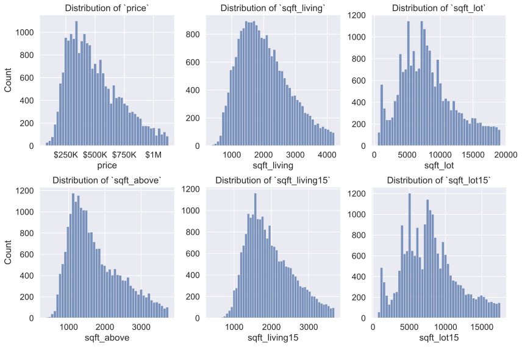
    


### Outlier Removal for Scaled Dataset
For the scaled version of the dataset&mdash;which is already pretty normal&mdash;I simply drop the points with an absolute Z-score greater than 3. Unfortunately, I haven't had a chance to implement standard-score-based tucking yet. That would be my method of choice for normally distributed continuous data.


```python
scale_df[address_outs] = outliers.z_drop(scale_df[address_outs])
axs = plotting.multi_dist(scale_df[address_outs], sp_height=4, ncols=3)
axs[0, 0].xaxis.set_major_formatter(plotting.big_money_formatter())
plt.tight_layout()
```


<div>
<style scoped>
    .dataframe tbody tr th:only-of-type {
        vertical-align: middle;
    }

    .dataframe tbody tr th {
        vertical-align: top;
    }

    .dataframe thead th {
        text-align: right;
    }
</style>
<table border="1" class="dataframe">
  <thead>
    <tr style="text-align: right;">
      <th></th>
      <th>n_dropped</th>
      <th>pct_dropped</th>
    </tr>
  </thead>
  <tbody>
    <tr>
      <th>price</th>
      <td>169</td>
      <td>0.788982</td>
    </tr>
    <tr>
      <th>sqft_living</th>
      <td>59</td>
      <td>0.275444</td>
    </tr>
    <tr>
      <th>sqft_lot</th>
      <td>378</td>
      <td>1.764706</td>
    </tr>
    <tr>
      <th>sqft_above</th>
      <td>40</td>
      <td>0.186741</td>
    </tr>
    <tr>
      <th>sqft_living15</th>
      <td>32</td>
      <td>0.149393</td>
    </tr>
    <tr>
      <th>sqft_lot15</th>
      <td>385</td>
      <td>1.797386</td>
    </tr>
    <tr>
      <th>total_obs</th>
      <td>738</td>
      <td>3.445378</td>
    </tr>
  </tbody>
</table>
</div>


    
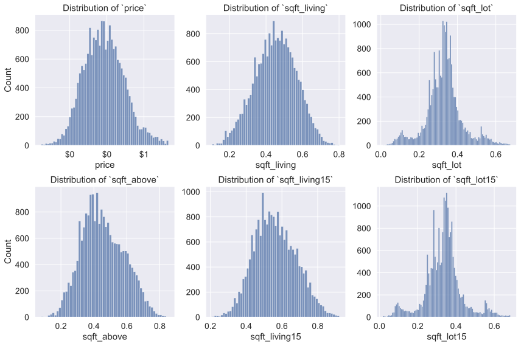
    


I pickle the cleaned and normalized data for use in "sweeps.py" and for general safe-keeping.


```python
dst1 = os.path.join("data", "scrubbed_kc_house_data.pkl.bz2")
dst2 = os.path.join("data", "scaled_kc_house_data.pkl.bz2")
df.to_pickle(dst1)
scale_df.to_pickle(dst2)
```

# Exploration
## Correlation Heatmaps

I begin exploring the data by plotting the pairwise correlation of (numeric) features. Besides being generally interesting, it's crucial to get a sense of the pairwise correlation of features so that I know which features cannot be modeled together. Highly correlated features will distort the coefficients of a multiple regression model, because the predictors are assumed to be largely independent of each other. If they're not, then their coefficients may not accurately reflect their individual effects on the target variable.


```python
ax = plotting.pair_corr_heatmap(df, scale=.65)
```


    
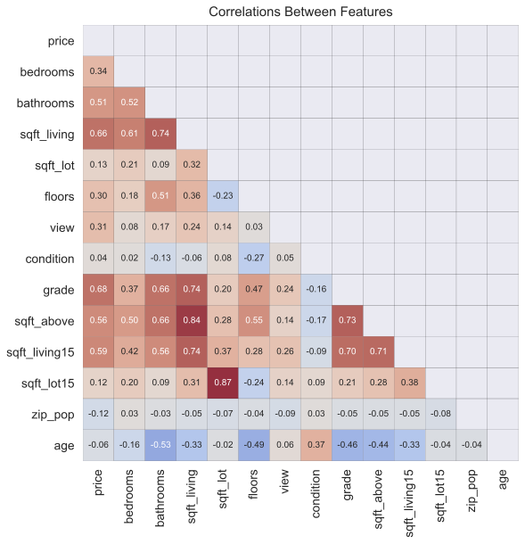
    


Looks like "sqft_living", "sqft_above", "sqft_living15", and "grade" have some high correlations with each other.


```python
ax = plotting.pair_corr_heatmap(df, high_corr=.7, scale=.65)
```


    
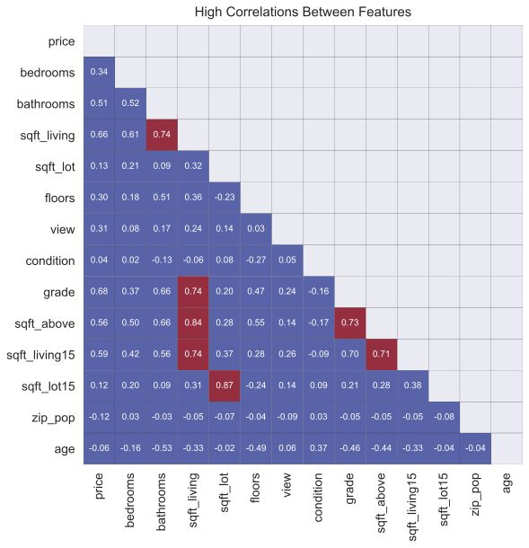
    


The zipcodes don't have any high correlations, and their correlations with price are pretty weak. One zipcode stands out with a $0.5$ correlation with "zip_pop".


```python
plotting.frame_corr_heatmap(df, "zipcode", fmt=".1f", square=True, scale=.4)
```


    <AxesSubplot:title={'center':'Correlation with Numeric Features'}, xlabel='Numeric Features', ylabel='Zipcode'>


    
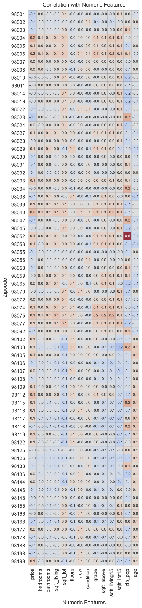
    


The city heatmap looks similar to the zipcodes, except that Seattle stands out with a number of negative correlations to things like "sqft_lot", "sqft_above", and "age". All of these things make sense for Seattle.


```python
plotting.frame_corr_heatmap(df, "nearby_city", fmt=".1f", scale=.45)
```


    <AxesSubplot:title={'center':'Correlation with Numeric Features'}, xlabel='Numeric Features', ylabel='Nearby City'>


    
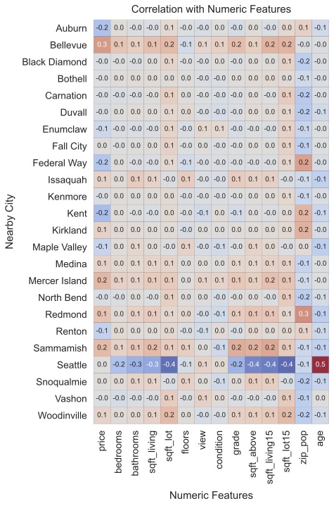
    


It also makes sense that Seattle dwarfs the other cities in terms of data points.


```python
city_pal = plotting.cat_palette("deep", df["nearby_city"].unique(), desat=0.85)
fig, ax = plt.subplots(figsize=(6,10))
ax = plotting.simple_barplot(df.groupby("nearby_city").count().reset_index(), 
                            "nearby_city", 
                            "price", 
                            orient="h", 
                            sort="desc", 
                            palette=city_pal,
                            ax=ax)
ax.set_xlabel("Count")
ax.set_ylabel("City")
ax.set_title("Nearby City Counts")
plotting.annot_bars(ax, format_spec="{x:,.0f}", dist=.1)
```


    <AxesSubplot:title={'center':'Nearby City Counts'}, xlabel='Count', ylabel='City'>


    
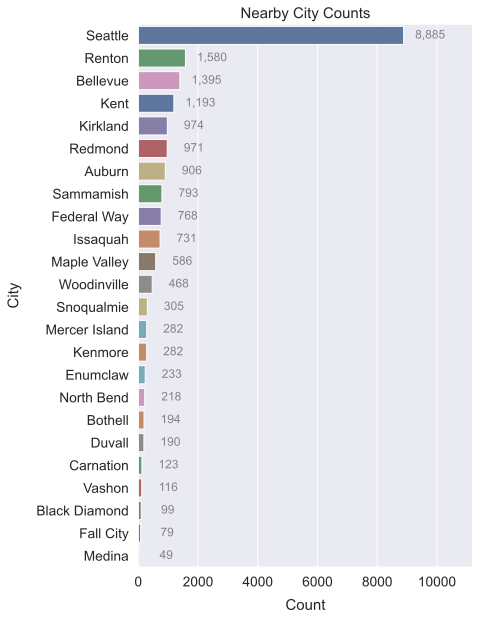
    


Not super strong correlations, but definitely varied. Bellevue is the frontrunner with $0.26$ while Seattle sits at $0.00$ and Kent sits at $-0.22$.


```python
city_corr = pd.get_dummies(df["nearby_city"]).corrwith(df["price"])
fig, ax = plt.subplots(figsize=(8, 10))
ax = plotting.heated_barplot(city_corr, ax=ax)
ax.set_title("Correlation: Nearby City and Price")
ax.set_ylabel(None, labelpad=10)
ax.set_xlabel("Correlation", labelpad=10)
plotting.annot_bars(ax, dist=.15, compact=False, fontsize=12, alpha=.5)
```


    <AxesSubplot:title={'center':'Correlation: Nearby City and Price'}, xlabel='Correlation'>


    

    


Bellevue and Mercer Island are towards the top of the medians graph, but at the very top is Medina. That's kind of surprising, given it's lowish correlation with price.


```python
fig, ax = plt.subplots(figsize=(6,10))
ax = plotting.simple_barplot(df, "nearby_city", "price", estimator=np.median, orient="h", sort="desc", ax=ax, palette=city_pal)
ax.xaxis.set_major_formatter(plotting.big_money_formatter(2))
```


    
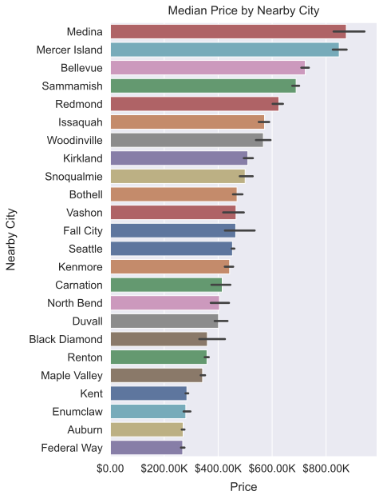
    


Let me remind myself what other categoricals there are to explore.


```python
df.select_dtypes("category").head()
```


<div>
<style scoped>
    .dataframe tbody tr th:only-of-type {
        vertical-align: middle;
    }

    .dataframe tbody tr th {
        vertical-align: top;
    }

    .dataframe thead th {
        text-align: right;
    }
</style>
<table border="1" class="dataframe">
  <thead>
    <tr style="text-align: right;">
      <th></th>
      <th>waterfront</th>
      <th>zipcode</th>
      <th>cat_bedrooms</th>
      <th>cat_bathrooms</th>
      <th>cat_condition</th>
      <th>cat_grade</th>
      <th>cat_floors</th>
      <th>cat_view</th>
      <th>nearby_city</th>
      <th>has_basement</th>
      <th>cat_age</th>
      <th>lot_area</th>
      <th>lot15_area</th>
    </tr>
    <tr>
      <th>id</th>
      <th></th>
      <th></th>
      <th></th>
      <th></th>
      <th></th>
      <th></th>
      <th></th>
      <th></th>
      <th></th>
      <th></th>
      <th></th>
      <th></th>
      <th></th>
    </tr>
  </thead>
  <tbody>
    <tr>
      <th>7129300520</th>
      <td>False</td>
      <td>98178</td>
      <td>3</td>
      <td>1.00</td>
      <td>3</td>
      <td>7</td>
      <td>1.0</td>
      <td>0</td>
      <td>Seattle</td>
      <td>False</td>
      <td>old</td>
      <td>M</td>
      <td>M</td>
    </tr>
    <tr>
      <th>6414100192</th>
      <td>False</td>
      <td>98125</td>
      <td>3</td>
      <td>2.25</td>
      <td>3</td>
      <td>7</td>
      <td>2.0</td>
      <td>0</td>
      <td>Seattle</td>
      <td>True</td>
      <td>old</td>
      <td>M</td>
      <td>L</td>
    </tr>
    <tr>
      <th>5631500400</th>
      <td>False</td>
      <td>98028</td>
      <td>2</td>
      <td>1.00</td>
      <td>3</td>
      <td>6</td>
      <td>1.0</td>
      <td>0</td>
      <td>Kenmore</td>
      <td>False</td>
      <td>old</td>
      <td>L</td>
      <td>L</td>
    </tr>
    <tr>
      <th>2487200875</th>
      <td>False</td>
      <td>98136</td>
      <td>4</td>
      <td>3.00</td>
      <td>5</td>
      <td>7</td>
      <td>1.0</td>
      <td>0</td>
      <td>Seattle</td>
      <td>True</td>
      <td>old</td>
      <td>S</td>
      <td>S</td>
    </tr>
    <tr>
      <th>1954400510</th>
      <td>False</td>
      <td>98074</td>
      <td>3</td>
      <td>2.00</td>
      <td>3</td>
      <td>8</td>
      <td>1.0</td>
      <td>0</td>
      <td>Sammamish</td>
      <td>False</td>
      <td>mid-age</td>
      <td>L</td>
      <td>M</td>
    </tr>
  </tbody>
</table>
</div>


A lot of trivial strong correlations here, like "lot_area_XL" with "sqft_lot", or "cat_bathrooms_1.0" and "bathrooms". Some of the correlations in the "age" column are interesting but not particularly relevant, like the $0.4$ with "cat_bathrooms_1.0". It's also interesting that "view" has a $0.4$ with "waterfront_True".

Correlations with price are relatively weak.


```python
cats = ["waterfront", "has_basement", "lot_area", "lot15_area", "cat_bathrooms"]
plotting.frame_corr_heatmap(df, cats, fmt=".1f", scale=.4)
```


    <AxesSubplot:title={'center':'Correlation with Numeric Features'}, xlabel='Numeric Features', ylabel='Categorical Features'>


    
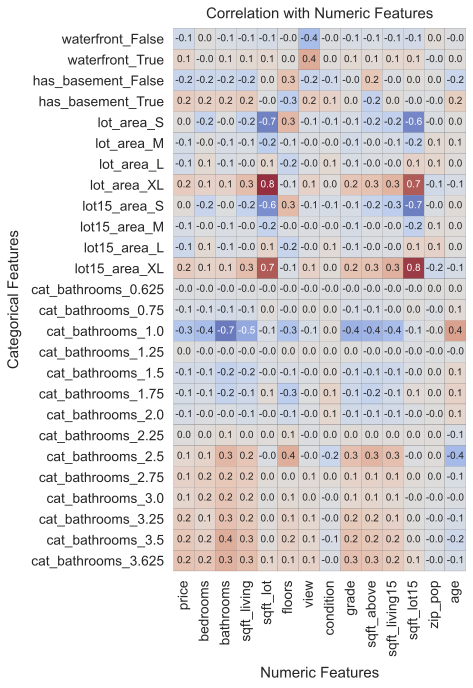
    


Yep, nothing but trivial and expected high correlations. 


```python
plotting.frame_corr_heatmap(df, cats, high_corr=0.7, fmt=".1f", scale=.4)
```


    <AxesSubplot:title={'center':'High Correlation with Numeric Features'}, xlabel='Numeric Features', ylabel='Categorical Features'>


    
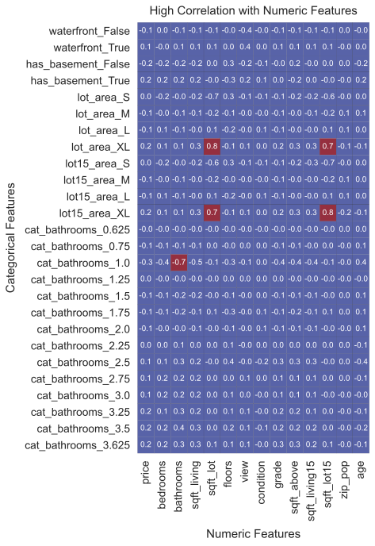
    


Here we have some more trivial high correlations, and a variety of mid-range correlations, like "cat_grade_10" with "price". There's a lot of information here.


```python
cats = ["cat_bedrooms", "cat_floors", "cat_age", "cat_condition", "cat_view", "cat_grade"]
plotting.frame_corr_heatmap(df, cats, fmt=".1f", scale=.4)
```


    <AxesSubplot:title={'center':'Correlation with Numeric Features'}, xlabel='Numeric Features', ylabel='Categorical Features'>


    
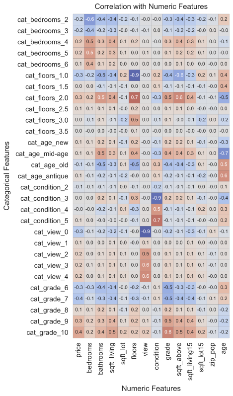
    


That's better. As far as multicollinearity is concerned, nothing but predictable conflicts.


```python
plotting.frame_corr_heatmap(df, cats, high_corr=.7, fmt=".1f", scale=.4)
```


    <AxesSubplot:title={'center':'High Correlation with Numeric Features'}, xlabel='Numeric Features', ylabel='Categorical Features'>


    
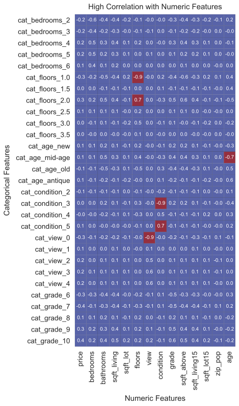
    


## Checking Linearity

Looks like all the numeric variables are either linearly related to price or just noisily related to price. There are no curves or anything like that.


```python
plotting.linearity_scatters(df, "price", s=5, sp_height=4, ncols=3, yformatter=plotting.big_money_formatter());
```


    

    


## Other Observations

Bathroom count has a pretty strong positive relationship with price.


```python
fig, ax = plt.subplots(figsize=(8, 5))
sns.lineplot(data=df.query("bathrooms > 1.5"), x="bathrooms", y="price", estimator=np.median, lw=3)
ax.yaxis.set_major_formatter(plotting.big_money_formatter())
ax.set_ylabel("Price", labelpad=10)
ax.set_xlabel("Bathrooms", labelpad=10)
ax.set_title("Median Price by Bathroom Count")
```


    Text(0.5, 1.0, 'Median Price by Bathroom Count')


    
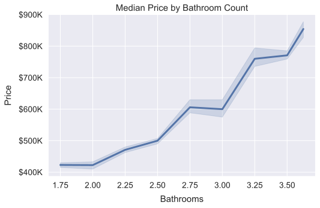
    


Age category actually does have a pretty intuitive relationship with price.


```python
df["cat_age"] = df["cat_age"].cat.rename_categories(["New", "Mid-Age", "Old", "Antique"])
fig, ax = plt.subplots(figsize=(8, 5))
sns.lineplot(data=df, x="cat_age", y="price", lw=3, ax=ax, estimator=np.median)
ax.yaxis.set_major_formatter(plotting.big_money_formatter())
ax.set_ylabel("Price", labelpad=10)
ax.set_xlabel("Age", labelpad=10)
ax.set_title("Median Price by Age Category")
```


    Text(0.5, 1.0, 'Median Price by Age Category')


    
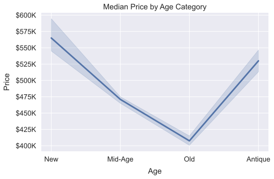
    


# Model Building
I've built models for every relevant feature combination and recorded their most important stats. I'll use this sweep data to select features for my model.

See the auxiliary notebook "sweeps.ipynb".


```python
sweeps = list(map(pd.read_json, glob.glob("test_models/ols_sweep/*.json")))
for i, sweep in enumerate(sweeps):
    sweeps[i]["bp_hetero"] = sweeps[i].bp_lm_pval < 0.05
    sweeps[i]["n_vars"] = i + 1
sweeps = pd.concat(sweeps, axis=0).sort_index(ascending=False, axis=1)
sweeps.query("n_vars == 1").sort_values("rsquared_adj", ascending=False).head(5)
```


    ---------------------------------------------------------------------------

    NameError                                 Traceback (most recent call last)

    <ipython-input-49-16ae11c76101> in <module>
    ----> 1 sweeps = list(map(pd.read_json, glob.glob("test_models/ols_sweep/*.json")))
          2 for i, sweep in enumerate(sweeps):
          3     sweeps[i]["bp_hetero"] = sweeps[i].bp_lm_pval < 0.05
          4     sweeps[i]["n_vars"] = i + 1
          5 sweeps = pd.concat(sweeps, axis=0).sort_index(ascending=False, axis=1)
    

    NameError: name 'glob' is not defined


Wow. Looks like the residuals of every test model are non-normally distributed, judging by the high Jarque-Bera (JB) scores and low JB p-values. Also looks like nearly all test models are ruled heteroscedastic by the Breusch Pagan test (BP), judging by the high Lagrange Multipliers and low p-values.


```python
sweeps[["jb", "jbpv", "bp_lm", "bp_lm_pval"]].describe()
```


<div>
<style scoped>
    .dataframe tbody tr th:only-of-type {
        vertical-align: middle;
    }

    .dataframe tbody tr th {
        vertical-align: top;
    }

    .dataframe thead th {
        text-align: right;
    }
</style>
<table border="1" class="dataframe">
  <thead>
    <tr style="text-align: right;">
      <th></th>
      <th>jb</th>
      <th>jbpv</th>
      <th>bp_lm</th>
      <th>bp_lm_pval</th>
    </tr>
  </thead>
  <tbody>
    <tr>
      <th>count</th>
      <td>4943.000000</td>
      <td>4.943000e+03</td>
      <td>4943.000000</td>
      <td>4.943000e+03</td>
    </tr>
    <tr>
      <th>mean</th>
      <td>2881.750417</td>
      <td>5.371742e-187</td>
      <td>1438.206645</td>
      <td>5.029646e-05</td>
    </tr>
    <tr>
      <th>std</th>
      <td>2041.816656</td>
      <td>0.000000e+00</td>
      <td>883.868998</td>
      <td>1.640042e-03</td>
    </tr>
    <tr>
      <th>min</th>
      <td>842.073665</td>
      <td>0.000000e+00</td>
      <td>3.602972</td>
      <td>0.000000e+00</td>
    </tr>
    <tr>
      <th>25%</th>
      <td>1359.046034</td>
      <td>0.000000e+00</td>
      <td>609.683010</td>
      <td>0.000000e+00</td>
    </tr>
    <tr>
      <th>50%</th>
      <td>2225.782119</td>
      <td>0.000000e+00</td>
      <td>1540.235531</td>
      <td>1.424673e-278</td>
    </tr>
    <tr>
      <th>75%</th>
      <td>3615.337013</td>
      <td>7.719287e-296</td>
      <td>2208.130446</td>
      <td>3.400408e-126</td>
    </tr>
    <tr>
      <th>max</th>
      <td>9601.311391</td>
      <td>1.399674e-183</td>
      <td>3455.555646</td>
      <td>6.753584e-02</td>
    </tr>
  </tbody>
</table>
</div>


Since I'm working with skewed and untransformed data for maximum interpretability, I have to relax my standards for residual homoscedasticity and normality. Nevertheless, I do maintain some loose standard. Let's cut the JB off at $3,500$, and cut the BP Lagrange Multiplier off at $3,200$, after the second curves of the histograms below. Since this is essentially to ignore the BP test, I'll have to keep an eye on the homoscedasticity diagnostic plots.


```python
sweeps_elig = sweeps.query("(jb < 3500) & (bp_lm < 3200)")
axs = plotting.multi_dist(sweeps[["jb", "bp_lm"]], ncols=2, sp_height=5)
axs[0].axvline(3500, color="r")
axs[1].axvline(3200, color="r")
```


    <matplotlib.lines.Line2D at 0x23c61592250>


    
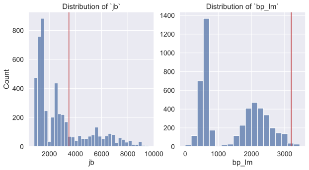
    


```python
imp_stats = ["bad_pvals", "bp_lm", "jb", "high_corr_exog", "f_pval", "rsquared_adj"]
select_v1 = sweeps_elig.query("(n_vars == 1)")
select_v1 = select_v1[imp_stats]
select_v1.sort_values("rsquared_adj", ascending=False).head()
```


<div>
<style scoped>
    .dataframe tbody tr th:only-of-type {
        vertical-align: middle;
    }

    .dataframe tbody tr th {
        vertical-align: top;
    }

    .dataframe thead th {
        text-align: right;
    }
</style>
<table border="1" class="dataframe">
  <thead>
    <tr style="text-align: right;">
      <th></th>
      <th>bad_pvals</th>
      <th>bp_lm</th>
      <th>jb</th>
      <th>high_corr_exog</th>
      <th>f_pval</th>
      <th>rsquared_adj</th>
    </tr>
  </thead>
  <tbody>
    <tr>
      <th>price~C(cat_grade)</th>
      <td>0</td>
      <td>512.922377</td>
      <td>1885.139189</td>
      <td>0</td>
      <td>0.0</td>
      <td>0.464451</td>
    </tr>
    <tr>
      <th>price~grade</th>
      <td>0</td>
      <td>223.382915</td>
      <td>1590.023602</td>
      <td>0</td>
      <td>0.0</td>
      <td>0.459713</td>
    </tr>
    <tr>
      <th>price~sqft_living</th>
      <td>0</td>
      <td>595.346643</td>
      <td>919.709138</td>
      <td>0</td>
      <td>0.0</td>
      <td>0.439314</td>
    </tr>
    <tr>
      <th>price~sqft_living15</th>
      <td>0</td>
      <td>200.747072</td>
      <td>1755.017038</td>
      <td>0</td>
      <td>0.0</td>
      <td>0.350103</td>
    </tr>
    <tr>
      <th>price~sqft_above</th>
      <td>0</td>
      <td>411.681402</td>
      <td>1313.153232</td>
      <td>0</td>
      <td>0.0</td>
      <td>0.313609</td>
    </tr>
  </tbody>
</table>
</div>


Zipcode is the clear winner on $r^2_{adj}$ but it's over the BP cutoff and it has many bad p-values ("bad_pvals"). On the other hand, "cat_grade" has none of these problems. I could also go with the non-categorical "grade", but it's highly correlated with other features like "sqft_living". Looks like "cat_grade" is the best choice.


```python
ax = plotting.simple_barplot(sweeps.query("n_vars == 1").reset_index(),
                            "index",
                            "rsquared_adj",
                            orient="h",
                            sort="desc",
                            palette=sns.color_palette("deep", n_colors=14, desat=0.85))
ax.set_xlabel("Adjusted R-squared", labelpad=10)
ax.set_ylabel("Formula")
ax.set_title("Fit: Simple Regression Models", pad=10)
```


    Text(0.5, 1.0, 'Fit: Simple Regression Models')


    
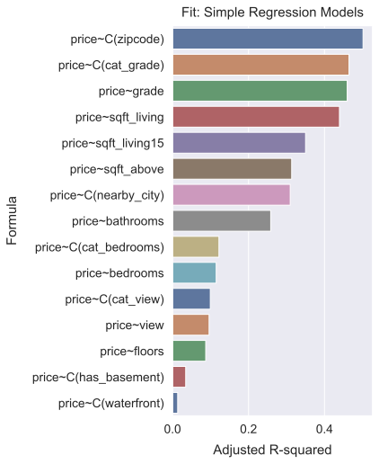
    


Despite the bad Jarque-Bera and Omnibus results, the residuals look relatively normal. They're about as normal as one could hope for with this dataset, since I'm avoiding using the scaled data to preserve interpretability.


```python
modeling.ols_model(df, "price~C(cat_grade)")
```


<table class="simpletable">
<caption>OLS Regression Results</caption>
<tr>
  <th>Dep. Variable:</th>          <td>price</td>      <th>  R-squared:         </th>  <td>   0.465</td>  
</tr>
<tr>
  <th>Model:</th>                   <td>OLS</td>       <th>  Adj. R-squared:    </th>  <td>   0.464</td>  
</tr>
<tr>
  <th>Method:</th>             <td>Least Squares</td>  <th>  F-statistic:       </th>  <td>   4645.</td>  
</tr>
<tr>
  <th>Date:</th>             <td>Sun, 02 May 2021</td> <th>  Prob (F-statistic):</th>   <td>  0.00</td>   
</tr>
<tr>
  <th>Time:</th>                 <td>09:53:40</td>     <th>  Log-Likelihood:    </th> <td>-2.8765e+05</td>
</tr>
<tr>
  <th>No. Observations:</th>      <td> 21420</td>      <th>  AIC:               </th>  <td>5.753e+05</td> 
</tr>
<tr>
  <th>Df Residuals:</th>          <td> 21415</td>      <th>  BIC:               </th>  <td>5.754e+05</td> 
</tr>
<tr>
  <th>Df Model:</th>              <td>     4</td>      <th>                     </th>      <td> </td>     
</tr>
<tr>
  <th>Covariance Type:</th>      <td>nonrobust</td>    <th>                     </th>      <td> </td>     
</tr>
</table>
<table class="simpletable">
<tr>
           <td></td>             <th>coef</th>     <th>std err</th>      <th>t</th>      <th>P>|t|</th>  <th>[0.025</th>    <th>0.975]</th>  
</tr>
<tr>
  <th>Intercept</th>          <td> 2.949e+05</td> <td> 3461.191</td> <td>   85.195</td> <td> 0.000</td> <td> 2.88e+05</td> <td> 3.02e+05</td>
</tr>
<tr>
  <th>C(cat_grade)[T.7]</th>  <td> 1.066e+05</td> <td> 3875.776</td> <td>   27.505</td> <td> 0.000</td> <td>  9.9e+04</td> <td> 1.14e+05</td>
</tr>
<tr>
  <th>C(cat_grade)[T.8]</th>  <td> 2.382e+05</td> <td> 4056.560</td> <td>   58.723</td> <td> 0.000</td> <td>  2.3e+05</td> <td> 2.46e+05</td>
</tr>
<tr>
  <th>C(cat_grade)[T.9]</th>  <td> 4.147e+05</td> <td> 4728.142</td> <td>   87.704</td> <td> 0.000</td> <td> 4.05e+05</td> <td> 4.24e+05</td>
</tr>
<tr>
  <th>C(cat_grade)[T.10]</th> <td> 5.558e+05</td> <td> 5347.754</td> <td>  103.933</td> <td> 0.000</td> <td> 5.45e+05</td> <td> 5.66e+05</td>
</tr>
</table>
<table class="simpletable">
<tr>
  <th>Omnibus:</th>       <td>1495.536</td> <th>  Durbin-Watson:     </th> <td>   1.965</td>
</tr>
<tr>
  <th>Prob(Omnibus):</th>  <td> 0.000</td>  <th>  Jarque-Bera (JB):  </th> <td>1885.139</td>
</tr>
<tr>
  <th>Skew:</th>           <td> 0.656</td>  <th>  Prob(JB):          </th> <td>    0.00</td>
</tr>
<tr>
  <th>Kurtosis:</th>       <td> 3.626</td>  <th>  Cond. No.          </th> <td>    8.31</td>
</tr>
</table><br/><br/>Notes:<br/>[1] Standard Errors assume that the covariance matrix of the errors is correctly specified.


<div>
<style scoped>
    .dataframe tbody tr th:only-of-type {
        vertical-align: middle;
    }

    .dataframe tbody tr th {
        vertical-align: top;
    }

    .dataframe thead th {
        text-align: right;
    }
</style>
<table border="1" class="dataframe">
  <thead>
    <tr style="text-align: right;">
      <th></th>
      <th>breusch_pagan</th>
    </tr>
  </thead>
  <tbody>
    <tr>
      <th>lm</th>
      <td>5.129224e+02</td>
    </tr>
    <tr>
      <th>lm_pval</th>
      <td>1.074071e-109</td>
    </tr>
    <tr>
      <th>f_val</th>
      <td>1.313459e+02</td>
    </tr>
    <tr>
      <th>f_pval</th>
      <td>5.035264e-111</td>
    </tr>
  </tbody>
</table>
</div>


<div>
<style scoped>
    .dataframe tbody tr th:only-of-type {
        vertical-align: middle;
    }

    .dataframe tbody tr th {
        vertical-align: top;
    }

    .dataframe thead th {
        text-align: right;
    }
</style>
<table border="1" class="dataframe">
  <thead>
    <tr style="text-align: right;">
      <th></th>
      <th>bad_pvalue</th>
    </tr>
  </thead>
  <tbody>
  </tbody>
</table>
</div>


    <statsmodels.regression.linear_model.RegressionResultsWrapper at 0x23c641aae50>


    

    


I'll decide on what features to add by combing through my sweep results. Here I only look at models which involve one of the "grade" features.

My coarse-grained location variable "nearby_city" looks to be the best overall choice. Looks like the sweep model had one bad p-value, but one bad p-value isn't so bad. I'll switch to numeric "grade", since it has slightly better JB and BP scores.


```python
select_v2 = sweeps_elig.query("(n_vars == 2)")
select_v2 = select_v2[imp_stats]
select_v2.sort_values("rsquared_adj", ascending=False, inplace=True)
select_v2.filter(like="grade", axis=0)
```


<div>
<style scoped>
    .dataframe tbody tr th:only-of-type {
        vertical-align: middle;
    }

    .dataframe tbody tr th {
        vertical-align: top;
    }

    .dataframe thead th {
        text-align: right;
    }
</style>
<table border="1" class="dataframe">
  <thead>
    <tr style="text-align: right;">
      <th></th>
      <th>bad_pvals</th>
      <th>bp_lm</th>
      <th>jb</th>
      <th>high_corr_exog</th>
      <th>f_pval</th>
      <th>rsquared_adj</th>
    </tr>
  </thead>
  <tbody>
    <tr>
      <th>price~C(cat_grade)+C(nearby_city)</th>
      <td>1</td>
      <td>1806.586055</td>
      <td>2911.015096</td>
      <td>0</td>
      <td>0.0</td>
      <td>0.628702</td>
    </tr>
    <tr>
      <th>price~grade+C(nearby_city)</th>
      <td>1</td>
      <td>1751.913187</td>
      <td>2703.124654</td>
      <td>0</td>
      <td>0.0</td>
      <td>0.626640</td>
    </tr>
    <tr>
      <th>price~sqft_living+C(cat_grade)</th>
      <td>0</td>
      <td>626.659656</td>
      <td>1566.811883</td>
      <td>0</td>
      <td>0.0</td>
      <td>0.520488</td>
    </tr>
    <tr>
      <th>price~sqft_living+grade</th>
      <td>0</td>
      <td>381.808508</td>
      <td>1379.151942</td>
      <td>1</td>
      <td>0.0</td>
      <td>0.517303</td>
    </tr>
    <tr>
      <th>price~C(cat_grade)+C(has_basement)</th>
      <td>0</td>
      <td>585.830121</td>
      <td>1807.669052</td>
      <td>0</td>
      <td>0.0</td>
      <td>0.492617</td>
    </tr>
    <tr>
      <th>price~sqft_living15+C(cat_grade)</th>
      <td>0</td>
      <td>677.962068</td>
      <td>1605.199529</td>
      <td>0</td>
      <td>0.0</td>
      <td>0.490379</td>
    </tr>
    <tr>
      <th>price~C(cat_grade)+C(cat_view)</th>
      <td>0</td>
      <td>525.562893</td>
      <td>1607.974049</td>
      <td>0</td>
      <td>0.0</td>
      <td>0.489140</td>
    </tr>
    <tr>
      <th>price~grade+sqft_living15</th>
      <td>0</td>
      <td>407.416938</td>
      <td>1408.494877</td>
      <td>0</td>
      <td>0.0</td>
      <td>0.487628</td>
    </tr>
    <tr>
      <th>price~view+C(cat_grade)</th>
      <td>0</td>
      <td>535.001454</td>
      <td>1596.607072</td>
      <td>0</td>
      <td>0.0</td>
      <td>0.487026</td>
    </tr>
    <tr>
      <th>price~grade+C(cat_view)</th>
      <td>0</td>
      <td>312.196407</td>
      <td>1421.625547</td>
      <td>0</td>
      <td>0.0</td>
      <td>0.485724</td>
    </tr>
    <tr>
      <th>price~grade+C(has_basement)</th>
      <td>0</td>
      <td>356.943118</td>
      <td>1454.221530</td>
      <td>0</td>
      <td>0.0</td>
      <td>0.484785</td>
    </tr>
    <tr>
      <th>price~view+grade</th>
      <td>0</td>
      <td>317.321751</td>
      <td>1412.743776</td>
      <td>0</td>
      <td>0.0</td>
      <td>0.483649</td>
    </tr>
    <tr>
      <th>price~C(cat_bedrooms)+C(cat_grade)</th>
      <td>0</td>
      <td>530.811002</td>
      <td>1867.288589</td>
      <td>0</td>
      <td>0.0</td>
      <td>0.478685</td>
    </tr>
    <tr>
      <th>price~bedrooms+C(cat_grade)</th>
      <td>0</td>
      <td>508.593254</td>
      <td>1808.998727</td>
      <td>0</td>
      <td>0.0</td>
      <td>0.475216</td>
    </tr>
    <tr>
      <th>price~grade+C(cat_bedrooms)</th>
      <td>0</td>
      <td>269.056678</td>
      <td>1611.693841</td>
      <td>0</td>
      <td>0.0</td>
      <td>0.474577</td>
    </tr>
    <tr>
      <th>price~bathrooms+C(cat_grade)</th>
      <td>0</td>
      <td>524.254194</td>
      <td>1905.779926</td>
      <td>0</td>
      <td>0.0</td>
      <td>0.472649</td>
    </tr>
    <tr>
      <th>price~sqft_above+C(cat_grade)</th>
      <td>0</td>
      <td>535.593245</td>
      <td>1835.856749</td>
      <td>0</td>
      <td>0.0</td>
      <td>0.471636</td>
    </tr>
    <tr>
      <th>price~bedrooms+grade</th>
      <td>0</td>
      <td>242.613630</td>
      <td>1507.785028</td>
      <td>0</td>
      <td>0.0</td>
      <td>0.469349</td>
    </tr>
    <tr>
      <th>price~C(waterfront)+C(cat_grade)</th>
      <td>0</td>
      <td>547.690297</td>
      <td>1766.925848</td>
      <td>0</td>
      <td>0.0</td>
      <td>0.468558</td>
    </tr>
    <tr>
      <th>price~grade+sqft_above</th>
      <td>0</td>
      <td>252.512072</td>
      <td>1593.589316</td>
      <td>1</td>
      <td>0.0</td>
      <td>0.468283</td>
    </tr>
    <tr>
      <th>price~bathrooms+grade</th>
      <td>0</td>
      <td>226.254772</td>
      <td>1539.430853</td>
      <td>0</td>
      <td>0.0</td>
      <td>0.466176</td>
    </tr>
    <tr>
      <th>price~floors+C(cat_grade)</th>
      <td>0</td>
      <td>530.233525</td>
      <td>1871.623800</td>
      <td>0</td>
      <td>0.0</td>
      <td>0.464948</td>
    </tr>
    <tr>
      <th>price~grade+C(cat_grade)</th>
      <td>0</td>
      <td>512.922377</td>
      <td>1885.139189</td>
      <td>0</td>
      <td>0.0</td>
      <td>0.464451</td>
    </tr>
    <tr>
      <th>price~grade+C(waterfront)</th>
      <td>0</td>
      <td>264.684757</td>
      <td>1507.834396</td>
      <td>0</td>
      <td>0.0</td>
      <td>0.464164</td>
    </tr>
    <tr>
      <th>price~floors+grade</th>
      <td>0</td>
      <td>225.988924</td>
      <td>1592.566494</td>
      <td>0</td>
      <td>0.0</td>
      <td>0.460387</td>
    </tr>
  </tbody>
</table>
</div>


Looks like one bad p-value for "Kent", as expected. The model has higher $r^2_{adj}$ and is within the eligible JB and BP ranges.


```python
modeling.ols_model(df, "price~C(cat_grade)+C(nearby_city)")
```


<table class="simpletable">
<caption>OLS Regression Results</caption>
<tr>
  <th>Dep. Variable:</th>          <td>price</td>      <th>  R-squared:         </th>  <td>   0.629</td>  
</tr>
<tr>
  <th>Model:</th>                   <td>OLS</td>       <th>  Adj. R-squared:    </th>  <td>   0.629</td>  
</tr>
<tr>
  <th>Method:</th>             <td>Least Squares</td>  <th>  F-statistic:       </th>  <td>   1344.</td>  
</tr>
<tr>
  <th>Date:</th>             <td>Sun, 02 May 2021</td> <th>  Prob (F-statistic):</th>   <td>  0.00</td>   
</tr>
<tr>
  <th>Time:</th>                 <td>12:26:01</td>     <th>  Log-Likelihood:    </th> <td>-2.8372e+05</td>
</tr>
<tr>
  <th>No. Observations:</th>      <td> 21420</td>      <th>  AIC:               </th>  <td>5.675e+05</td> 
</tr>
<tr>
  <th>Df Residuals:</th>          <td> 21392</td>      <th>  BIC:               </th>  <td>5.677e+05</td> 
</tr>
<tr>
  <th>Df Model:</th>              <td>    27</td>      <th>                     </th>      <td> </td>     
</tr>
<tr>
  <th>Covariance Type:</th>      <td>nonrobust</td>    <th>                     </th>      <td> </td>     
</tr>
</table>
<table class="simpletable">
<tr>
                 <td></td>                    <th>coef</th>     <th>std err</th>      <th>t</th>      <th>P>|t|</th>  <th>[0.025</th>    <th>0.975]</th>  
</tr>
<tr>
  <th>Intercept</th>                       <td> 1.252e+05</td> <td> 5297.395</td> <td>   23.630</td> <td> 0.000</td> <td> 1.15e+05</td> <td> 1.36e+05</td>
</tr>
<tr>
  <th>C(cat_grade)[T.7]</th>               <td> 1.122e+05</td> <td> 3257.790</td> <td>   34.449</td> <td> 0.000</td> <td> 1.06e+05</td> <td> 1.19e+05</td>
</tr>
<tr>
  <th>C(cat_grade)[T.8]</th>               <td> 2.332e+05</td> <td> 3452.764</td> <td>   67.529</td> <td> 0.000</td> <td> 2.26e+05</td> <td>  2.4e+05</td>
</tr>
<tr>
  <th>C(cat_grade)[T.9]</th>               <td> 3.935e+05</td> <td> 4074.205</td> <td>   96.573</td> <td> 0.000</td> <td> 3.85e+05</td> <td> 4.01e+05</td>
</tr>
<tr>
  <th>C(cat_grade)[T.10]</th>              <td> 5.012e+05</td> <td> 4720.326</td> <td>  106.186</td> <td> 0.000</td> <td> 4.92e+05</td> <td>  5.1e+05</td>
</tr>
<tr>
  <th>C(nearby_city)[T.Bellevue]</th>      <td> 3.105e+05</td> <td> 5909.982</td> <td>   52.538</td> <td> 0.000</td> <td> 2.99e+05</td> <td> 3.22e+05</td>
</tr>
<tr>
  <th>C(nearby_city)[T.Black Diamond]</th> <td> 1.209e+05</td> <td> 1.45e+04</td> <td>    8.336</td> <td> 0.000</td> <td> 9.25e+04</td> <td> 1.49e+05</td>
</tr>
<tr>
  <th>C(nearby_city)[T.Bothell]</th>       <td> 1.508e+05</td> <td> 1.08e+04</td> <td>   13.910</td> <td> 0.000</td> <td>  1.3e+05</td> <td> 1.72e+05</td>
</tr>
<tr>
  <th>C(nearby_city)[T.Carnation]</th>     <td>  1.35e+05</td> <td> 1.32e+04</td> <td>   10.255</td> <td> 0.000</td> <td> 1.09e+05</td> <td> 1.61e+05</td>
</tr>
<tr>
  <th>C(nearby_city)[T.Duvall]</th>        <td> 1.195e+05</td> <td> 1.09e+04</td> <td>   10.935</td> <td> 0.000</td> <td> 9.81e+04</td> <td> 1.41e+05</td>
</tr>
<tr>
  <th>C(nearby_city)[T.Enumclaw]</th>      <td>  4.94e+04</td> <td> 1.01e+04</td> <td>    4.911</td> <td> 0.000</td> <td> 2.97e+04</td> <td> 6.91e+04</td>
</tr>
<tr>
  <th>C(nearby_city)[T.Fall City]</th>     <td> 2.053e+05</td> <td> 1.61e+04</td> <td>   12.773</td> <td> 0.000</td> <td> 1.74e+05</td> <td> 2.37e+05</td>
</tr>
<tr>
  <th>C(nearby_city)[T.Federal Way]</th>   <td>-2.194e+04</td> <td> 6722.739</td> <td>   -3.263</td> <td> 0.001</td> <td>-3.51e+04</td> <td>-8761.057</td>
</tr>
<tr>
  <th>C(nearby_city)[T.Issaquah]</th>      <td> 1.898e+05</td> <td> 6862.834</td> <td>   27.658</td> <td> 0.000</td> <td> 1.76e+05</td> <td> 2.03e+05</td>
</tr>
<tr>
  <th>C(nearby_city)[T.Kenmore]</th>       <td> 1.414e+05</td> <td> 9341.944</td> <td>   15.141</td> <td> 0.000</td> <td> 1.23e+05</td> <td>  1.6e+05</td>
</tr>
<tr>
  <th>C(nearby_city)[T.Kent]</th>          <td> 9400.9800</td> <td> 6036.546</td> <td>    1.557</td> <td> 0.119</td> <td>-2431.102</td> <td> 2.12e+04</td>
</tr>
<tr>
  <th>C(nearby_city)[T.Kirkland]</th>      <td> 2.441e+05</td> <td> 6331.844</td> <td>   38.557</td> <td> 0.000</td> <td> 2.32e+05</td> <td> 2.57e+05</td>
</tr>
<tr>
  <th>C(nearby_city)[T.Maple Valley]</th>  <td> 4.805e+04</td> <td> 7262.598</td> <td>    6.616</td> <td> 0.000</td> <td> 3.38e+04</td> <td> 6.23e+04</td>
</tr>
<tr>
  <th>C(nearby_city)[T.Medina]</th>        <td> 3.738e+05</td> <td> 2.02e+04</td> <td>   18.532</td> <td> 0.000</td> <td> 3.34e+05</td> <td> 4.13e+05</td>
</tr>
<tr>
  <th>C(nearby_city)[T.Mercer Island]</th> <td>  3.76e+05</td> <td> 9451.865</td> <td>   39.779</td> <td> 0.000</td> <td> 3.57e+05</td> <td> 3.95e+05</td>
</tr>
<tr>
  <th>C(nearby_city)[T.North Bend]</th>    <td> 1.117e+05</td> <td> 1.03e+04</td> <td>   10.810</td> <td> 0.000</td> <td> 9.14e+04</td> <td> 1.32e+05</td>
</tr>
<tr>
  <th>C(nearby_city)[T.Redmond]</th>       <td> 2.469e+05</td> <td> 6371.616</td> <td>   38.742</td> <td> 0.000</td> <td> 2.34e+05</td> <td> 2.59e+05</td>
</tr>
<tr>
  <th>C(nearby_city)[T.Renton]</th>        <td> 8.573e+04</td> <td> 5708.976</td> <td>   15.017</td> <td> 0.000</td> <td> 7.45e+04</td> <td> 9.69e+04</td>
</tr>
<tr>
  <th>C(nearby_city)[T.Sammamish]</th>     <td> 2.242e+05</td> <td> 6803.972</td> <td>   32.949</td> <td> 0.000</td> <td> 2.11e+05</td> <td> 2.38e+05</td>
</tr>
<tr>
  <th>C(nearby_city)[T.Seattle]</th>       <td> 2.153e+05</td> <td> 4777.098</td> <td>   45.073</td> <td> 0.000</td> <td> 2.06e+05</td> <td> 2.25e+05</td>
</tr>
<tr>
  <th>C(nearby_city)[T.Snoqualmie]</th>    <td> 1.686e+05</td> <td> 9075.580</td> <td>   18.578</td> <td> 0.000</td> <td> 1.51e+05</td> <td> 1.86e+05</td>
</tr>
<tr>
  <th>C(nearby_city)[T.Vashon]</th>        <td> 1.969e+05</td> <td> 1.35e+04</td> <td>   14.574</td> <td> 0.000</td> <td>  1.7e+05</td> <td> 2.23e+05</td>
</tr>
<tr>
  <th>C(nearby_city)[T.Woodinville]</th>   <td> 1.927e+05</td> <td> 7843.083</td> <td>   24.570</td> <td> 0.000</td> <td> 1.77e+05</td> <td> 2.08e+05</td>
</tr>
</table>
<table class="simpletable">
<tr>
  <th>Omnibus:</th>       <td>1871.568</td> <th>  Durbin-Watson:     </th> <td>   1.978</td>
</tr>
<tr>
  <th>Prob(Omnibus):</th>  <td> 0.000</td>  <th>  Jarque-Bera (JB):  </th> <td>2911.015</td>
</tr>
<tr>
  <th>Skew:</th>           <td> 0.669</td>  <th>  Prob(JB):          </th> <td>    0.00</td>
</tr>
<tr>
  <th>Kurtosis:</th>       <td> 4.213</td>  <th>  Cond. No.          </th> <td>    32.4</td>
</tr>
</table><br/><br/>Notes:<br/>[1] Standard Errors assume that the covariance matrix of the errors is correctly specified.


<div>
<style scoped>
    .dataframe tbody tr th:only-of-type {
        vertical-align: middle;
    }

    .dataframe tbody tr th {
        vertical-align: top;
    }

    .dataframe thead th {
        text-align: right;
    }
</style>
<table border="1" class="dataframe">
  <thead>
    <tr style="text-align: right;">
      <th></th>
      <th>breusch_pagan</th>
    </tr>
  </thead>
  <tbody>
    <tr>
      <th>lm</th>
      <td>1806.586055</td>
    </tr>
    <tr>
      <th>lm_pval</th>
      <td>0.000000</td>
    </tr>
    <tr>
      <th>f_val</th>
      <td>72.978190</td>
    </tr>
    <tr>
      <th>f_pval</th>
      <td>0.000000</td>
    </tr>
  </tbody>
</table>
</div>


<div>
<style scoped>
    .dataframe tbody tr th:only-of-type {
        vertical-align: middle;
    }

    .dataframe tbody tr th {
        vertical-align: top;
    }

    .dataframe thead th {
        text-align: right;
    }
</style>
<table border="1" class="dataframe">
  <thead>
    <tr style="text-align: right;">
      <th></th>
      <th>bad_pvalue</th>
    </tr>
  </thead>
  <tbody>
    <tr>
      <th>C(nearby_city)[T.Kent]</th>
      <td>0.119404</td>
    </tr>
  </tbody>
</table>
</div>


    <statsmodels.regression.linear_model.RegressionResultsWrapper at 0x23c11404520>


    

    


I think "sqft_living" is the clear winner here. The only downside is the one bad p-value, but it's probably the same one.


```python
select_v3 = sweeps_elig.query("(n_vars == 3)")
select_v3 = select_v3[imp_stats]
select_v3.sort_values("rsquared_adj", ascending=False, inplace=True)
utils.filter_pipe(select_v3, like=["grade", "nearby_city"], axis=0)
```


<div>
<style scoped>
    .dataframe tbody tr th:only-of-type {
        vertical-align: middle;
    }

    .dataframe tbody tr th {
        vertical-align: top;
    }

    .dataframe thead th {
        text-align: right;
    }
</style>
<table border="1" class="dataframe">
  <thead>
    <tr style="text-align: right;">
      <th></th>
      <th>bad_pvals</th>
      <th>bp_lm</th>
      <th>jb</th>
      <th>high_corr_exog</th>
      <th>f_pval</th>
      <th>rsquared_adj</th>
    </tr>
  </thead>
  <tbody>
    <tr>
      <th>price~sqft_living+C(cat_grade)+C(nearby_city)</th>
      <td>1</td>
      <td>2156.636182</td>
      <td>3180.901176</td>
      <td>0</td>
      <td>0.0</td>
      <td>0.694134</td>
    </tr>
    <tr>
      <th>price~sqft_living+grade+C(nearby_city)</th>
      <td>1</td>
      <td>2147.748216</td>
      <td>3121.367170</td>
      <td>1</td>
      <td>0.0</td>
      <td>0.693079</td>
    </tr>
    <tr>
      <th>price~sqft_living15+C(cat_grade)+C(nearby_city)</th>
      <td>1</td>
      <td>2014.408507</td>
      <td>2633.950849</td>
      <td>0</td>
      <td>0.0</td>
      <td>0.662387</td>
    </tr>
    <tr>
      <th>price~grade+sqft_living15+C(nearby_city)</th>
      <td>1</td>
      <td>2005.185264</td>
      <td>2575.223337</td>
      <td>0</td>
      <td>0.0</td>
      <td>0.661647</td>
    </tr>
    <tr>
      <th>price~sqft_above+C(cat_grade)+C(nearby_city)</th>
      <td>1</td>
      <td>2027.659794</td>
      <td>2979.836618</td>
      <td>0</td>
      <td>0.0</td>
      <td>0.656239</td>
    </tr>
    <tr>
      <th>price~grade+sqft_above+C(nearby_city)</th>
      <td>2</td>
      <td>2030.207975</td>
      <td>2910.578715</td>
      <td>1</td>
      <td>0.0</td>
      <td>0.655634</td>
    </tr>
    <tr>
      <th>price~bathrooms+C(cat_grade)+C(nearby_city)</th>
      <td>1</td>
      <td>2010.655722</td>
      <td>3092.688078</td>
      <td>0</td>
      <td>0.0</td>
      <td>0.644230</td>
    </tr>
    <tr>
      <th>price~C(cat_grade)+C(cat_view)+C(nearby_city)</th>
      <td>1</td>
      <td>1889.057820</td>
      <td>2629.631401</td>
      <td>0</td>
      <td>0.0</td>
      <td>0.644190</td>
    </tr>
    <tr>
      <th>price~view+C(cat_grade)+C(nearby_city)</th>
      <td>1</td>
      <td>1887.754756</td>
      <td>2607.870120</td>
      <td>0</td>
      <td>0.0</td>
      <td>0.643509</td>
    </tr>
    <tr>
      <th>price~C(cat_bedrooms)+C(cat_grade)+C(nearby_city)</th>
      <td>1</td>
      <td>1795.195724</td>
      <td>3081.572867</td>
      <td>0</td>
      <td>0.0</td>
      <td>0.642973</td>
    </tr>
    <tr>
      <th>price~bedrooms+C(cat_grade)+C(nearby_city)</th>
      <td>1</td>
      <td>1810.836139</td>
      <td>3064.865872</td>
      <td>0</td>
      <td>0.0</td>
      <td>0.642492</td>
    </tr>
    <tr>
      <th>price~grade+C(cat_view)+C(nearby_city)</th>
      <td>1</td>
      <td>1885.869864</td>
      <td>2503.059965</td>
      <td>0</td>
      <td>0.0</td>
      <td>0.642383</td>
    </tr>
    <tr>
      <th>price~view+grade+C(nearby_city)</th>
      <td>1</td>
      <td>1885.627834</td>
      <td>2484.232399</td>
      <td>0</td>
      <td>0.0</td>
      <td>0.641707</td>
    </tr>
    <tr>
      <th>price~bathrooms+grade+C(nearby_city)</th>
      <td>1</td>
      <td>1929.174422</td>
      <td>2717.537048</td>
      <td>0</td>
      <td>0.0</td>
      <td>0.640692</td>
    </tr>
    <tr>
      <th>price~grade+C(cat_bedrooms)+C(nearby_city)</th>
      <td>1</td>
      <td>1748.911842</td>
      <td>2860.894768</td>
      <td>0</td>
      <td>0.0</td>
      <td>0.640526</td>
    </tr>
    <tr>
      <th>price~bedrooms+grade+C(nearby_city)</th>
      <td>1</td>
      <td>1763.761664</td>
      <td>2822.700789</td>
      <td>0</td>
      <td>0.0</td>
      <td>0.639825</td>
    </tr>
    <tr>
      <th>price~C(cat_grade)+C(nearby_city)+C(has_basement)</th>
      <td>1</td>
      <td>1761.415963</td>
      <td>2946.869485</td>
      <td>0</td>
      <td>0.0</td>
      <td>0.638615</td>
    </tr>
    <tr>
      <th>price~grade+C(nearby_city)+C(has_basement)</th>
      <td>1</td>
      <td>1709.279006</td>
      <td>2669.022382</td>
      <td>0</td>
      <td>0.0</td>
      <td>0.635423</td>
    </tr>
    <tr>
      <th>price~C(waterfront)+C(cat_grade)+C(nearby_city)</th>
      <td>1</td>
      <td>1906.607822</td>
      <td>2726.612801</td>
      <td>0</td>
      <td>0.0</td>
      <td>0.631379</td>
    </tr>
    <tr>
      <th>price~grade+C(waterfront)+C(nearby_city)</th>
      <td>1</td>
      <td>1861.594148</td>
      <td>2548.570277</td>
      <td>0</td>
      <td>0.0</td>
      <td>0.629332</td>
    </tr>
    <tr>
      <th>price~floors+C(cat_grade)+C(nearby_city)</th>
      <td>2</td>
      <td>1826.848865</td>
      <td>2904.716533</td>
      <td>0</td>
      <td>0.0</td>
      <td>0.628729</td>
    </tr>
    <tr>
      <th>price~grade+C(cat_grade)+C(nearby_city)</th>
      <td>1</td>
      <td>1806.586055</td>
      <td>2911.015096</td>
      <td>0</td>
      <td>0.0</td>
      <td>0.628702</td>
    </tr>
    <tr>
      <th>price~floors+grade+C(nearby_city)</th>
      <td>2</td>
      <td>1774.896057</td>
      <td>2694.114240</td>
      <td>0</td>
      <td>0.0</td>
      <td>0.626650</td>
    </tr>
  </tbody>
</table>
</div>


There's a bad p-value, as anticipated. But still, that's not so bad. Nearly all of the cities have good p-values and nothing else seems particularly problematic. The homoscedasticity looks a bit erratic, but I'm holding myself to a low standard in order to get a higher $R^2_{adj}$.


```python
modeling.ols_model(df, "price~sqft_living+C(cat_grade)+C(nearby_city)")
```


<table class="simpletable">
<caption>OLS Regression Results</caption>
<tr>
  <th>Dep. Variable:</th>          <td>price</td>      <th>  R-squared:         </th>  <td>   0.695</td>  
</tr>
<tr>
  <th>Model:</th>                   <td>OLS</td>       <th>  Adj. R-squared:    </th>  <td>   0.694</td>  
</tr>
<tr>
  <th>Method:</th>             <td>Least Squares</td>  <th>  F-statistic:       </th>  <td>   1737.</td>  
</tr>
<tr>
  <th>Date:</th>             <td>Sun, 02 May 2021</td> <th>  Prob (F-statistic):</th>   <td>  0.00</td>   
</tr>
<tr>
  <th>Time:</th>                 <td>12:01:26</td>     <th>  Log-Likelihood:    </th> <td>-2.8164e+05</td>
</tr>
<tr>
  <th>No. Observations:</th>      <td> 21420</td>      <th>  AIC:               </th>  <td>5.633e+05</td> 
</tr>
<tr>
  <th>Df Residuals:</th>          <td> 21391</td>      <th>  BIC:               </th>  <td>5.636e+05</td> 
</tr>
<tr>
  <th>Df Model:</th>              <td>    28</td>      <th>                     </th>      <td> </td>     
</tr>
<tr>
  <th>Covariance Type:</th>      <td>nonrobust</td>    <th>                     </th>      <td> </td>     
</tr>
</table>
<table class="simpletable">
<tr>
                 <td></td>                    <th>coef</th>     <th>std err</th>      <th>t</th>      <th>P>|t|</th>  <th>[0.025</th>    <th>0.975]</th>  
</tr>
<tr>
  <th>Intercept</th>                       <td>-1.043e+04</td> <td> 5209.122</td> <td>   -2.003</td> <td> 0.045</td> <td>-2.06e+04</td> <td> -222.271</td>
</tr>
<tr>
  <th>C(cat_grade)[T.7]</th>               <td> 5.737e+04</td> <td> 3065.998</td> <td>   18.712</td> <td> 0.000</td> <td> 5.14e+04</td> <td> 6.34e+04</td>
</tr>
<tr>
  <th>C(cat_grade)[T.8]</th>               <td> 1.264e+05</td> <td> 3508.623</td> <td>   36.028</td> <td> 0.000</td> <td>  1.2e+05</td> <td> 1.33e+05</td>
</tr>
<tr>
  <th>C(cat_grade)[T.9]</th>               <td>  2.19e+05</td> <td> 4508.372</td> <td>   48.570</td> <td> 0.000</td> <td>  2.1e+05</td> <td> 2.28e+05</td>
</tr>
<tr>
  <th>C(cat_grade)[T.10]</th>              <td>  2.71e+05</td> <td> 5471.228</td> <td>   49.534</td> <td> 0.000</td> <td>  2.6e+05</td> <td> 2.82e+05</td>
</tr>
<tr>
  <th>C(nearby_city)[T.Bellevue]</th>      <td> 3.042e+05</td> <td> 5364.842</td> <td>   56.696</td> <td> 0.000</td> <td> 2.94e+05</td> <td> 3.15e+05</td>
</tr>
<tr>
  <th>C(nearby_city)[T.Black Diamond]</th> <td> 1.088e+05</td> <td> 1.32e+04</td> <td>    8.265</td> <td> 0.000</td> <td>  8.3e+04</td> <td> 1.35e+05</td>
</tr>
<tr>
  <th>C(nearby_city)[T.Bothell]</th>       <td> 1.407e+05</td> <td> 9839.306</td> <td>   14.296</td> <td> 0.000</td> <td> 1.21e+05</td> <td>  1.6e+05</td>
</tr>
<tr>
  <th>C(nearby_city)[T.Carnation]</th>     <td> 1.294e+05</td> <td> 1.19e+04</td> <td>   10.828</td> <td> 0.000</td> <td> 1.06e+05</td> <td> 1.53e+05</td>
</tr>
<tr>
  <th>C(nearby_city)[T.Duvall]</th>        <td> 1.028e+05</td> <td> 9920.568</td> <td>   10.362</td> <td> 0.000</td> <td> 8.34e+04</td> <td> 1.22e+05</td>
</tr>
<tr>
  <th>C(nearby_city)[T.Enumclaw]</th>      <td> 5.194e+04</td> <td> 9130.844</td> <td>    5.688</td> <td> 0.000</td> <td>  3.4e+04</td> <td> 6.98e+04</td>
</tr>
<tr>
  <th>C(nearby_city)[T.Fall City]</th>     <td> 1.913e+05</td> <td> 1.46e+04</td> <td>   13.115</td> <td> 0.000</td> <td> 1.63e+05</td> <td>  2.2e+05</td>
</tr>
<tr>
  <th>C(nearby_city)[T.Federal Way]</th>   <td>-1.449e+04</td> <td> 6102.694</td> <td>   -2.374</td> <td> 0.018</td> <td>-2.64e+04</td> <td>-2523.483</td>
</tr>
<tr>
  <th>C(nearby_city)[T.Issaquah]</th>      <td> 1.958e+05</td> <td> 6229.473</td> <td>   31.425</td> <td> 0.000</td> <td> 1.84e+05</td> <td> 2.08e+05</td>
</tr>
<tr>
  <th>C(nearby_city)[T.Kenmore]</th>       <td> 1.337e+05</td> <td> 8479.717</td> <td>   15.768</td> <td> 0.000</td> <td> 1.17e+05</td> <td>  1.5e+05</td>
</tr>
<tr>
  <th>C(nearby_city)[T.Kent]</th>          <td> 1.045e+04</td> <td> 5478.918</td> <td>    1.906</td> <td> 0.057</td> <td> -293.599</td> <td> 2.12e+04</td>
</tr>
<tr>
  <th>C(nearby_city)[T.Kirkland]</th>      <td> 2.458e+05</td> <td> 5746.971</td> <td>   42.779</td> <td> 0.000</td> <td> 2.35e+05</td> <td> 2.57e+05</td>
</tr>
<tr>
  <th>C(nearby_city)[T.Maple Valley]</th>  <td> 3.748e+04</td> <td> 6593.538</td> <td>    5.685</td> <td> 0.000</td> <td> 2.46e+04</td> <td> 5.04e+04</td>
</tr>
<tr>
  <th>C(nearby_city)[T.Medina]</th>        <td> 3.428e+05</td> <td> 1.83e+04</td> <td>   18.719</td> <td> 0.000</td> <td> 3.07e+05</td> <td> 3.79e+05</td>
</tr>
<tr>
  <th>C(nearby_city)[T.Mercer Island]</th> <td> 3.615e+05</td> <td> 8581.376</td> <td>   42.128</td> <td> 0.000</td> <td> 3.45e+05</td> <td> 3.78e+05</td>
</tr>
<tr>
  <th>C(nearby_city)[T.North Bend]</th>    <td> 1.175e+05</td> <td> 9377.185</td> <td>   12.526</td> <td> 0.000</td> <td> 9.91e+04</td> <td> 1.36e+05</td>
</tr>
<tr>
  <th>C(nearby_city)[T.Redmond]</th>       <td> 2.417e+05</td> <td> 5783.519</td> <td>   41.787</td> <td> 0.000</td> <td>  2.3e+05</td> <td> 2.53e+05</td>
</tr>
<tr>
  <th>C(nearby_city)[T.Renton]</th>        <td> 7.993e+04</td> <td> 5182.298</td> <td>   15.424</td> <td> 0.000</td> <td> 6.98e+04</td> <td> 9.01e+04</td>
</tr>
<tr>
  <th>C(nearby_city)[T.Sammamish]</th>     <td> 2.196e+05</td> <td> 6175.803</td> <td>   35.555</td> <td> 0.000</td> <td> 2.07e+05</td> <td> 2.32e+05</td>
</tr>
<tr>
  <th>C(nearby_city)[T.Seattle]</th>       <td> 2.307e+05</td> <td> 4341.722</td> <td>   53.127</td> <td> 0.000</td> <td> 2.22e+05</td> <td> 2.39e+05</td>
</tr>
<tr>
  <th>C(nearby_city)[T.Snoqualmie]</th>    <td> 1.334e+05</td> <td> 8253.581</td> <td>   16.166</td> <td> 0.000</td> <td> 1.17e+05</td> <td>  1.5e+05</td>
</tr>
<tr>
  <th>C(nearby_city)[T.Vashon]</th>        <td> 1.985e+05</td> <td> 1.23e+04</td> <td>   16.189</td> <td> 0.000</td> <td> 1.74e+05</td> <td> 2.23e+05</td>
</tr>
<tr>
  <th>C(nearby_city)[T.Woodinville]</th>   <td> 1.865e+05</td> <td> 7119.146</td> <td>   26.192</td> <td> 0.000</td> <td> 1.73e+05</td> <td>    2e+05</td>
</tr>
<tr>
  <th>sqft_living</th>                     <td>  109.4069</td> <td>    1.617</td> <td>   67.655</td> <td> 0.000</td> <td>  106.237</td> <td>  112.577</td>
</tr>
</table>
<table class="simpletable">
<tr>
  <th>Omnibus:</th>       <td>1843.470</td> <th>  Durbin-Watson:     </th> <td>   1.986</td>
</tr>
<tr>
  <th>Prob(Omnibus):</th>  <td> 0.000</td>  <th>  Jarque-Bera (JB):  </th> <td>3180.901</td>
</tr>
<tr>
  <th>Skew:</th>           <td> 0.625</td>  <th>  Prob(JB):          </th> <td>    0.00</td>
</tr>
<tr>
  <th>Kurtosis:</th>       <td> 4.415</td>  <th>  Cond. No.          </th> <td>5.76e+04</td>
</tr>
</table><br/><br/>Notes:<br/>[1] Standard Errors assume that the covariance matrix of the errors is correctly specified.<br/>[2] The condition number is large, 5.76e+04. This might indicate that there are<br/>strong multicollinearity or other numerical problems.


<div>
<style scoped>
    .dataframe tbody tr th:only-of-type {
        vertical-align: middle;
    }

    .dataframe tbody tr th {
        vertical-align: top;
    }

    .dataframe thead th {
        text-align: right;
    }
</style>
<table border="1" class="dataframe">
  <thead>
    <tr style="text-align: right;">
      <th></th>
      <th>breusch_pagan</th>
    </tr>
  </thead>
  <tbody>
    <tr>
      <th>lm</th>
      <td>2156.636182</td>
    </tr>
    <tr>
      <th>lm_pval</th>
      <td>0.000000</td>
    </tr>
    <tr>
      <th>f_val</th>
      <td>85.529871</td>
    </tr>
    <tr>
      <th>f_pval</th>
      <td>0.000000</td>
    </tr>
  </tbody>
</table>
</div>


<div>
<style scoped>
    .dataframe tbody tr th:only-of-type {
        vertical-align: middle;
    }

    .dataframe tbody tr th {
        vertical-align: top;
    }

    .dataframe thead th {
        text-align: right;
    }
</style>
<table border="1" class="dataframe">
  <thead>
    <tr style="text-align: right;">
      <th></th>
      <th>bad_pvalue</th>
    </tr>
  </thead>
  <tbody>
    <tr>
      <th>C(nearby_city)[T.Kent]</th>
      <td>0.0566</td>
    </tr>
  </tbody>
</table>
</div>


    <statsmodels.regression.linear_model.RegressionResultsWrapper at 0x23c61972070>


    

    


Unsurprisingly, "zipcode" and "nearby_city" have many high correlations and can never be used together. For some reason, "floors" has a weird negative coefficient despite being positively correlated with price. "cat_age" also has a weird positive coefficient. I'll go with "cat_view", which is slightly more interpretable than "view", although not always renovatable.


```python
select_v4 = sweeps_elig.query("(n_vars == 4)")
select_v4 = select_v4[imp_stats]
select_v4.sort_values("rsquared_adj", ascending=False, inplace=True)
utils.filter_pipe(select_v4, like=["sqft_living", "grade", "nearby_city"], axis=0).head(10)
```


<div>
<style scoped>
    .dataframe tbody tr th:only-of-type {
        vertical-align: middle;
    }

    .dataframe tbody tr th {
        vertical-align: top;
    }

    .dataframe thead th {
        text-align: right;
    }
</style>
<table border="1" class="dataframe">
  <thead>
    <tr style="text-align: right;">
      <th></th>
      <th>bad_pvals</th>
      <th>bp_lm</th>
      <th>jb</th>
      <th>high_corr_exog</th>
      <th>f_pval</th>
      <th>rsquared_adj</th>
    </tr>
  </thead>
  <tbody>
    <tr>
      <th>price~sqft_living+C(cat_grade)+C(cat_view)+C(nearby_city)</th>
      <td>1</td>
      <td>2322.581848</td>
      <td>2964.466952</td>
      <td>0</td>
      <td>0.0</td>
      <td>0.702254</td>
    </tr>
    <tr>
      <th>price~sqft_living+view+C(cat_grade)+C(nearby_city)</th>
      <td>1</td>
      <td>2325.173854</td>
      <td>2949.002101</td>
      <td>0</td>
      <td>0.0</td>
      <td>0.701956</td>
    </tr>
    <tr>
      <th>price~sqft_living+grade+C(cat_view)+C(nearby_city)</th>
      <td>0</td>
      <td>2344.019359</td>
      <td>2940.173447</td>
      <td>1</td>
      <td>0.0</td>
      <td>0.701253</td>
    </tr>
    <tr>
      <th>price~sqft_living+view+grade+C(nearby_city)</th>
      <td>0</td>
      <td>2346.937913</td>
      <td>2925.984280</td>
      <td>1</td>
      <td>0.0</td>
      <td>0.700959</td>
    </tr>
    <tr>
      <th>price~sqft_living+sqft_living15+C(cat_grade)+C(nearby_city)</th>
      <td>1</td>
      <td>2347.724122</td>
      <td>2686.853471</td>
      <td>1</td>
      <td>0.0</td>
      <td>0.700063</td>
    </tr>
    <tr>
      <th>price~sqft_living+grade+sqft_living15+C(nearby_city)</th>
      <td>1</td>
      <td>2340.887110</td>
      <td>2656.945648</td>
      <td>2</td>
      <td>0.0</td>
      <td>0.699422</td>
    </tr>
    <tr>
      <th>price~sqft_living+C(waterfront)+C(cat_grade)+C(nearby_city)</th>
      <td>2</td>
      <td>2241.199150</td>
      <td>3041.468522</td>
      <td>0</td>
      <td>0.0</td>
      <td>0.696049</td>
    </tr>
    <tr>
      <th>price~sqft_living+grade+C(waterfront)+C(nearby_city)</th>
      <td>1</td>
      <td>2244.510819</td>
      <td>2996.824114</td>
      <td>1</td>
      <td>0.0</td>
      <td>0.694973</td>
    </tr>
    <tr>
      <th>price~sqft_living+C(cat_bedrooms)+C(cat_grade)+C(nearby_city)</th>
      <td>1</td>
      <td>2143.394747</td>
      <td>3226.354114</td>
      <td>0</td>
      <td>0.0</td>
      <td>0.694866</td>
    </tr>
    <tr>
      <th>price~bedrooms+sqft_living+C(cat_grade)+C(nearby_city)</th>
      <td>2</td>
      <td>2146.214914</td>
      <td>3216.447371</td>
      <td>0</td>
      <td>0.0</td>
      <td>0.694836</td>
    </tr>
  </tbody>
</table>
</div>


I switch from "cat_grade" to "grade" in order to prevent my intercept from having a bad p-value. The homoscedasticity plot is not looking ideal, but it's the best I can do for now.


```python
modeling.ols_model(df, "price~sqft_living+grade+C(nearby_city)+C(cat_view)")
```


<table class="simpletable">
<caption>OLS Regression Results</caption>
<tr>
  <th>Dep. Variable:</th>          <td>price</td>      <th>  R-squared:         </th>  <td>   0.702</td>  
</tr>
<tr>
  <th>Model:</th>                   <td>OLS</td>       <th>  Adj. R-squared:    </th>  <td>   0.701</td>  
</tr>
<tr>
  <th>Method:</th>             <td>Least Squares</td>  <th>  F-statistic:       </th>  <td>   1735.</td>  
</tr>
<tr>
  <th>Date:</th>             <td>Sun, 02 May 2021</td> <th>  Prob (F-statistic):</th>   <td>  0.00</td>   
</tr>
<tr>
  <th>Time:</th>                 <td>12:28:46</td>     <th>  Log-Likelihood:    </th> <td>-2.8139e+05</td>
</tr>
<tr>
  <th>No. Observations:</th>      <td> 21420</td>      <th>  AIC:               </th>  <td>5.628e+05</td> 
</tr>
<tr>
  <th>Df Residuals:</th>          <td> 21390</td>      <th>  BIC:               </th>  <td>5.631e+05</td> 
</tr>
<tr>
  <th>Df Model:</th>              <td>    29</td>      <th>                     </th>      <td> </td>     
</tr>
<tr>
  <th>Covariance Type:</th>      <td>nonrobust</td>    <th>                     </th>      <td> </td>     
</tr>
</table>
<table class="simpletable">
<tr>
                 <td></td>                    <th>coef</th>     <th>std err</th>      <th>t</th>      <th>P>|t|</th>  <th>[0.025</th>    <th>0.975]</th>  
</tr>
<tr>
  <th>Intercept</th>                       <td>-4.215e+05</td> <td> 8255.390</td> <td>  -51.062</td> <td> 0.000</td> <td>-4.38e+05</td> <td>-4.05e+05</td>
</tr>
<tr>
  <th>C(nearby_city)[T.Bellevue]</th>      <td> 2.999e+05</td> <td> 5301.180</td> <td>   56.578</td> <td> 0.000</td> <td>  2.9e+05</td> <td>  3.1e+05</td>
</tr>
<tr>
  <th>C(nearby_city)[T.Black Diamond]</th> <td>  1.12e+05</td> <td>  1.3e+04</td> <td>    8.611</td> <td> 0.000</td> <td> 8.65e+04</td> <td> 1.37e+05</td>
</tr>
<tr>
  <th>C(nearby_city)[T.Bothell]</th>       <td> 1.441e+05</td> <td> 9723.283</td> <td>   14.818</td> <td> 0.000</td> <td> 1.25e+05</td> <td> 1.63e+05</td>
</tr>
<tr>
  <th>C(nearby_city)[T.Carnation]</th>     <td> 1.301e+05</td> <td> 1.18e+04</td> <td>   11.020</td> <td> 0.000</td> <td> 1.07e+05</td> <td> 1.53e+05</td>
</tr>
<tr>
  <th>C(nearby_city)[T.Duvall]</th>        <td> 1.053e+05</td> <td> 9803.961</td> <td>   10.738</td> <td> 0.000</td> <td> 8.61e+04</td> <td> 1.24e+05</td>
</tr>
<tr>
  <th>C(nearby_city)[T.Enumclaw]</th>      <td> 3.746e+04</td> <td> 9060.848</td> <td>    4.134</td> <td> 0.000</td> <td> 1.97e+04</td> <td> 5.52e+04</td>
</tr>
<tr>
  <th>C(nearby_city)[T.Fall City]</th>     <td>  1.92e+05</td> <td> 1.44e+04</td> <td>   13.325</td> <td> 0.000</td> <td> 1.64e+05</td> <td>  2.2e+05</td>
</tr>
<tr>
  <th>C(nearby_city)[T.Federal Way]</th>   <td> -1.79e+04</td> <td> 6028.157</td> <td>   -2.969</td> <td> 0.003</td> <td>-2.97e+04</td> <td>-6079.848</td>
</tr>
<tr>
  <th>C(nearby_city)[T.Issaquah]</th>      <td> 1.988e+05</td> <td> 6150.972</td> <td>   32.325</td> <td> 0.000</td> <td> 1.87e+05</td> <td> 2.11e+05</td>
</tr>
<tr>
  <th>C(nearby_city)[T.Kenmore]</th>       <td> 1.315e+05</td> <td> 8378.272</td> <td>   15.693</td> <td> 0.000</td> <td> 1.15e+05</td> <td> 1.48e+05</td>
</tr>
<tr>
  <th>C(nearby_city)[T.Kent]</th>          <td> 1.079e+04</td> <td> 5412.641</td> <td>    1.994</td> <td> 0.046</td> <td>  181.796</td> <td> 2.14e+04</td>
</tr>
<tr>
  <th>C(nearby_city)[T.Kirkland]</th>      <td> 2.417e+05</td> <td> 5678.723</td> <td>   42.567</td> <td> 0.000</td> <td> 2.31e+05</td> <td> 2.53e+05</td>
</tr>
<tr>
  <th>C(nearby_city)[T.Maple Valley]</th>  <td>  3.99e+04</td> <td> 6516.330</td> <td>    6.123</td> <td> 0.000</td> <td> 2.71e+04</td> <td> 5.27e+04</td>
</tr>
<tr>
  <th>C(nearby_city)[T.Medina]</th>        <td> 3.416e+05</td> <td> 1.81e+04</td> <td>   18.886</td> <td> 0.000</td> <td> 3.06e+05</td> <td> 3.77e+05</td>
</tr>
<tr>
  <th>C(nearby_city)[T.Mercer Island]</th> <td> 3.509e+05</td> <td> 8488.533</td> <td>   41.333</td> <td> 0.000</td> <td> 3.34e+05</td> <td> 3.67e+05</td>
</tr>
<tr>
  <th>C(nearby_city)[T.North Bend]</th>    <td> 1.135e+05</td> <td> 9270.519</td> <td>   12.245</td> <td> 0.000</td> <td> 9.53e+04</td> <td> 1.32e+05</td>
</tr>
<tr>
  <th>C(nearby_city)[T.Redmond]</th>       <td> 2.469e+05</td> <td> 5718.457</td> <td>   43.181</td> <td> 0.000</td> <td> 2.36e+05</td> <td> 2.58e+05</td>
</tr>
<tr>
  <th>C(nearby_city)[T.Renton]</th>        <td> 8.098e+04</td> <td> 5121.047</td> <td>   15.813</td> <td> 0.000</td> <td> 7.09e+04</td> <td>  9.1e+04</td>
</tr>
<tr>
  <th>C(nearby_city)[T.Sammamish]</th>     <td> 2.242e+05</td> <td> 6093.228</td> <td>   36.792</td> <td> 0.000</td> <td> 2.12e+05</td> <td> 2.36e+05</td>
</tr>
<tr>
  <th>C(nearby_city)[T.Seattle]</th>       <td> 2.231e+05</td> <td> 4301.667</td> <td>   51.855</td> <td> 0.000</td> <td> 2.15e+05</td> <td> 2.31e+05</td>
</tr>
<tr>
  <th>C(nearby_city)[T.Snoqualmie]</th>    <td> 1.327e+05</td> <td> 8157.787</td> <td>   16.271</td> <td> 0.000</td> <td> 1.17e+05</td> <td> 1.49e+05</td>
</tr>
<tr>
  <th>C(nearby_city)[T.Vashon]</th>        <td> 1.714e+05</td> <td> 1.22e+04</td> <td>   14.079</td> <td> 0.000</td> <td> 1.48e+05</td> <td> 1.95e+05</td>
</tr>
<tr>
  <th>C(nearby_city)[T.Woodinville]</th>   <td> 1.932e+05</td> <td> 7039.026</td> <td>   27.443</td> <td> 0.000</td> <td> 1.79e+05</td> <td> 2.07e+05</td>
</tr>
<tr>
  <th>C(cat_view)[T.1]</th>                <td> 5.304e+04</td> <td> 6900.822</td> <td>    7.686</td> <td> 0.000</td> <td> 3.95e+04</td> <td> 6.66e+04</td>
</tr>
<tr>
  <th>C(cat_view)[T.2]</th>                <td> 5.975e+04</td> <td> 4168.182</td> <td>   14.335</td> <td> 0.000</td> <td> 5.16e+04</td> <td> 6.79e+04</td>
</tr>
<tr>
  <th>C(cat_view)[T.3]</th>                <td> 6.786e+04</td> <td> 5688.643</td> <td>   11.929</td> <td> 0.000</td> <td> 5.67e+04</td> <td>  7.9e+04</td>
</tr>
<tr>
  <th>C(cat_view)[T.4]</th>                <td> 1.191e+05</td> <td> 7128.733</td> <td>   16.704</td> <td> 0.000</td> <td> 1.05e+05</td> <td> 1.33e+05</td>
</tr>
<tr>
  <th>sqft_living</th>                     <td>  104.6516</td> <td>    1.612</td> <td>   64.933</td> <td> 0.000</td> <td>  101.493</td> <td>  107.811</td>
</tr>
<tr>
  <th>grade</th>                           <td> 6.852e+04</td> <td> 1207.617</td> <td>   56.739</td> <td> 0.000</td> <td> 6.62e+04</td> <td> 7.09e+04</td>
</tr>
</table>
<table class="simpletable">
<tr>
  <th>Omnibus:</th>       <td>1671.257</td> <th>  Durbin-Watson:     </th> <td>   1.985</td>
</tr>
<tr>
  <th>Prob(Omnibus):</th>  <td> 0.000</td>  <th>  Jarque-Bera (JB):  </th> <td>2940.173</td>
</tr>
<tr>
  <th>Skew:</th>           <td> 0.572</td>  <th>  Prob(JB):          </th> <td>    0.00</td>
</tr>
<tr>
  <th>Kurtosis:</th>       <td> 4.409</td>  <th>  Cond. No.          </th> <td>5.75e+04</td>
</tr>
</table><br/><br/>Notes:<br/>[1] Standard Errors assume that the covariance matrix of the errors is correctly specified.<br/>[2] The condition number is large, 5.75e+04. This might indicate that there are<br/>strong multicollinearity or other numerical problems.


<div>
<style scoped>
    .dataframe tbody tr th:only-of-type {
        vertical-align: middle;
    }

    .dataframe tbody tr th {
        vertical-align: top;
    }

    .dataframe thead th {
        text-align: right;
    }
</style>
<table border="1" class="dataframe">
  <thead>
    <tr style="text-align: right;">
      <th></th>
      <th>breusch_pagan</th>
    </tr>
  </thead>
  <tbody>
    <tr>
      <th>lm</th>
      <td>2344.019359</td>
    </tr>
    <tr>
      <th>lm_pval</th>
      <td>0.000000</td>
    </tr>
    <tr>
      <th>f_val</th>
      <td>90.633157</td>
    </tr>
    <tr>
      <th>f_pval</th>
      <td>0.000000</td>
    </tr>
  </tbody>
</table>
</div>


<div>
<style scoped>
    .dataframe tbody tr th:only-of-type {
        vertical-align: middle;
    }

    .dataframe tbody tr th {
        vertical-align: top;
    }

    .dataframe thead th {
        text-align: right;
    }
</style>
<table border="1" class="dataframe">
  <thead>
    <tr style="text-align: right;">
      <th></th>
      <th>bad_pvalue</th>
    </tr>
  </thead>
  <tbody>
  </tbody>
</table>
</div>


    <statsmodels.regression.linear_model.RegressionResultsWrapper at 0x23c0e4dfc10>


    

    


I can't choose "sqft_living15" because it's highly correlated with "sqft_living", as indicated by "high_corr_exog".

Unfortunately, the rest of these options increase my $R^2_{adj}$ by less than $0.001$. I think I'll avoid choosing any of these.


```python
select_v5 = sweeps_elig.query("(n_vars == 5) & (high_corr_exog < 1)")
select_v5 = select_v5[imp_stats]
select_v5.sort_values("rsquared_adj", ascending=False, inplace=True)
utils.filter_pipe(select_v5, like=["sqft_living", "grade", "view", "nearby_city"], axis=0).head(10)
```


<div>
<style scoped>
    .dataframe tbody tr th:only-of-type {
        vertical-align: middle;
    }

    .dataframe tbody tr th {
        vertical-align: top;
    }

    .dataframe thead th {
        text-align: right;
    }
</style>
<table border="1" class="dataframe">
  <thead>
    <tr style="text-align: right;">
      <th></th>
      <th>bad_pvals</th>
      <th>bp_lm</th>
      <th>jb</th>
      <th>high_corr_exog</th>
      <th>f_pval</th>
      <th>rsquared_adj</th>
    </tr>
  </thead>
  <tbody>
    <tr>
      <th>price~sqft_living+C(cat_bedrooms)+C(cat_grade)+C(cat_view)+C(nearby_city)</th>
      <td>1</td>
      <td>2307.403873</td>
      <td>3024.117704</td>
      <td>0</td>
      <td>0.0</td>
      <td>0.702775</td>
    </tr>
    <tr>
      <th>price~bedrooms+sqft_living+C(cat_grade)+C(cat_view)+C(nearby_city)</th>
      <td>1</td>
      <td>2313.426114</td>
      <td>3013.709465</td>
      <td>0</td>
      <td>0.0</td>
      <td>0.702684</td>
    </tr>
    <tr>
      <th>price~sqft_living+view+C(cat_bedrooms)+C(cat_grade)+C(nearby_city)</th>
      <td>1</td>
      <td>2310.181706</td>
      <td>3007.379683</td>
      <td>0</td>
      <td>0.0</td>
      <td>0.702488</td>
    </tr>
    <tr>
      <th>price~bedrooms+sqft_living+view+C(cat_grade)+C(nearby_city)</th>
      <td>1</td>
      <td>2316.053854</td>
      <td>2997.322407</td>
      <td>0</td>
      <td>0.0</td>
      <td>0.702401</td>
    </tr>
    <tr>
      <th>price~sqft_living+C(waterfront)+C(cat_grade)+C(cat_view)+C(nearby_city)</th>
      <td>1</td>
      <td>2336.403657</td>
      <td>2954.205092</td>
      <td>0</td>
      <td>0.0</td>
      <td>0.702381</td>
    </tr>
    <tr>
      <th>price~sqft_living+C(cat_grade)+C(cat_view)+C(nearby_city)+C(has_basement)</th>
      <td>1</td>
      <td>2312.807416</td>
      <td>2974.905010</td>
      <td>0</td>
      <td>0.0</td>
      <td>0.702331</td>
    </tr>
    <tr>
      <th>price~sqft_living+floors+C(cat_grade)+C(cat_view)+C(nearby_city)</th>
      <td>2</td>
      <td>2334.536025</td>
      <td>2966.312043</td>
      <td>0</td>
      <td>0.0</td>
      <td>0.702289</td>
    </tr>
    <tr>
      <th>price~sqft_living+view+C(cat_grade)+C(cat_view)+C(nearby_city)</th>
      <td>2</td>
      <td>2322.581848</td>
      <td>2964.466952</td>
      <td>0</td>
      <td>0.0</td>
      <td>0.702254</td>
    </tr>
    <tr>
      <th>price~sqft_living+view+C(waterfront)+C(cat_grade)+C(nearby_city)</th>
      <td>1</td>
      <td>2335.691089</td>
      <td>2942.406522</td>
      <td>0</td>
      <td>0.0</td>
      <td>0.702101</td>
    </tr>
    <tr>
      <th>price~sqft_living+view+C(cat_grade)+C(nearby_city)+C(has_basement)</th>
      <td>1</td>
      <td>2315.184497</td>
      <td>2960.299228</td>
      <td>0</td>
      <td>0.0</td>
      <td>0.702043</td>
    </tr>
  </tbody>
</table>
</div>


Since I've hit a dead end, it's time to take the gloves off and stop restricting JB and BP. I'm going for maximum interpretability at the expense of accuracy.

I'll switch "nearby_city" to "zipcode", and add "cat_bedrooms", which is a renovatable feature.

My $R^2_{adj}$ shoots up about $0.1$.


```python
select_v5 = sweeps.query("(n_vars == 5) & (high_corr_exog < 1)")
select_v5 = select_v5[imp_stats]
select_v5.sort_values("rsquared_adj", ascending=False, inplace=True)
utils.filter_pipe(select_v5, like=["sqft_living", "grade", "view"], axis=0).head(10)
```


<div>
<style scoped>
    .dataframe tbody tr th:only-of-type {
        vertical-align: middle;
    }

    .dataframe tbody tr th {
        vertical-align: top;
    }

    .dataframe thead th {
        text-align: right;
    }
</style>
<table border="1" class="dataframe">
  <thead>
    <tr style="text-align: right;">
      <th></th>
      <th>bad_pvals</th>
      <th>bp_lm</th>
      <th>jb</th>
      <th>high_corr_exog</th>
      <th>f_pval</th>
      <th>rsquared_adj</th>
    </tr>
  </thead>
  <tbody>
    <tr>
      <th>price~sqft_living+floors+C(zipcode)+C(cat_grade)+C(cat_view)</th>
      <td>5</td>
      <td>3372.547137</td>
      <td>6938.299736</td>
      <td>0</td>
      <td>0.0</td>
      <td>0.808422</td>
    </tr>
    <tr>
      <th>price~sqft_living+floors+view+C(zipcode)+C(cat_grade)</th>
      <td>5</td>
      <td>3286.907076</td>
      <td>6948.038919</td>
      <td>0</td>
      <td>0.0</td>
      <td>0.808026</td>
    </tr>
    <tr>
      <th>price~sqft_living+C(zipcode)+C(cat_bedrooms)+C(cat_grade)+C(cat_view)</th>
      <td>6</td>
      <td>3396.788304</td>
      <td>6874.591087</td>
      <td>0</td>
      <td>0.0</td>
      <td>0.808024</td>
    </tr>
    <tr>
      <th>price~sqft_living+C(waterfront)+C(zipcode)+C(cat_grade)+C(cat_view)</th>
      <td>5</td>
      <td>3427.285313</td>
      <td>6525.040168</td>
      <td>0</td>
      <td>0.0</td>
      <td>0.807889</td>
    </tr>
    <tr>
      <th>price~sqft_living+C(zipcode)+C(cat_grade)+C(cat_view)+C(has_basement)</th>
      <td>5</td>
      <td>3400.820340</td>
      <td>6777.036792</td>
      <td>0</td>
      <td>0.0</td>
      <td>0.807762</td>
    </tr>
    <tr>
      <th>price~sqft_living+view+C(waterfront)+C(zipcode)+C(cat_grade)</th>
      <td>5</td>
      <td>3408.422087</td>
      <td>6520.013743</td>
      <td>0</td>
      <td>0.0</td>
      <td>0.807674</td>
    </tr>
    <tr>
      <th>price~sqft_living+view+C(zipcode)+C(cat_bedrooms)+C(cat_grade)</th>
      <td>6</td>
      <td>3312.686205</td>
      <td>6881.579682</td>
      <td>0</td>
      <td>0.0</td>
      <td>0.807606</td>
    </tr>
    <tr>
      <th>price~bedrooms+sqft_living+C(zipcode)+C(cat_grade)+C(cat_view)</th>
      <td>6</td>
      <td>3401.379623</td>
      <td>6738.907682</td>
      <td>0</td>
      <td>0.0</td>
      <td>0.807366</td>
    </tr>
    <tr>
      <th>price~sqft_living+view+C(zipcode)+C(cat_grade)+C(cat_view)</th>
      <td>6</td>
      <td>3401.267444</td>
      <td>6746.951083</td>
      <td>0</td>
      <td>0.0</td>
      <td>0.807351</td>
    </tr>
    <tr>
      <th>price~sqft_living+view+C(zipcode)+C(cat_grade)+C(has_basement)</th>
      <td>5</td>
      <td>3318.915257</td>
      <td>6784.455181</td>
      <td>0</td>
      <td>0.0</td>
      <td>0.807350</td>
    </tr>
  </tbody>
</table>
</div>


```python
final_model = modeling.ols_model(df, "price~sqft_living+C(zipcode)+C(cat_bedrooms)+C(cat_grade)+C(cat_view)")
```


<table class="simpletable">
<caption>OLS Regression Results</caption>
<tr>
  <th>Dep. Variable:</th>          <td>price</td>      <th>  R-squared:         </th>  <td>   0.809</td>  
</tr>
<tr>
  <th>Model:</th>                   <td>OLS</td>       <th>  Adj. R-squared:    </th>  <td>   0.808</td>  
</tr>
<tr>
  <th>Method:</th>             <td>Least Squares</td>  <th>  F-statistic:       </th>  <td>   1100.</td>  
</tr>
<tr>
  <th>Date:</th>             <td>Sun, 02 May 2021</td> <th>  Prob (F-statistic):</th>   <td>  0.00</td>   
</tr>
<tr>
  <th>Time:</th>                 <td>14:26:34</td>     <th>  Log-Likelihood:    </th> <td>-2.7662e+05</td>
</tr>
<tr>
  <th>No. Observations:</th>      <td> 21420</td>      <th>  AIC:               </th>  <td>5.534e+05</td> 
</tr>
<tr>
  <th>Df Residuals:</th>          <td> 21337</td>      <th>  BIC:               </th>  <td>5.541e+05</td> 
</tr>
<tr>
  <th>Df Model:</th>              <td>    82</td>      <th>                     </th>      <td> </td>     
</tr>
<tr>
  <th>Covariance Type:</th>      <td>nonrobust</td>    <th>                     </th>      <td> </td>     
</tr>
</table>
<table class="simpletable">
<tr>
            <td></td>              <th>coef</th>     <th>std err</th>      <th>t</th>      <th>P>|t|</th>  <th>[0.025</th>    <th>0.975]</th>  
</tr>
<tr>
  <th>Intercept</th>            <td> 1.821e+04</td> <td> 5948.731</td> <td>    3.062</td> <td> 0.002</td> <td> 6554.506</td> <td> 2.99e+04</td>
</tr>
<tr>
  <th>C(zipcode)[T.98002]</th>  <td> 9279.6956</td> <td> 8752.708</td> <td>    1.060</td> <td> 0.289</td> <td>-7876.270</td> <td> 2.64e+04</td>
</tr>
<tr>
  <th>C(zipcode)[T.98003]</th>  <td> 1859.9331</td> <td> 7896.520</td> <td>    0.236</td> <td> 0.814</td> <td>-1.36e+04</td> <td> 1.73e+04</td>
</tr>
<tr>
  <th>C(zipcode)[T.98004]</th>  <td> 4.281e+05</td> <td> 7678.519</td> <td>   55.751</td> <td> 0.000</td> <td> 4.13e+05</td> <td> 4.43e+05</td>
</tr>
<tr>
  <th>C(zipcode)[T.98005]</th>  <td> 3.576e+05</td> <td> 9248.934</td> <td>   38.660</td> <td> 0.000</td> <td> 3.39e+05</td> <td> 3.76e+05</td>
</tr>
<tr>
  <th>C(zipcode)[T.98006]</th>  <td> 2.824e+05</td> <td> 6921.932</td> <td>   40.796</td> <td> 0.000</td> <td> 2.69e+05</td> <td> 2.96e+05</td>
</tr>
<tr>
  <th>C(zipcode)[T.98007]</th>  <td> 2.713e+05</td> <td> 9861.990</td> <td>   27.506</td> <td> 0.000</td> <td> 2.52e+05</td> <td> 2.91e+05</td>
</tr>
<tr>
  <th>C(zipcode)[T.98008]</th>  <td> 2.538e+05</td> <td> 7849.409</td> <td>   32.338</td> <td> 0.000</td> <td> 2.38e+05</td> <td> 2.69e+05</td>
</tr>
<tr>
  <th>C(zipcode)[T.98010]</th>  <td> 1.075e+05</td> <td> 1.12e+04</td> <td>    9.605</td> <td> 0.000</td> <td> 8.56e+04</td> <td> 1.29e+05</td>
</tr>
<tr>
  <th>C(zipcode)[T.98011]</th>  <td> 1.533e+05</td> <td> 8790.890</td> <td>   17.437</td> <td> 0.000</td> <td> 1.36e+05</td> <td> 1.71e+05</td>
</tr>
<tr>
  <th>C(zipcode)[T.98014]</th>  <td> 1.275e+05</td> <td> 1.03e+04</td> <td>   12.365</td> <td> 0.000</td> <td> 1.07e+05</td> <td> 1.48e+05</td>
</tr>
<tr>
  <th>C(zipcode)[T.98019]</th>  <td> 1.089e+05</td> <td> 8846.337</td> <td>   12.311</td> <td> 0.000</td> <td> 9.16e+04</td> <td> 1.26e+05</td>
</tr>
<tr>
  <th>C(zipcode)[T.98022]</th>  <td> 3.253e+04</td> <td> 8318.516</td> <td>    3.910</td> <td> 0.000</td> <td> 1.62e+04</td> <td> 4.88e+04</td>
</tr>
<tr>
  <th>C(zipcode)[T.98023]</th>  <td>-1.795e+04</td> <td> 6847.025</td> <td>   -2.621</td> <td> 0.009</td> <td>-3.14e+04</td> <td>-4527.965</td>
</tr>
<tr>
  <th>C(zipcode)[T.98024]</th>  <td> 1.916e+05</td> <td> 1.23e+04</td> <td>   15.632</td> <td> 0.000</td> <td> 1.68e+05</td> <td> 2.16e+05</td>
</tr>
<tr>
  <th>C(zipcode)[T.98027]</th>  <td>  2.08e+05</td> <td> 7155.941</td> <td>   29.069</td> <td> 0.000</td> <td> 1.94e+05</td> <td> 2.22e+05</td>
</tr>
<tr>
  <th>C(zipcode)[T.98028]</th>  <td> 1.385e+05</td> <td> 7846.079</td> <td>   17.654</td> <td> 0.000</td> <td> 1.23e+05</td> <td> 1.54e+05</td>
</tr>
<tr>
  <th>C(zipcode)[T.98029]</th>  <td> 2.283e+05</td> <td> 7633.453</td> <td>   29.904</td> <td> 0.000</td> <td> 2.13e+05</td> <td> 2.43e+05</td>
</tr>
<tr>
  <th>C(zipcode)[T.98030]</th>  <td> 5459.5600</td> <td> 8087.669</td> <td>    0.675</td> <td> 0.500</td> <td>-1.04e+04</td> <td> 2.13e+04</td>
</tr>
<tr>
  <th>C(zipcode)[T.98031]</th>  <td> 1.844e+04</td> <td> 7930.597</td> <td>    2.325</td> <td> 0.020</td> <td> 2893.363</td> <td>  3.4e+04</td>
</tr>
<tr>
  <th>C(zipcode)[T.98032]</th>  <td>-3167.3233</td> <td> 1.03e+04</td> <td>   -0.308</td> <td> 0.758</td> <td>-2.33e+04</td> <td>  1.7e+04</td>
</tr>
<tr>
  <th>C(zipcode)[T.98033]</th>  <td> 3.246e+05</td> <td> 7065.987</td> <td>   45.944</td> <td> 0.000</td> <td> 3.11e+05</td> <td> 3.38e+05</td>
</tr>
<tr>
  <th>C(zipcode)[T.98034]</th>  <td> 1.898e+05</td> <td> 6708.425</td> <td>   28.290</td> <td> 0.000</td> <td> 1.77e+05</td> <td> 2.03e+05</td>
</tr>
<tr>
  <th>C(zipcode)[T.98038]</th>  <td> 4.509e+04</td> <td> 6612.160</td> <td>    6.820</td> <td> 0.000</td> <td> 3.21e+04</td> <td> 5.81e+04</td>
</tr>
<tr>
  <th>C(zipcode)[T.98039]</th>  <td> 3.687e+05</td> <td> 1.51e+04</td> <td>   24.446</td> <td> 0.000</td> <td> 3.39e+05</td> <td> 3.98e+05</td>
</tr>
<tr>
  <th>C(zipcode)[T.98040]</th>  <td> 3.741e+05</td> <td> 7951.344</td> <td>   47.043</td> <td> 0.000</td> <td> 3.58e+05</td> <td>  3.9e+05</td>
</tr>
<tr>
  <th>C(zipcode)[T.98042]</th>  <td> 1.938e+04</td> <td> 6697.897</td> <td>    2.894</td> <td> 0.004</td> <td> 6252.564</td> <td> 3.25e+04</td>
</tr>
<tr>
  <th>C(zipcode)[T.98045]</th>  <td> 1.189e+05</td> <td> 8467.807</td> <td>   14.046</td> <td> 0.000</td> <td> 1.02e+05</td> <td> 1.36e+05</td>
</tr>
<tr>
  <th>C(zipcode)[T.98052]</th>  <td>  2.65e+05</td> <td> 6675.236</td> <td>   39.705</td> <td> 0.000</td> <td> 2.52e+05</td> <td> 2.78e+05</td>
</tr>
<tr>
  <th>C(zipcode)[T.98053]</th>  <td> 2.613e+05</td> <td> 7229.338</td> <td>   36.146</td> <td> 0.000</td> <td> 2.47e+05</td> <td> 2.75e+05</td>
</tr>
<tr>
  <th>C(zipcode)[T.98055]</th>  <td> 4.091e+04</td> <td> 8028.852</td> <td>    5.095</td> <td> 0.000</td> <td> 2.52e+04</td> <td> 5.66e+04</td>
</tr>
<tr>
  <th>C(zipcode)[T.98056]</th>  <td> 1.085e+05</td> <td> 7152.714</td> <td>   15.167</td> <td> 0.000</td> <td> 9.45e+04</td> <td> 1.23e+05</td>
</tr>
<tr>
  <th>C(zipcode)[T.98058]</th>  <td> 4.818e+04</td> <td> 6976.550</td> <td>    6.907</td> <td> 0.000</td> <td> 3.45e+04</td> <td> 6.19e+04</td>
</tr>
<tr>
  <th>C(zipcode)[T.98059]</th>  <td> 1.255e+05</td> <td> 6941.873</td> <td>   18.085</td> <td> 0.000</td> <td> 1.12e+05</td> <td> 1.39e+05</td>
</tr>
<tr>
  <th>C(zipcode)[T.98065]</th>  <td>  1.38e+05</td> <td> 7702.040</td> <td>   17.920</td> <td> 0.000</td> <td> 1.23e+05</td> <td> 1.53e+05</td>
</tr>
<tr>
  <th>C(zipcode)[T.98070]</th>  <td> 1.649e+05</td> <td> 1.06e+04</td> <td>   15.563</td> <td> 0.000</td> <td> 1.44e+05</td> <td> 1.86e+05</td>
</tr>
<tr>
  <th>C(zipcode)[T.98072]</th>  <td> 1.985e+05</td> <td> 7941.275</td> <td>   24.994</td> <td> 0.000</td> <td> 1.83e+05</td> <td> 2.14e+05</td>
</tr>
<tr>
  <th>C(zipcode)[T.98074]</th>  <td> 2.316e+05</td> <td> 7102.917</td> <td>   32.608</td> <td> 0.000</td> <td> 2.18e+05</td> <td> 2.46e+05</td>
</tr>
<tr>
  <th>C(zipcode)[T.98075]</th>  <td> 2.647e+05</td> <td> 7476.823</td> <td>   35.404</td> <td> 0.000</td> <td>  2.5e+05</td> <td> 2.79e+05</td>
</tr>
<tr>
  <th>C(zipcode)[T.98077]</th>  <td> 2.245e+05</td> <td> 8820.460</td> <td>   25.449</td> <td> 0.000</td> <td> 2.07e+05</td> <td> 2.42e+05</td>
</tr>
<tr>
  <th>C(zipcode)[T.98092]</th>  <td>-3116.4807</td> <td> 7410.707</td> <td>   -0.421</td> <td> 0.674</td> <td>-1.76e+04</td> <td> 1.14e+04</td>
</tr>
<tr>
  <th>C(zipcode)[T.98102]</th>  <td> 3.875e+05</td> <td>  1.1e+04</td> <td>   35.202</td> <td> 0.000</td> <td> 3.66e+05</td> <td> 4.09e+05</td>
</tr>
<tr>
  <th>C(zipcode)[T.98103]</th>  <td> 3.218e+05</td> <td> 6607.994</td> <td>   48.703</td> <td> 0.000</td> <td> 3.09e+05</td> <td> 3.35e+05</td>
</tr>
<tr>
  <th>C(zipcode)[T.98105]</th>  <td> 3.807e+05</td> <td> 8357.323</td> <td>   45.557</td> <td> 0.000</td> <td> 3.64e+05</td> <td> 3.97e+05</td>
</tr>
<tr>
  <th>C(zipcode)[T.98106]</th>  <td> 1.015e+05</td> <td> 7543.977</td> <td>   13.454</td> <td> 0.000</td> <td> 8.67e+04</td> <td> 1.16e+05</td>
</tr>
<tr>
  <th>C(zipcode)[T.98107]</th>  <td> 3.161e+05</td> <td> 8027.048</td> <td>   39.385</td> <td> 0.000</td> <td>    3e+05</td> <td> 3.32e+05</td>
</tr>
<tr>
  <th>C(zipcode)[T.98108]</th>  <td> 1.104e+05</td> <td> 8926.620</td> <td>   12.372</td> <td> 0.000</td> <td> 9.29e+04</td> <td> 1.28e+05</td>
</tr>
<tr>
  <th>C(zipcode)[T.98109]</th>  <td> 4.084e+05</td> <td> 1.08e+04</td> <td>   37.804</td> <td> 0.000</td> <td> 3.87e+05</td> <td>  4.3e+05</td>
</tr>
<tr>
  <th>C(zipcode)[T.98112]</th>  <td>  4.08e+05</td> <td> 8008.514</td> <td>   50.948</td> <td> 0.000</td> <td> 3.92e+05</td> <td> 4.24e+05</td>
</tr>
<tr>
  <th>C(zipcode)[T.98115]</th>  <td> 3.228e+05</td> <td> 6642.521</td> <td>   48.601</td> <td> 0.000</td> <td>  3.1e+05</td> <td> 3.36e+05</td>
</tr>
<tr>
  <th>C(zipcode)[T.98116]</th>  <td> 2.908e+05</td> <td> 7554.867</td> <td>   38.487</td> <td> 0.000</td> <td> 2.76e+05</td> <td> 3.06e+05</td>
</tr>
<tr>
  <th>C(zipcode)[T.98117]</th>  <td> 3.124e+05</td> <td> 6713.022</td> <td>   46.535</td> <td> 0.000</td> <td> 2.99e+05</td> <td> 3.26e+05</td>
</tr>
<tr>
  <th>C(zipcode)[T.98118]</th>  <td> 1.593e+05</td> <td> 6855.714</td> <td>   23.231</td> <td> 0.000</td> <td> 1.46e+05</td> <td> 1.73e+05</td>
</tr>
<tr>
  <th>C(zipcode)[T.98119]</th>  <td> 3.937e+05</td> <td> 8978.481</td> <td>   43.851</td> <td> 0.000</td> <td> 3.76e+05</td> <td> 4.11e+05</td>
</tr>
<tr>
  <th>C(zipcode)[T.98122]</th>  <td> 3.085e+05</td> <td> 7820.698</td> <td>   39.445</td> <td> 0.000</td> <td> 2.93e+05</td> <td> 3.24e+05</td>
</tr>
<tr>
  <th>C(zipcode)[T.98125]</th>  <td> 1.957e+05</td> <td> 7164.473</td> <td>   27.317</td> <td> 0.000</td> <td> 1.82e+05</td> <td>  2.1e+05</td>
</tr>
<tr>
  <th>C(zipcode)[T.98126]</th>  <td> 1.854e+05</td> <td> 7438.473</td> <td>   24.919</td> <td> 0.000</td> <td> 1.71e+05</td> <td>    2e+05</td>
</tr>
<tr>
  <th>C(zipcode)[T.98133]</th>  <td> 1.509e+05</td> <td> 6875.639</td> <td>   21.946</td> <td> 0.000</td> <td> 1.37e+05</td> <td> 1.64e+05</td>
</tr>
<tr>
  <th>C(zipcode)[T.98136]</th>  <td>  2.51e+05</td> <td> 8052.727</td> <td>   31.169</td> <td> 0.000</td> <td> 2.35e+05</td> <td> 2.67e+05</td>
</tr>
<tr>
  <th>C(zipcode)[T.98144]</th>  <td> 2.432e+05</td> <td> 7479.816</td> <td>   32.512</td> <td> 0.000</td> <td> 2.29e+05</td> <td> 2.58e+05</td>
</tr>
<tr>
  <th>C(zipcode)[T.98146]</th>  <td>   1.1e+05</td> <td> 7884.418</td> <td>   13.957</td> <td> 0.000</td> <td> 9.46e+04</td> <td> 1.25e+05</td>
</tr>
<tr>
  <th>C(zipcode)[T.98148]</th>  <td> 5.123e+04</td> <td> 1.42e+04</td> <td>    3.620</td> <td> 0.000</td> <td> 2.35e+04</td> <td>  7.9e+04</td>
</tr>
<tr>
  <th>C(zipcode)[T.98155]</th>  <td> 1.438e+05</td> <td> 7007.141</td> <td>   20.524</td> <td> 0.000</td> <td>  1.3e+05</td> <td> 1.58e+05</td>
</tr>
<tr>
  <th>C(zipcode)[T.98166]</th>  <td> 1.203e+05</td> <td> 8144.686</td> <td>   14.773</td> <td> 0.000</td> <td> 1.04e+05</td> <td> 1.36e+05</td>
</tr>
<tr>
  <th>C(zipcode)[T.98168]</th>  <td> 3.899e+04</td> <td> 8041.616</td> <td>    4.848</td> <td> 0.000</td> <td> 2.32e+04</td> <td> 5.48e+04</td>
</tr>
<tr>
  <th>C(zipcode)[T.98177]</th>  <td>   2.3e+05</td> <td> 8120.478</td> <td>   28.323</td> <td> 0.000</td> <td> 2.14e+05</td> <td> 2.46e+05</td>
</tr>
<tr>
  <th>C(zipcode)[T.98178]</th>  <td> 4.917e+04</td> <td> 8075.878</td> <td>    6.089</td> <td> 0.000</td> <td> 3.33e+04</td> <td>  6.5e+04</td>
</tr>
<tr>
  <th>C(zipcode)[T.98188]</th>  <td>  3.02e+04</td> <td> 9949.183</td> <td>    3.035</td> <td> 0.002</td> <td> 1.07e+04</td> <td> 4.97e+04</td>
</tr>
<tr>
  <th>C(zipcode)[T.98198]</th>  <td> 2.785e+04</td> <td> 7921.506</td> <td>    3.516</td> <td> 0.000</td> <td> 1.23e+04</td> <td> 4.34e+04</td>
</tr>
<tr>
  <th>C(zipcode)[T.98199]</th>  <td> 3.513e+05</td> <td> 7645.122</td> <td>   45.955</td> <td> 0.000</td> <td> 3.36e+05</td> <td> 3.66e+05</td>
</tr>
<tr>
  <th>C(cat_bedrooms)[T.3]</th> <td> 9222.4168</td> <td> 2304.874</td> <td>    4.001</td> <td> 0.000</td> <td> 4704.690</td> <td> 1.37e+04</td>
</tr>
<tr>
  <th>C(cat_bedrooms)[T.4]</th> <td> 1.163e+04</td> <td> 2720.798</td> <td>    4.274</td> <td> 0.000</td> <td> 6295.074</td> <td>  1.7e+04</td>
</tr>
<tr>
  <th>C(cat_bedrooms)[T.5]</th> <td>-2587.6150</td> <td> 3680.077</td> <td>   -0.703</td> <td> 0.482</td> <td>-9800.842</td> <td> 4625.612</td>
</tr>
<tr>
  <th>C(cat_bedrooms)[T.6]</th> <td>-2.498e+04</td> <td> 6200.239</td> <td>   -4.029</td> <td> 0.000</td> <td>-3.71e+04</td> <td>-1.28e+04</td>
</tr>
<tr>
  <th>C(cat_grade)[T.7]</th>    <td> 1.946e+04</td> <td> 2554.875</td> <td>    7.616</td> <td> 0.000</td> <td> 1.45e+04</td> <td> 2.45e+04</td>
</tr>
<tr>
  <th>C(cat_grade)[T.8]</th>    <td> 5.984e+04</td> <td> 2945.702</td> <td>   20.316</td> <td> 0.000</td> <td> 5.41e+04</td> <td> 6.56e+04</td>
</tr>
<tr>
  <th>C(cat_grade)[T.9]</th>    <td> 1.333e+05</td> <td> 3747.010</td> <td>   35.571</td> <td> 0.000</td> <td> 1.26e+05</td> <td> 1.41e+05</td>
</tr>
<tr>
  <th>C(cat_grade)[T.10]</th>   <td> 1.643e+05</td> <td> 4527.314</td> <td>   36.285</td> <td> 0.000</td> <td> 1.55e+05</td> <td> 1.73e+05</td>
</tr>
<tr>
  <th>C(cat_view)[T.1]</th>     <td>  5.42e+04</td> <td> 5582.092</td> <td>    9.710</td> <td> 0.000</td> <td> 4.33e+04</td> <td> 6.51e+04</td>
</tr>
<tr>
  <th>C(cat_view)[T.2]</th>     <td> 6.258e+04</td> <td> 3377.963</td> <td>   18.527</td> <td> 0.000</td> <td>  5.6e+04</td> <td> 6.92e+04</td>
</tr>
<tr>
  <th>C(cat_view)[T.3]</th>     <td> 7.949e+04</td> <td> 4600.383</td> <td>   17.278</td> <td> 0.000</td> <td> 7.05e+04</td> <td> 8.85e+04</td>
</tr>
<tr>
  <th>C(cat_view)[T.4]</th>     <td> 1.529e+05</td> <td> 5807.676</td> <td>   26.320</td> <td> 0.000</td> <td> 1.41e+05</td> <td> 1.64e+05</td>
</tr>
<tr>
  <th>sqft_living</th>          <td>  112.4366</td> <td>    1.567</td> <td>   71.760</td> <td> 0.000</td> <td>  109.365</td> <td>  115.508</td>
</tr>
</table>
<table class="simpletable">
<tr>
  <th>Omnibus:</th>       <td>2063.571</td> <th>  Durbin-Watson:     </th> <td>   1.989</td>
</tr>
<tr>
  <th>Prob(Omnibus):</th>  <td> 0.000</td>  <th>  Jarque-Bera (JB):  </th> <td>6874.591</td>
</tr>
<tr>
  <th>Skew:</th>           <td> 0.482</td>  <th>  Prob(JB):          </th> <td>    0.00</td>
</tr>
<tr>
  <th>Kurtosis:</th>       <td> 5.602</td>  <th>  Cond. No.          </th> <td>1.44e+05</td>
</tr>
</table><br/><br/>Notes:<br/>[1] Standard Errors assume that the covariance matrix of the errors is correctly specified.<br/>[2] The condition number is large, 1.44e+05. This might indicate that there are<br/>strong multicollinearity or other numerical problems.


<div>
<style scoped>
    .dataframe tbody tr th:only-of-type {
        vertical-align: middle;
    }

    .dataframe tbody tr th {
        vertical-align: top;
    }

    .dataframe thead th {
        text-align: right;
    }
</style>
<table border="1" class="dataframe">
  <thead>
    <tr style="text-align: right;">
      <th></th>
      <th>breusch_pagan</th>
    </tr>
  </thead>
  <tbody>
    <tr>
      <th>lm</th>
      <td>3396.788304</td>
    </tr>
    <tr>
      <th>lm_pval</th>
      <td>0.000000</td>
    </tr>
    <tr>
      <th>f_val</th>
      <td>49.040603</td>
    </tr>
    <tr>
      <th>f_pval</th>
      <td>0.000000</td>
    </tr>
  </tbody>
</table>
</div>


<div>
<style scoped>
    .dataframe tbody tr th:only-of-type {
        vertical-align: middle;
    }

    .dataframe tbody tr th {
        vertical-align: top;
    }

    .dataframe thead th {
        text-align: right;
    }
</style>
<table border="1" class="dataframe">
  <thead>
    <tr style="text-align: right;">
      <th></th>
      <th>bad_pvalue</th>
    </tr>
  </thead>
  <tbody>
    <tr>
      <th>C(zipcode)[T.98002]</th>
      <td>0.289062</td>
    </tr>
    <tr>
      <th>C(zipcode)[T.98003]</th>
      <td>0.813793</td>
    </tr>
    <tr>
      <th>C(zipcode)[T.98030]</th>
      <td>0.499653</td>
    </tr>
    <tr>
      <th>C(zipcode)[T.98032]</th>
      <td>0.758302</td>
    </tr>
    <tr>
      <th>C(zipcode)[T.98092]</th>
      <td>0.674097</td>
    </tr>
    <tr>
      <th>C(cat_bedrooms)[T.5]</th>
      <td>0.481975</td>
    </tr>
  </tbody>
</table>
</div>


    

    


## Interpretation and Recommendations

My `final_model` has somewhat sketchy diagnostic plots for residual normality and homoscedasticity, but it does have very high $R^2_{adj}$ of $.808$, meaning that it explains about $81\%$ of the variance of "price". Its JB score is massive, and its residuals are quite clearly ruled heteroscedastic by the BP test. Nonetheless, I'm not aiming to make highly accurate predictions. I really just want to get a sense for how the independent variables affect price.

As I've discovered with this dataset, it's very hard to pass the JB and BP tests. Doing well on these tests (with this data) requires scaling the data and always means sacrificing $R^2_{adj}$.


```python
print(final_model.summary().tables[0])
print(final_model.summary().tables[2])
```

                                OLS Regression Results                            
    ==============================================================================
    Dep. Variable:                  price   R-squared:                       0.809
    Model:                            OLS   Adj. R-squared:                  0.808
    Method:                 Least Squares   F-statistic:                     1100.
    Date:                Sun, 02 May 2021   Prob (F-statistic):               0.00
    Time:                        13:36:39   Log-Likelihood:            -2.7662e+05
    No. Observations:               21420   AIC:                         5.534e+05
    Df Residuals:                   21337   BIC:                         5.541e+05
    Df Model:                          82                                         
    Covariance Type:            nonrobust                                         
    ==============================================================================
    ==============================================================================
    Omnibus:                     2063.571   Durbin-Watson:                   1.989
    Prob(Omnibus):                  0.000   Jarque-Bera (JB):             6874.591
    Skew:                           0.482   Prob(JB):                         0.00
    Kurtosis:                       5.602   Cond. No.                     1.44e+05
    ==============================================================================
    

Without further ado, let's take a look at the coefficients. The table below gives an overall impression of which features have the largest coefficients: "zipcode", "zipcode", and "zipcode".


```python
coeff_df = final_model.params.to_frame("coeff").join(final_model.pvalues.to_frame("p_val"))
coeff_df.sort_values("coeff", inplace=True)
coeff_df.drop(index=coeff_df.query("p_val > 0.05").index, inplace=True)
coeff_df = plotting.derive_coeff_labels(coeff_df)
coeff_df.sort_values("coeff", ascending=False).head(15)
```


<div>
<style scoped>
    .dataframe tbody tr th:only-of-type {
        vertical-align: middle;
    }

    .dataframe tbody tr th {
        vertical-align: top;
    }

    .dataframe thead th {
        text-align: right;
    }
</style>
<table border="1" class="dataframe">
  <thead>
    <tr style="text-align: right;">
      <th></th>
      <th>coeff</th>
      <th>p_val</th>
      <th>label</th>
    </tr>
  </thead>
  <tbody>
    <tr>
      <th>C(zipcode)[T.98004]</th>
      <td>428084.628675</td>
      <td>0.000000e+00</td>
      <td>98004</td>
    </tr>
    <tr>
      <th>C(zipcode)[T.98109]</th>
      <td>408370.078792</td>
      <td>8.957212e-303</td>
      <td>98109</td>
    </tr>
    <tr>
      <th>C(zipcode)[T.98112]</th>
      <td>408015.024802</td>
      <td>0.000000e+00</td>
      <td>98112</td>
    </tr>
    <tr>
      <th>C(zipcode)[T.98119]</th>
      <td>393717.304066</td>
      <td>0.000000e+00</td>
      <td>98119</td>
    </tr>
    <tr>
      <th>C(zipcode)[T.98102]</th>
      <td>387534.117404</td>
      <td>6.453823e-264</td>
      <td>98102</td>
    </tr>
    <tr>
      <th>C(zipcode)[T.98105]</th>
      <td>380738.076725</td>
      <td>0.000000e+00</td>
      <td>98105</td>
    </tr>
    <tr>
      <th>C(zipcode)[T.98040]</th>
      <td>374057.432390</td>
      <td>0.000000e+00</td>
      <td>98040</td>
    </tr>
    <tr>
      <th>C(zipcode)[T.98039]</th>
      <td>368718.689389</td>
      <td>3.430225e-130</td>
      <td>98039</td>
    </tr>
    <tr>
      <th>C(zipcode)[T.98005]</th>
      <td>357562.885416</td>
      <td>0.000000e+00</td>
      <td>98005</td>
    </tr>
    <tr>
      <th>C(zipcode)[T.98199]</th>
      <td>351328.487471</td>
      <td>0.000000e+00</td>
      <td>98199</td>
    </tr>
    <tr>
      <th>C(zipcode)[T.98033]</th>
      <td>324643.031242</td>
      <td>0.000000e+00</td>
      <td>98033</td>
    </tr>
    <tr>
      <th>C(zipcode)[T.98115]</th>
      <td>322830.855776</td>
      <td>0.000000e+00</td>
      <td>98115</td>
    </tr>
    <tr>
      <th>C(zipcode)[T.98103]</th>
      <td>321830.302084</td>
      <td>0.000000e+00</td>
      <td>98103</td>
    </tr>
    <tr>
      <th>C(zipcode)[T.98107]</th>
      <td>316146.206633</td>
      <td>0.000000e+00</td>
      <td>98107</td>
    </tr>
    <tr>
      <th>C(zipcode)[T.98117]</th>
      <td>312387.836357</td>
      <td>0.000000e+00</td>
      <td>98117</td>
    </tr>
  </tbody>
</table>
</div>


### Zipcode

It's usually not economically or logistically feasible to relocate a house. Nevertheless, it's worth knowing how home prices relate to their location in King County. People who are looking to sell their house might also be interested in buying or building one in a different location. They might also want to get a sense for the value of other homes in their area.

The zipcode coefficients (left) represent how much a home's value increases if it is located in that zipcode (on average). Unfortunately there are a lot of zipcodes, and zipcodes are numeric codes, so the following graphs of the coefficients and median prices are a bit hard to read. A geographic plot would be better, but since this non-renovatable feature isn't my highest priority, I'll settle for bars and move on to plotting the cities. You can at least see that there is a lot of overlap between the top coefficients and the top medians.


```python
zips = coeff_df.filter(like="zipcode", axis=0).copy()
fig, (ax1, ax2) = plt.subplots(ncols=2, figsize=(10, 8))
zips.sort_values("coeff", ascending=False, inplace=True)
zips["label"] = zips["label"].astype(int)
zips = zips.set_index("label").join(
    df.groupby("zipcode")["price"].median(), how="left")
zips = zips.reset_index()
zip_pal = plotting.cat_palette("deep", df["zipcode"].unique(), desat=0.9)
ax1 = plotting.simple_barplot(zips.head(
    20), "label", "coeff", sort="desc", orient="h", ax=ax1, palette=zip_pal)
zips.sort_values("price", ascending=False, inplace=True)
ax2 = plotting.simple_barplot(zips.head(
    20), "label", "price", sort="desc", orient="h", ax=ax2, palette=zip_pal)
ax1.xaxis.set_major_formatter(plotting.big_money_formatter())
ax2.xaxis.set_major_formatter(plotting.big_money_formatter())
ax1.set_ylabel(None)
ax1.set_xlabel("Average Effect", labelpad=10)
ax1.set_title("Average Effect of Zipcode on Price", pad=10)
ax2.set_title("Median Price by Zipcode", pad=10)
ax2.set_ylabel(None)
fig.tight_layout()
```


    
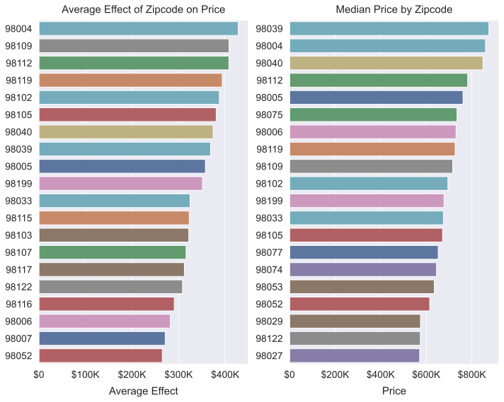
    


I prefer the "nearby_city" feature for its readability and ease of interpretation, but "zipcode" is a finer-grained category and led to a higher $R^2$. The cities are, if you recall, derived from the zipcodes. 

Medina, Mercer Island, and Bellevue lead on the medians plot. Interestingly, Bellevue is at the top of the correlation plot with $0.26$ and Medina has fallen in rank with a measly $0.08$. I'm not sure why that is. Anyway, Mercer Island is still in second place with $0.18$.


```python
fig, (ax1, ax2) = plt.subplots(ncols=2, figsize=(14, 8))
city_pal = plotting.cat_palette("deep", df["nearby_city"].unique(), desat=.9)
ax1 = plotting.simple_barplot(df, "nearby_city", "price", sort="desc",
                              orient="h", ax=ax1, palette=city_pal, estimator=np.median)
ax2 = plotting.heated_barplot(pd.get_dummies(
    df["nearby_city"]).corrwith(df["price"]), ax=ax2, heat_desat=0.6)
ax1.xaxis.set_major_formatter(plotting.big_money_formatter())
ax1.set_ylabel(None)
ax2.set_ylabel(None)
ax2.set_title("Correlation: Nearby City and Price")
ax2.set_xlabel("Correlation", labelpad=10)
plotting.annot_bars(ax2, dist=.15, compact=False, fontsize=12, alpha=.5)
fig.tight_layout()
```


    
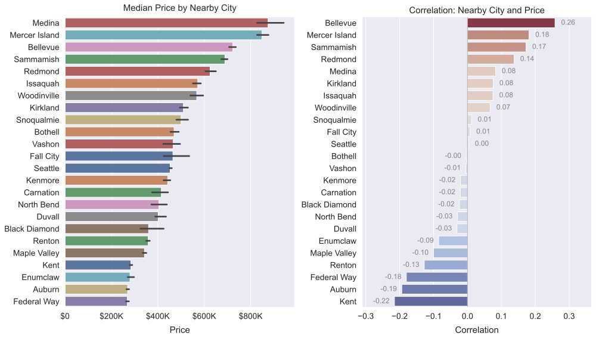
    


It's worth noting that Medina has the fewest data points of any city. Maybe that has something to do with it.


```python
df["nearby_city"].value_counts()
```


    Seattle          8885
    Renton           1580
    Bellevue         1395
    Kent             1193
    Kirkland          974
    Redmond           971
    Auburn            906
    Sammamish         793
    Federal Way       768
    Issaquah          731
    Maple Valley      586
    Woodinville       468
    Snoqualmie        305
    Mercer Island     282
    Kenmore           282
    Enumclaw          233
    North Bend        218
    Bothell           194
    Duvall            190
    Carnation         123
    Vashon            116
    Black Diamond      99
    Fall City          79
    Medina             49
    Name: nearby_city, dtype: int64


### Housing Grade

As the following figure illustrates, housing grade has a clear positive linear relationship with price. On the left are the `final_model` coefficients, in the center are the median prices, and on the right are the Pearson correlation coefficients.

I opted to process "grade" as a categorical variable in my model. Each grade's regression coefficient represents the average increase in a home's value if it has that grade, all else being equal. According to the model, having a grade of $10$ increases a home's value by an average of $\$325,049$. Likewise, having a grade of $7$ increases a home's value by an average of $\$79,781$.

The only anomaly in the figure is that $6$ has a slightly higher correlation with price than $7$. I'm not sure why that is, but the median plot looks pretty straightforwardly linear, and the slope seems to change only slightly between arcs. The confidence interval of the median plot is so small that it's barely visible, which indicates that these medians are pretty accurate estimates of central tendency. This is further corroborated by the coefficients graph, which mirrors the structur of the medians graph on $[6, 10]$.

#### Recommendation:

Try to increase your housing grade&mdash;the higher, the better.


```python
fig = plotting.cat_regressor_lineplots(df, coeff_df, "grade", "price", sp_height=5, estimator=np.median);
ax1, ax2, ax3 = fig.axes
ax1.yaxis.set_major_formatter(plotting.big_money_formatter())
ax2.yaxis.set_major_formatter(plotting.big_money_formatter())
```


    
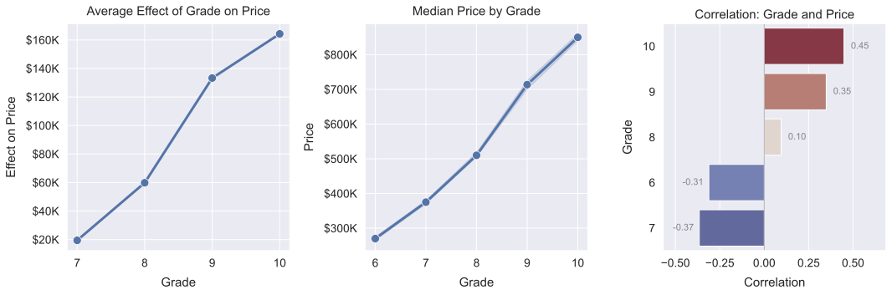
    


One for the presentation.


```python
# fig = plotting.cat_line_and_corr(df, "grade", "price", sp_height=5, estimator=np.median);
# ax1, ax2 = fig.axes
# ax1.yaxis.set_major_formatter(plotting.big_money_formatter())
```

### View Quality

The "view" feature appears to be incorrectly defined in the column information file (column_names.md). The file indicates that "view" means "has been viewed", which is implausible for a few reasons. First, "view" has five unique values: the integers $[0, 4]$. If it were really "has been viewed", it would either be a 2-valued boolean feature or a count of the number of views. Given that it maxes out at $4$, and this is a dataset of over $20\text{k}$ houses, I think we can safely infer that it's not a count of the number of views. Second, there is a more plausible definition on [Kaggle](https://www.kaggle.com/harlfoxem/housesalesprediction/discussion/207885). According to the Kaggle definition, "view" is a rating of the house's view. This definition is corroborated by this King County [report](https://kingcounty.gov/depts/assessor/Reports/area-reports/2016/~/media/depts/Assessor/documents/AreaReports/2016/Residential/034.ashx) for Mercer Island, which explains the features "condition" and "grade" and states on page 6: 
>The analysis for this area consisted of a general review of applicable characteristics, such 
as: grade, age, condition, stories, living area, views, waterfront, lot size, land problems and neighborhoods.

Anyway, judging by the `final_model` coefficients graphed on the left below, having a view of $4$ is a major improvement over a view in $[1,3]$. Having a view of $4$ increases price by about $\$150\text{k}$ on average, whereas the other average effects are all under $\$100\text{k}$. The median and correlation plots tell a somewhat more complicated story. The most striking thing about those plots is how bad $0$ is compared to the other values. The median price with a view of $0$ is about $\$250\text{k}$ lower than the median price with a view of $1$. Furthermore, it's negative correlation of $-0.3$ is about $0.12$ stronger than any of the positive correlations. This pattern doesn't show up in the coefficients because "view" (or rather "cat_view") was analyzed as a categorical variable, and the dummy variables for $0$ were automatically dropped to prevent multicollinearity.

#### Recommendation:

Try to attain a view rating of at least $1$ by landscaping, installing windows, or removing junk.


```python
fig = plotting.cat_regressor_lineplots(df, coeff_df, "view", "price", estimator=np.median);
ax1, ax2, ax3 = fig.axes
ax1.yaxis.set_major_formatter(plotting.big_money_formatter())
ax2.yaxis.set_major_formatter(plotting.big_money_formatter())
ax1.set_xlabel("View Quality", labelpad=10)
ax2.set_xlabel("View Quality", labelpad=10)
ax3.set_ylabel("View Quality", labelpad=10)
ax2.set_title("Median Price by View Quality", pad=10)
```


    Text(0.5, 1.0, 'Median Price by View Quality')


    
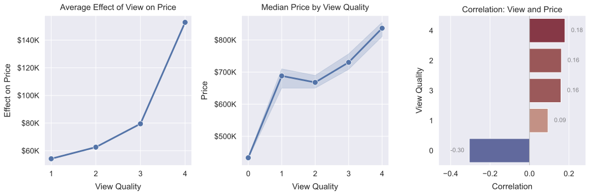
    


One for the presentation.


```python
# fig = plotting.cat_line_and_corr(df, "view", "price", estimator=np.median);
# ax1, ax2 = fig.axes
# ax1.yaxis.set_major_formatter(plotting.big_money_formatter())
# ax1.set_xlabel("View Quality", labelpad=10)
# ax1.set_title("Median Price by View Quality", pad=10)
```

### Bedrooms
The "cat_bedrooms" coefficients are lower overall than the others I've addressed, but there is a striking drop into the negative after $4$. I don't think this is really accurate, especially since the coefficient for $5$ is insignificantly different than $0$ (has a bad p-value). It's probably related to the wide confidence interval around the medians for $5$ and $6$. The confidence interval indicates the range of possible values for the *real* central tendency of $5$ and $6$. All of this suggests that having $4$ bedrooms is a good minimum goal, and then there are diminishing returns for bedroom counts higher than $4$.  Interestingly, the correlation plot shows that $4$ has the highest positive correlation with price, while $2$ and $3$ are negatively correlated with price.

#### Recommendation:

Aim to have at least $4$ bedrooms, and then expect diminishing returns if you keep adding more.


```python
fig = plotting.cat_regressor_lineplots(df, coeff_df, "bedrooms", "price");
ax1, ax2, ax3= fig.axes
ax1.yaxis.set_major_formatter(plotting.big_money_formatter())
ax2.yaxis.set_major_formatter(plotting.big_money_formatter())
ax1.set_xlabel("Bedroom Count", labelpad=10)
ax2.set_xlabel("Bedroom Count", labelpad=10)
ax3.set_ylabel("Bedroom Count", labelpad=10)
ax2.set_title("Median Price by Bedroom Count", pad=10)
```


    Text(0.5, 1.0, 'Median Price by Bedroom Count')


    
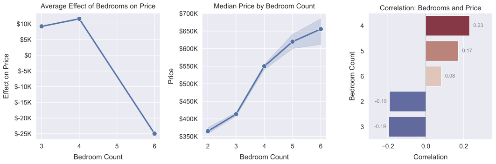
    


One for the presentation.


```python
# fig = plotting.cat_line_and_corr(df, "bedrooms", "price", estimator=np.median);
# ax1, ax2 = fig.axes
# ax1.yaxis.set_major_formatter(plotting.big_money_formatter())
# ax1.set_xlabel("Bedroom Count", labelpad=10)
# ax1.set_title("Median Price by Bedroom Count", pad=10)
```

Interesting that $4$-beds has the strongest correlation with "sqft_living", "sqft_above", "grade", and "floors". It also has the strongest negative correlation with "age".


```python
ax = plotting.frame_corr_heatmap(df.drop("bedrooms", axis=1), "cat_bedrooms")
ax.set_ylabel("Bedrooms", labelpad=10)
```


    Text(97.72800000000002, 0.5, 'Bedrooms')


    
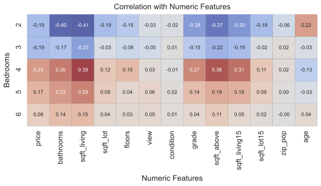
    


### Living Space

The simple regression plot below illustrates that "sqft_living" has a fairly strong positive linear relationship with price. It has a coefficient of $112.44$ in `final_model`, meaning that a home's value increases by $\$112.44$ on average for each square foot of living space added. It also has a $0.66$ correlation with price, again indicating a pretty solid linear relationship.

#### Recommendation:

Increase living space as much as possible.


```python
g = sns.jointplot(data=df,
                    x="sqft_living", 
                    y="price", 
                    kind="reg",
                    scatter_kws={"s":.25, "alpha":.5}, 
                    ratio=10, 
                    height=6, 
                    line_kws={"lw":4, "color":"b"}, 
                    marginal_kws={"fill":True, "kde":True})
g.set_axis_labels(xlabel="Square Footage", ylabel="Price", labelpad=10)
ax = g.ax_joint
ax.yaxis.set_major_formatter(plotting.big_money_formatter())
ax.xaxis.set_major_formatter(ticker.StrMethodFormatter("{x:,.0f}"))
g.ax_marg_x.set_title("Living Space vs. Price", pad=20)
```


    Text(0.5, 1.0, 'Living Space vs. Price')


    

    


```python
df[["sqft_living", "price"]].corr()
```


<div>
<style scoped>
    .dataframe tbody tr th:only-of-type {
        vertical-align: middle;
    }

    .dataframe tbody tr th {
        vertical-align: top;
    }

    .dataframe thead th {
        text-align: right;
    }
</style>
<table border="1" class="dataframe">
  <thead>
    <tr style="text-align: right;">
      <th></th>
      <th>sqft_living</th>
      <th>price</th>
    </tr>
  </thead>
  <tbody>
    <tr>
      <th>sqft_living</th>
      <td>1.000000</td>
      <td>0.662827</td>
    </tr>
    <tr>
      <th>price</th>
      <td>0.662827</td>
      <td>1.000000</td>
    </tr>
  </tbody>
</table>
</div>


# Recommendations Recap
I managed to create a solid multiple regression model for the residents of King County, and arrived at the following recommendations:
* Try to increase your housing grade as much as possible.
* Try to attain a view rating of at least $1$ by landscaping, installing windows, or removing junk.
* Aim to have at least $4$ bedrooms, and then expect diminishing returns if you keep adding more.
* Try to increase aboveground square footage as much as possible.

I'm confident in that these recommendations will help residents increase the value of their homes through renovation. I selected `final_model` from about 4,900 other models I created with a wide variety of predictor combinations. I filtered through this massive set of models to find the model with the highest $R^2_{adj}$ and the most relevant predictors.

# Future Work

There is much more that could be done for King County homeowners. The first step would be to look at other models I've created and learn about features such as "bathrooms" which didn't make it into `final_model`. There is much more that could be done with data from this very notebook.

Speaking of data from this very notebook, I'd like to run feature-selection sweeps using the normalized dataset, `scale_df`, I created. I'd be interested in seeing how much better the scaled models are, and what insights they offer at the expense of interpretability.

My final suggestion is to look for more data, ideally data with time information gathered over the course of decades. I'd be interested in investigating the change over time in how various features affect home value. For someone looking to renovate, the best investment would be in features that are on the rise.


